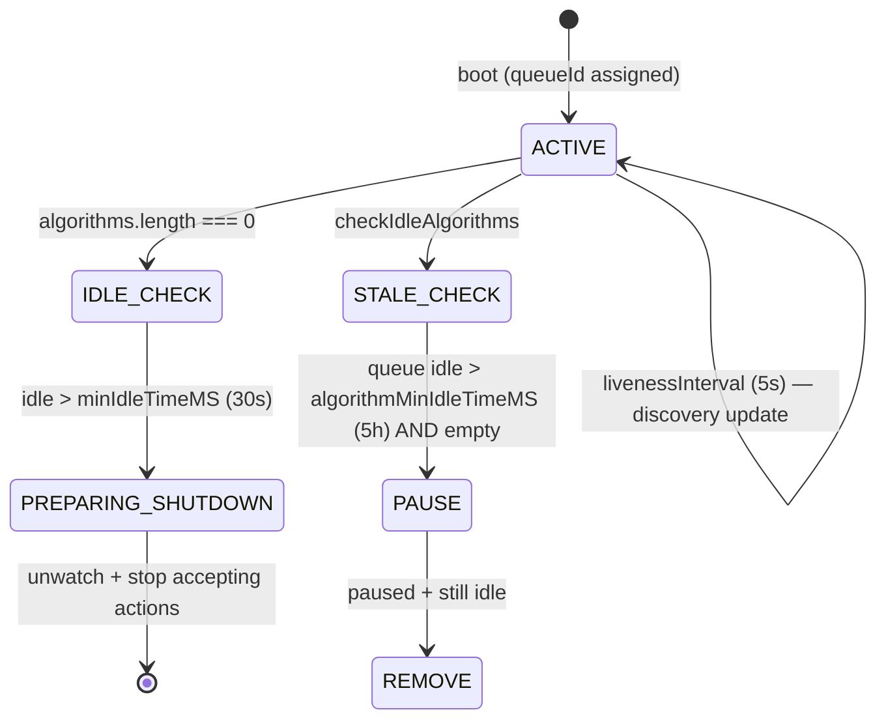
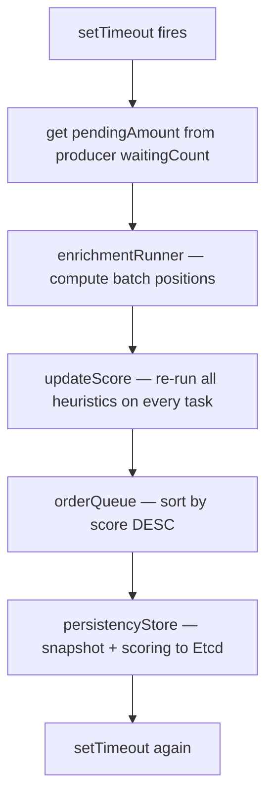
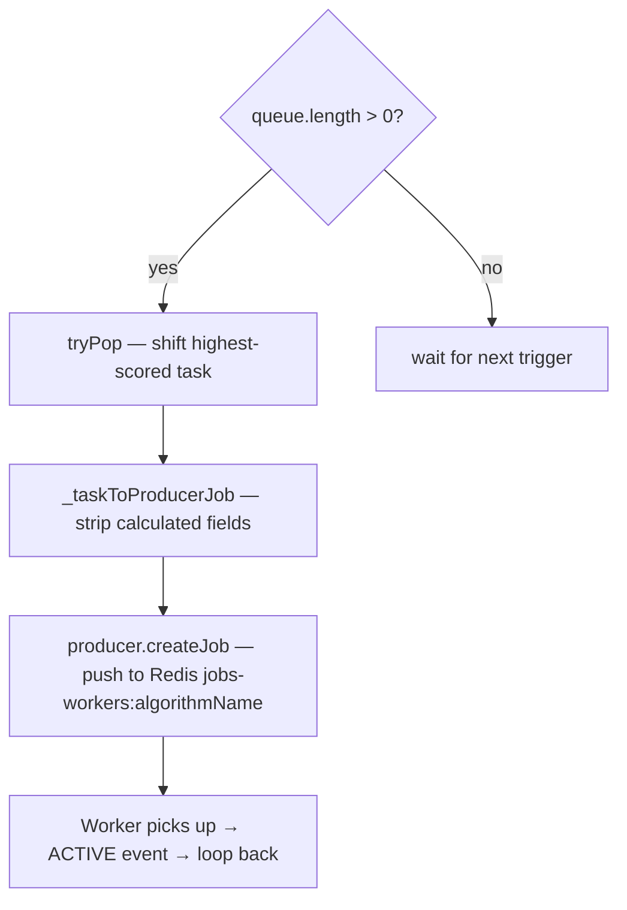
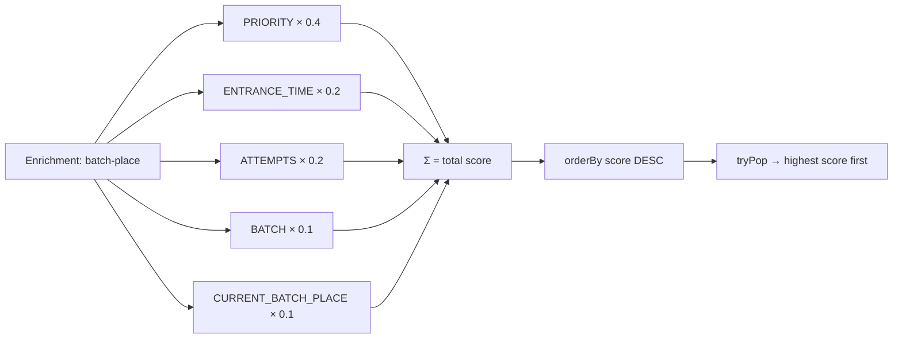
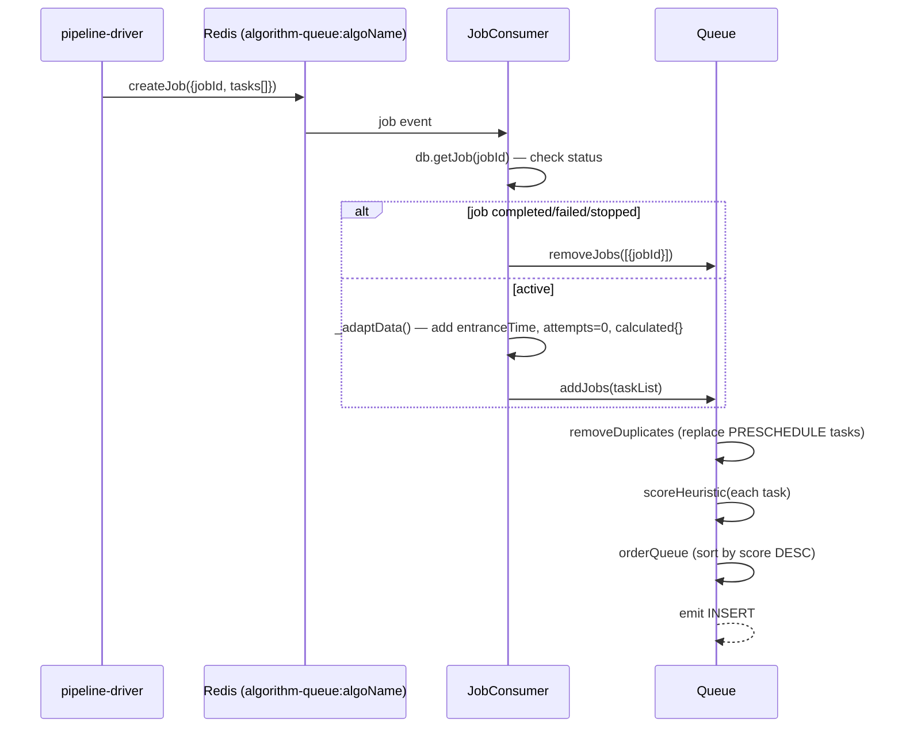
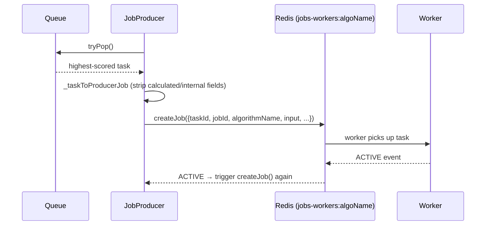
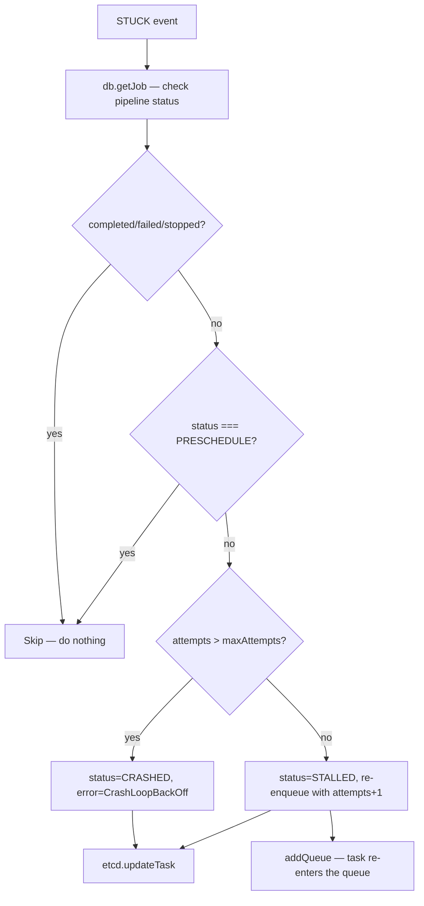
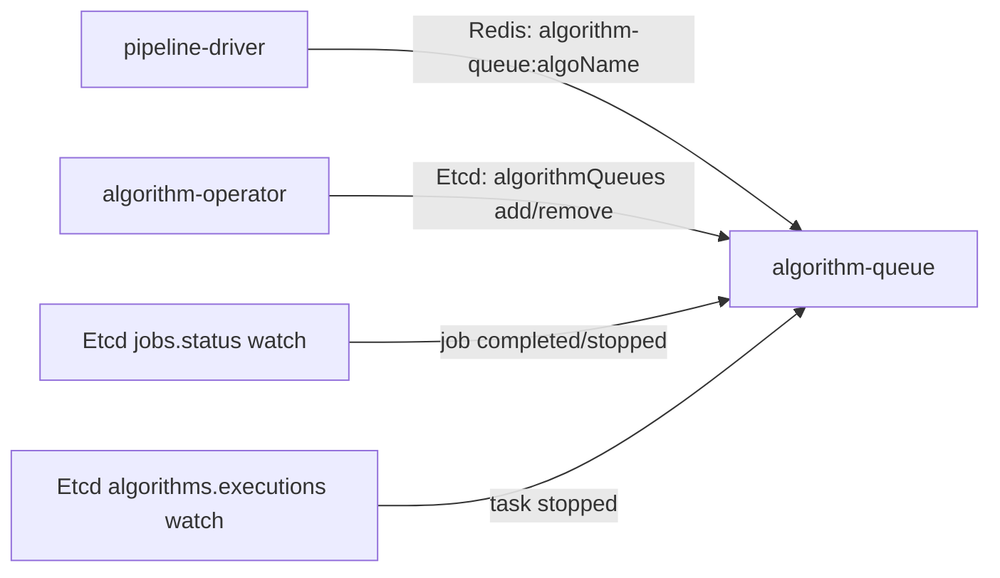
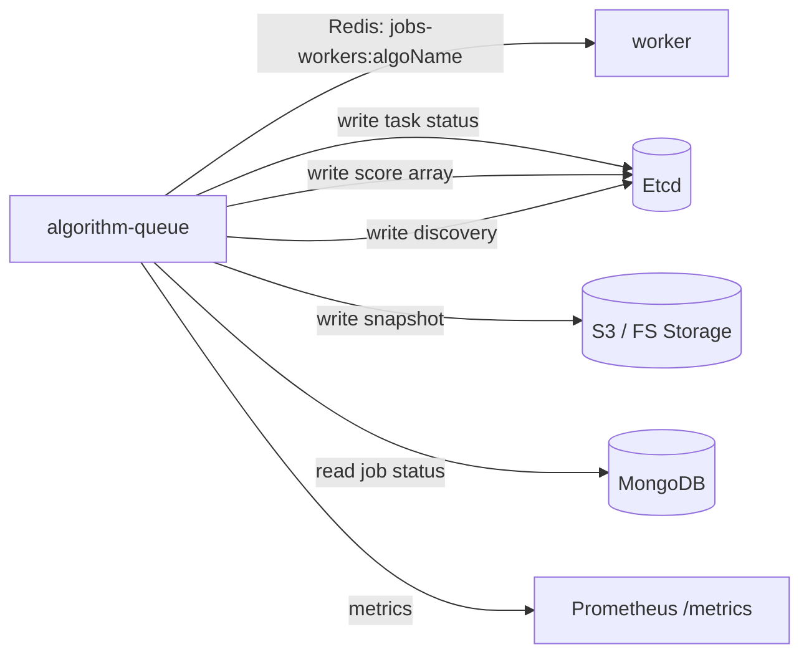

# algorithm-queue — Reverse-Spec Discovery

> **Service:** `algorithm-queue`  
> **Version:** 2.11.0  
> **Language:** Node.js  
> **Description:** Priority-scored task queue engine. Each instance manages one or more in-memory queues, one per algorithm name. Tasks arrive from pipeline-driver via Redis, are scored by a weighted heuristic system, and are dispatched one-at-a-time to workers via a separate Redis producer. The scoring system re-evaluates all tasks on a periodic interval, ensuring that priority, wait time, batch position and retry attempts are continuously factored into execution order.

---

## 1. Structural Overview

```
algorithm-queue/
├── app.js                              # Entry — calls bootstrap.init()
├── bootstrap.js                        # Init: Redis monitor → storage → etcd, db, queues-manager, metrics
├── config/main/config.base.js          # All configuration & env-var mapping
├── lib/
│   ├── queues-manager.js               # **ORCHESTRATOR** — manages Map<algorithmName, Queue>, handles add/remove actions, discovery, idle detection
│   ├── queue-runner.js                 # Factory — wires Queue + HeuristicRunner + EnrichmentRunner + Persistence + metrics events
│   ├── queue.js                        # **CORE ENGINE** — in-memory priority queue: insert, pop, score, persist, interval loop
│   ├── heuristic-runner.js             # Executes all heuristic functions and sums their weighted scores
│   ├── heuristic/
│   │   ├── index.js                    # Exports all heuristics
│   │   ├── priority.js                 # Score by task priority (1-5)
│   │   ├── attempts.js                 # Score by retry attempts
│   │   ├── entrance-time.js            # Score by wait time (age in queue)
│   │   ├── batch.js                    # Score by batch index (lower index → higher score)
│   │   └── current-batch-place.js      # Score by relative position within current batch
│   ├── enrichment-runner.js            # Pre-scoring enrichment pass over the queue
│   ├── enrichments/
│   │   ├── index.js                    # Exports all enrichments
│   │   └── batch-place.js              # Computes currentBatchPlace/currentBatchLength per task
│   ├── jobs/
│   │   ├── consumer.js                 # Redis consumer — receives task batches from pipeline-driver, builds queue entries
│   │   └── producer.js                 # Redis producer — pops highest-scored task, dispatches to workers
│   ├── persistency/
│   │   ├── persistence.js              # Persistence orchestrator — delegates to snapshot + scoring
│   │   ├── snapshot.js                 # Full queue snapshot to S3/FS via @hkube/storage-manager
│   │   ├── scoring.js                  # Score array + pendingAmount to Etcd (for task-executor visibility)
│   │   ├── redis-storage-adapter.js    # Legacy Redis-based persistence adapter
│   │   ├── etcd.js                     # Etcd client — watches, discovery, task updates, queue data
│   │   └── db.js                       # MongoDB client — job status lookups
│   ├── querier.js                      # Functional query helpers over queue array (group by jobId/nodeName)
│   ├── metrics/
│   │   └── aggregation-metrics-factory.js  # Prometheus metrics registration + emit helpers
│   ├── graceful-shutdown.js            # Orchestrates queue pause + persist on shutdown
│   ├── consts/                         # heuristics-name, component-name, metrics-name, queue-events, etc.
│   └── utils/
│       ├── formatters.js               # parseInt, parseBool
│       └── pipelineStatuses.js         # isCompletedState helper
└── tests/
```

---

## 2. The Control Loop

The service has **three nested control loops**:

### 2.1 Outer Loop — QueuesManager (Liveness + Idle Detection)



**Trigger:** Etcd `algorithmQueues.watch` delivers `{action, algorithmName}` events.

**Actions:**
- `add` → creates a new `Queue` instance for that algorithm (up to `concurrency limit`)
- `remove` → stops and deletes the queue

**Discovery:** Reports `{queueId, algorithms[], active}` to Etcd. Only updates if data differs from last report (deep equality check).

**Idle lifecycle:**
1. If the manager has zero algorithms for `minIdleTimeMS` (30s), it unwatches and prepares for shutdown
2. Individual algorithm queues that are empty + idle for `algorithmMinIdleTimeMS` (5h) are first paused, then removed on next check

### 2.2 Middle Loop — Queue Interval (`queue.js`)

Each `Queue` runs a `setTimeout` loop at `updateInterval` (default 1s):



### 2.3 Inner Loop — Producer Dispatch (`producer.js`)

The producer has **two dispatch triggers**:

1. **On ACTIVE event:** When a worker picks up a task (Bull `ACTIVE` event), immediately pop and produce the next task
2. **Polling interval** (`producerUpdateInterval`, default 1s): If queue has items but no waiting jobs in Redis, produce one



---

## 3. The Scoring System — Heuristic Engine

### 3.1 Architecture

Each task is scored by summing 5 weighted heuristic functions. Scores are recomputed every `updateInterval` (1s) for all tasks in the queue.

$$\text{score}(t) = \sum_{h \in H} h.\text{weight} \times h.\text{fn}(t)$$

Tasks with `status === PRESCHEDULE` receive a score of 0 (they are placeholders for future scheduling).

### 3.2 Heuristic Functions

| Heuristic | Weight | Formula | Intent |
|-----------|--------|---------|--------|
| **PRIORITY** | 0.4 | $w \times \frac{|6 - \text{priority}|}{5}$ | Higher priority (1=highest) → higher score. Priority range 1–5, inverted so 1 maps to max. |
| **ENTRANCE_TIME** | 0.2 | $w \times \frac{\text{now} - \text{entranceTime}}{3{,}600{,}000}$ | Longer wait → higher score. Normalizes against 1 hour max. Unbounded (can exceed weight). |
| **ATTEMPTS** | 0.2 | $w \times \frac{\text{attempts}}{3}$ | More retries → higher score (up to max 3). Prevents starvation of failing tasks. |
| **BATCH** | 0.1 | $w \times \frac{|\text{batchIndex} - 1501|}{1500}$ if $\text{batchIndex} < 1500$, else $w$ | Lower batch index → higher score. Normalizes against max 1500. |
| **CURRENT_BATCH_PLACE** | 0.1 | $w \times \frac{|\text{currentBatchPlace} - (\text{currentBatchLength} + 1)|}{\text{currentBatchLength}}$ | Front-of-batch bias within the current live batch. 0 if not yet enriched. |

### 3.3 Enrichment (Pre-scoring Pass)

Before scoring, the `EnrichmentRunner` runs `batch-place` enrichment:
- Groups the queue by `(jobId, nodeName)`
- Tracks `currentBatchLength` (how many tasks remain for this job+node)
- Adjusts `currentBatchPlace` as the batch shrinks: $\text{place} = \text{place} - (\text{previousLength} - \text{currentLength})$
- This feeds the `CURRENT_BATCH_PLACE` heuristic

### 3.4 Score Flow



---

## 4. Task Lifecycle

### 4.1 Inbound — From pipeline-driver to Queue



### 4.2 Outbound — From Queue to Worker



### 4.3 Stalled Task Recovery

When a worker task stalls (Bull `STUCK` event):



**Max attempts:** `task.retry.limit` if set, otherwise `MAX_JOB_ATTEMPTS = 3`.

### 4.4 Invalidation — Job/Task Removal

The `QueuesManager._watch()` listens for two Etcd events:

| Event | Source | Action |
|-------|--------|--------|
| `job-change` (jobs.status watch) | pipeline-driver sets COMPLETED/FAILED/STOPPED | Remove all tasks for that jobId from queue + remove waiting Redis jobs |
| `exec-change` (algorithms.executions watch) | pipeline-driver sets STOPPED on a specific task | Remove that specific `{jobId, taskId}` from queue |

---

## 5. State Sovereignty

### Owns (Read-Write)

| Data | Store | Access Pattern |
|------|-------|----------------|
| In-memory task queue (per algorithm) | RAM | Insert/pop/remove/reorder every 1s |
| Queue snapshot | S3/FS via `@hkube/storage-manager` (`hkubePersistency`) | Write every 1s, read on startup |
| Score array + pendingAmount | Etcd (`algorithms.queue`) | Write every 1s (consumed by task-executor) |
| Discovery registration | Etcd (`discovery`) | Write every 5s (if changed) |
| Task status updates (STALLED/CRASHED) | Etcd (`jobs.tasks`) | Write on stalled task |

### Observes (Read-Only)

| Data | Source |
|------|--------|
| Task batches from pipeline-driver | Redis queue (`algorithm-queue:algorithmName`) |
| Job pipeline status | MongoDB (`jobs.fetchStatus`) |
| Job status changes | Etcd watch (`jobs.status`) |
| Algorithm execution changes | Etcd watch (`algorithms.executions`) |
| Queue management actions (add/remove algorithm) | Etcd watch (`algorithmQueues`) |

---

## 6. Side Effects

| Side Effect | Target | Trigger |
|------------|--------|---------|
| **Produce task to worker** | Redis `jobs-workers:algorithmName` | tryPop on queue (highest-scored task) |
| **Update task status (STALLED/CRASHED)** | Etcd `jobs.tasks` | Bull STUCK event |
| **Persist queue snapshot** | S3/FS (`hkubePersistency`) | Every updateInterval (1s) |
| **Publish score array** | Etcd `algorithms.queue` | Every updateInterval (1s) — consumed by task-executor for resource decisions |
| **Update discovery** | Etcd `discovery` | Every livenessInterval (5s) if changed |
| **Remove waiting Redis jobs** | Redis (Bull queue) | Job completed/failed/stopped event |
| **Emit Prometheus metrics** | Prometheus `/metrics` | Task insert/pop/remove + score updates |
| **process.exit** | OS | Redis close, Etcd watcher error, unhandled rejection, uncaught exception |

---

## 7. Configuration & Thresholds

| Parameter | Env Var | Default | Purpose |
|-----------|---------|---------|---------|
| `queueId` | `QUEUE_ID` | — (required) | Unique identifier for this queue instance |
| `algorithmQueueBalancer.limit` | `CONCURRENCY_LIMIT` | `5` | Max algorithm queues per instance |
| `algorithmQueueBalancer.minIdleTimeMS` | `ALGORITHM_QUEUE_MIN_IDLE_TIME` | `30000` ms | Idle time before instance prepares shutdown |
| `algorithmQueueBalancer.livenessInterval` | `ALGORITHM_QUEUE_LIVENESS_INTERVAL` | `5000` ms | Discovery update + idle check interval |
| `algorithmQueueBalancer.algorithmMinIdleTimeMS` | `ALGORITHM_QUEUE_ALGORITHM_MIN_IDLE_TIME` | `18000000` ms (5h) | Idle time before individual algorithm queue is removed |
| `queue.updateInterval` | `INTERVAL` | `1000` ms | Queue score recalculation + persist interval |
| `queue.maxPersistencySize` | `MAX_PERSISTENCY_SIZE` | `10e6` | Max serialized queue size for Redis persistence |
| `producerUpdateInterval` | `PRODUCER_UPDATE_INTERVAL` | `1000` ms | Producer poll interval for stuck dispatch |
| `producer.checkStalledJobsInterval` | `STALLED_JOB_INTERVAL` | `15000` ms | Bull stalled job check interval |
| `consumer.concurrency` | — | `10000` | Max concurrent Redis consumer jobs |
| `scoring.maxSize` | `MAX_SCORING_SIZE` | `5000` | Max tasks to include in Etcd score array |
| `heuristicsWeights.PRIORITY` | — | `0.4` | Priority heuristic weight |
| `heuristicsWeights.ENTRANCE_TIME` | — | `0.2` | Wait time heuristic weight |
| `heuristicsWeights.ATTEMPTS` | — | `0.2` | Retry attempts heuristic weight |
| `heuristicsWeights.BATCH` | — | `0.1` | Batch index heuristic weight |
| `heuristicsWeights.CURRENT_BATCH_PLACE` | — | `0.1` | Current batch position heuristic weight |
| `logging.tasks` | `LOG_TASKS` | `true` | Log individual task enqueue events |
| MAX_JOB_ATTEMPTS (hardcoded) | — | `3` | Default max stalled retries before CRASHED |
| maxPriority (hardcoded) | — | `5` | Priority scale max |
| maxTime (hardcoded) | — | `3600000` ms (1h) | Entrance time normalization ceiling |
| maxBatch (hardcoded) | — | `1500` | Batch index normalization ceiling |

---

## 8. Dependency Map

### 8.1 Northbound (What triggers this service)



### 8.2 Southbound (What this service calls)



### 8.3 Internal Module Dependencies (`@hkube/*`)

| Package | Role |
|---------|------|
| `@hkube/producer-consumer` | Redis-backed job queue (Bull) — both Consumer (from pipeline-driver) and Producer (to workers) |
| `@hkube/etcd` | Etcd client — watches (jobs.status, algorithms.executions, algorithmQueues), discovery, queue data |
| `@hkube/db` | MongoDB client — job status lookup |
| `@hkube/storage-manager` | S3/FS abstraction — queue snapshot persistence |
| `@hkube/metrics` | Prometheus metrics + Jaeger tracer |
| `@hkube/consts` | Shared enums: `pipelineStatuses`, `taskStatuses` |
| `@hkube/logger` | Structured logging |
| `@hkube/redis-utils` | Redis connection monitor + client factory |
| `@hkube/uid` | UUID generation (for producer job IDs) |

---

## 9. Metrics Emitted (Prometheus)

| Metric Name | Type | Labels | Description |
|-------------|------|--------|-------------|
| `algorithm_queue_time_in_queue` | Histogram | `pipeline_name`, `algorithm_name`, `node_name`, `jobId` | Time a task spent waiting in queue |
| `algorithm_queue_queue_amount` | Gauge | `pipeline_name`, `algorithm_name`, `node_name`, `jobId` | Current number of tasks in queue |
| `algorithm_queue_queue_counter` | Counter | `pipeline_name`, `algorithm_name`, `nodeName`, `jobId` | Total tasks ever enqueued |
| `algorithm_queue_total_score` | Histogram | `pipeline_name`, `algorithm_name`, `node_name`, `jobId` | Distribution of total heuristic scores |
| `algorithm_queue_batch_score` | Histogram | `pipeline_name`, `algorithm_name`, `node_name`, `jobId` | Distribution of batch heuristic scores |
| `algorithm_queue_priority_score` | Histogram | `pipeline_name`, `algorithm_name`, `node_name`, `jobId` | Distribution of priority heuristic scores |
| `algorithm_queue_time_score` | Histogram | `pipeline_name`, `algorithm_name`, `node_name`, `jobId` | Distribution of time heuristic scores |

---

## 10. Logic Contract

### LC-1: Score-Ordered Dispatch
- Tasks are always dispatched in descending score order via `tryPop()` (array shift after sort)
- Scores are recomputed every `updateInterval` — the order is **not static**, it evolves as tasks age, batches shrink, etc.
- `PRESCHEDULE` tasks receive score 0, ensuring they are dispatched last (or not at all until promoted)

### LC-2: Duplicate Prevention
- When new tasks arrive, any existing task with the same `(jobId, taskId)` and `status === 'preschedule'` is removed before insertion
- This handles the preschedule → actual task promotion pattern from pipeline-driver

### LC-3: Stalled Task Recovery Contract
- Tasks that stall are re-enqueued with `attempts + 1`
- After `maxAttempts` (default 3, overridable via `task.retry.limit`), status becomes `CRASHED` with `CrashLoopBackOff`
- Completed/stopped pipeline tasks are never re-enqueued (checked via DB status lookup)
- `PRESCHEDULE` tasks that stall are silently ignored

### LC-4: Graceful Shutdown Guarantee
- On shutdown: all consumer queues are paused, then current queue state is persisted to S3/FS with `pendingAmount`
- On startup: queue is restored from S3/FS snapshot, re-scored, and processing resumes

### LC-5: Queue Lifecycle Management
- A queue instance auto-shuts down if it has zero algorithms for `minIdleTimeMS` (30s)
- Individual algorithm queues are paused if idle + empty for `algorithmMinIdleTimeMS` (5h), then removed on next check cycle
- Queue cannot be stopped (`stop(force=false)`) while it has pending tasks — only forced removal or graceful shutdown will clear it

### LC-6: Score Publication Contract
- The top `maxScoringSize` (5000) scores are published to Etcd every interval
- This data is consumed by `task-executor` to make resource allocation decisions (how many workers to schedule)
- The `pendingAmount` (tasks waiting in Redis but not yet in the queue) is also published
