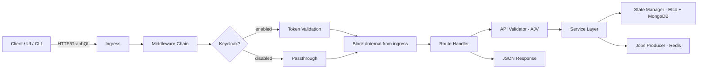
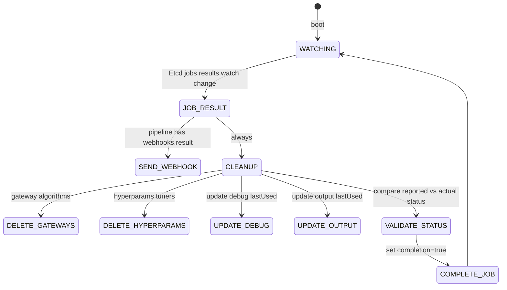
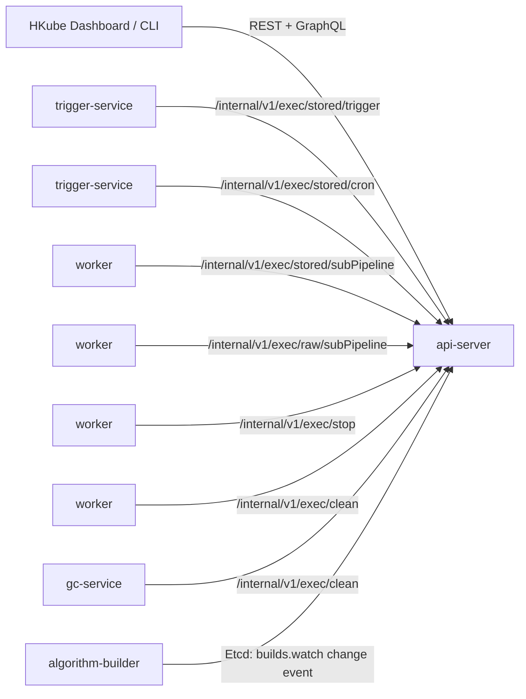
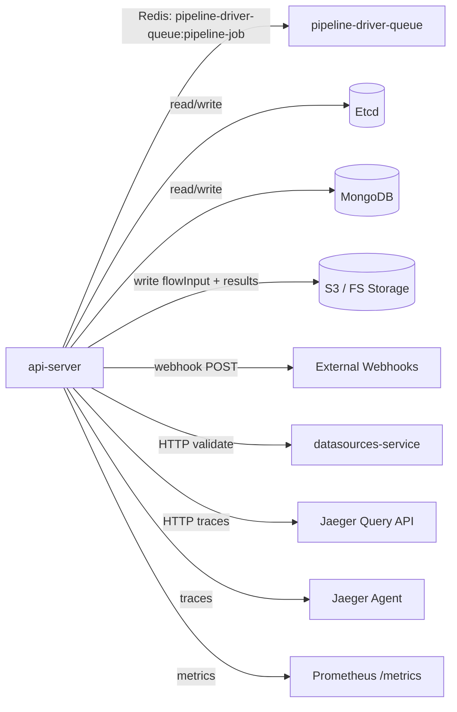
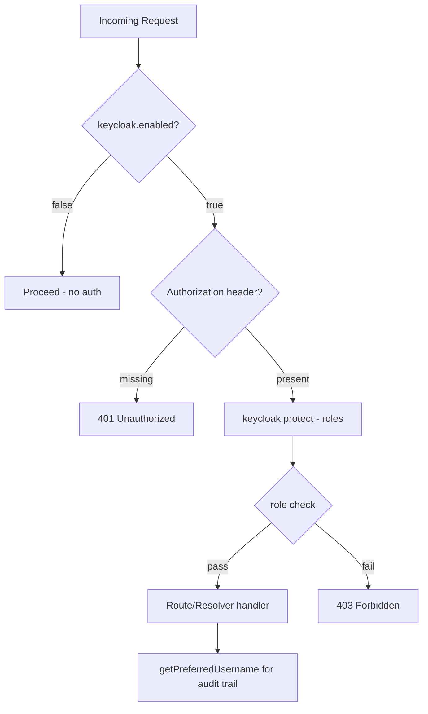
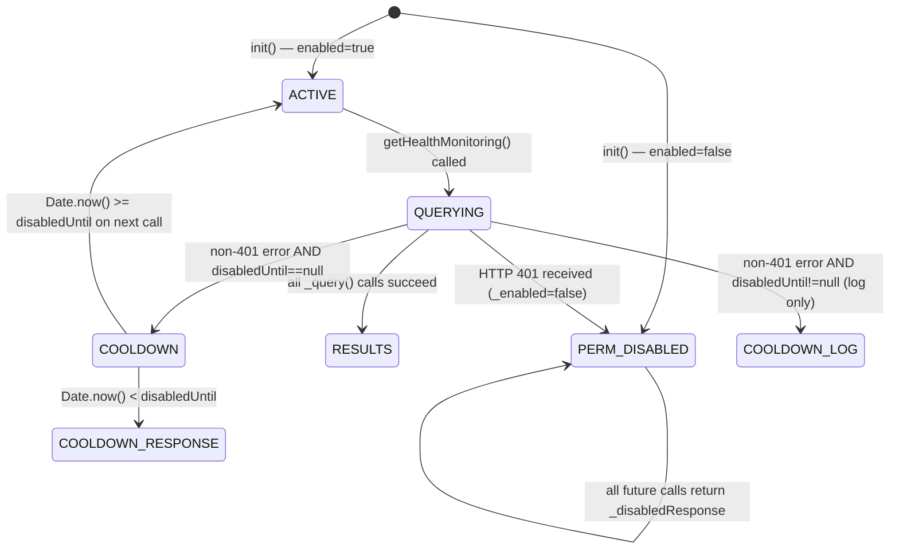
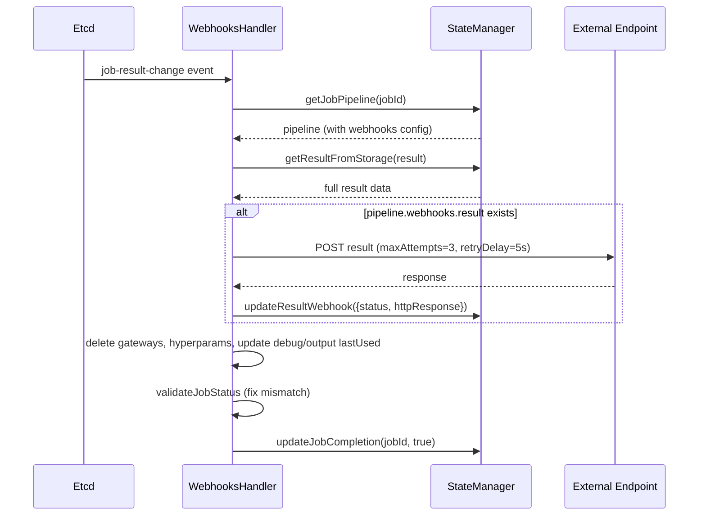

# api-server — Reverse-Spec Discovery

> **Service:** `api-server`  
> **Version:** 2.11.1  
> **Language:** Node.js  
> **Description:** Central API gateway for the HKube platform. Exposes REST (Express) and GraphQL (Apollo) interfaces for managing algorithms, pipelines, experiments, builds, and job execution. Receives user requests, validates them via AJV schema validation, orchestrates pipeline creation (including DAG construction, streaming flow parsing, and sub-pipeline composition), persists state to MongoDB/Etcd, publishes jobs to the pipeline-driver-queue via Redis, and dispatches webhook callbacks on job completion. Also serves as the internal API for trigger-service and worker sub-pipeline requests.

---

## 1. Structural Overview

```
api-server/
├── app.js                              # Entry — calls bootstrap.init()
├── bootstrap.js                        # Init: Redis monitor → metrics → storage → modules[]
├── config/main/config.base.js          # All configuration & env-var mapping
├── api/
│   ├── app-server.js                   # Express + Apollo server setup, route loading, Keycloak middleware
│   ├── rest-api/
│   │   ├── swagger.json                # OpenAPI spec (schema source for AJV validation)
│   │   ├── internal/                   # Internal-only routes (cron, trigger, subPipeline, stop, clean)
│   │   │   ├── index.js                # Mounts internal routes at /internal/v1
│   │   │   ├── exec.js                 # Cron/trigger/subPipeline execution + internal stop/clean
│   │   │   └── algorithms.js           # Internal algorithm queue listing
│   │   ├── middlewares/
│   │   │   ├── interceptors.js         # Blocks /internal/* from ingress (403 Forbidden)
│   │   │   └── methods.js              # HTTP method enforcement
│   │   └── routes/v1/
│   │       ├── exec.js                 # Pipeline execution: raw, stored, caching, algorithm, rerun, stop, pause, resume, search
│   │       ├── store.js                # Algorithms + Pipelines CRUD (with file upload via multer)
│   │       ├── status.js               # System version info
│   │       ├── builds.js               # Build CRUD (start, stop, rerun, list)
│   │       ├── cron.js                 # Cron trigger management
│   │       ├── experiment.js           # Experiment CRUD
│   │       ├── versions.js             # Algorithm & pipeline version management
│   │       ├── graph.js                # DAG graph queries (raw + parsed)
│   │       ├── boards.js               # TensorBoard + OptunaBoard management
│   │       ├── gateway.js              # Gateway algorithm CRUD
│   │       ├── storage.js              # Storage browser (prefixes, keys, streams, downloads)
│   │       ├── webhooks.js             # Webhook result/status query
│   │       ├── readme.js               # Algorithm & pipeline README CRUD
│   │       ├── resources.js            # Unscheduled/ignored algorithm resource info
│   │       ├── jaeger.js               # Jaeger trace proxy
│   │       ├── kubernetes.js           # K8s resource queries
│   │       ├── pipelines.js            # Pipeline trigger tree
│   │       └── auth.js                 # Keycloak login endpoint
│   ├── graphql/
│   │   ├── graphql-server.js           # Apollo Server init with Keycloak auth context
│   │   ├── graphql-schema.js           # Combined type definitions
│   │   ├── resolvers.js                # Query/Mutation/Subscription resolvers
│   │   ├── schemas/                    # Per-entity GraphQL type definitions
│   │   └── queries/
│   │       ├── database-querier.js     # Polling daemon (2s) — caches discovery + experiments + jobs
│   │       ├── prefered-querier.js     # Preferred data aggregation
│   │       ├── statistics-querier.js   # Node statistics + disk usage
│   │       ├── dataSource-querier.js   # DataSource proxy
│   │       └── error-logs-querier.js   # Error log aggregation
│   └── task-logs/
│       └── logs.js                     # Task log retrieval (K8s / ElasticSearch)
├── lib/
│   ├── service/
│   │   ├── execution.js                # **CORE** — Pipeline execution orchestrator
│   │   ├── pipeline-creator.js         # DAG construction, streaming flow parsing, debug/output/optimize node injection
│   │   ├── pipelines.js                # Stored pipeline CRUD + versioning + trigger tree
│   │   ├── algorithms.js               # Algorithm lifecycle: apply, delete (with dependency check), build triggers
│   │   ├── builds.js                   # Build lifecycle: create, stop, rerun, file handling, shouldBuild logic
│   │   ├── build.js                    # Build model (buildId, imageTag generation)
│   │   ├── caching.js                  # Cache-node execution: extract sub-DAG from prior job
│   │   ├── cron.js                     # Cron pipeline trigger management
│   │   ├── internal.js                 # Internal execution: trigger pipelines, sub-pipelines
│   │   ├── versioning.js               # Semver auto-increment + version UID generation
│   │   ├── algorithm-versions.js       # Algorithm version management (delegates to versioning.js)
│   │   ├── pipeline-versions.js        # Pipeline version management (delegates to versioning.js)
│   │   ├── gateway.js                  # Gateway algorithm creation/deletion
│   │   ├── debug.js                    # Debug algorithm creation/deletion
│   │   ├── output.js                   # Output algorithm creation/deletion
│   │   ├── hyperparams-tuner.js        # HyperparamsTuner algorithm creation/deletion
│   │   ├── graph.js                    # DAG graph persistence queries (via @hkube/dag Persistency)
│   │   ├── storage.js                  # Storage browsing, result download as ZIP archive
│   │   ├── boards.js                   # TensorBoard + OptunaBoard lifecycle
│   │   ├── experiment.js               # Experiment CRUD + cascading delete
│   │   ├── data-sources.js             # DataSource validation proxy
│   │   ├── webhooks.js                 # Webhook result/status queries
│   │   ├── auth.js                     # Keycloak token login
│   │   ├── keycloak.js                 # Keycloak middleware: protect(), getPreferredUsername()
│   │   ├── jaeger-api.js               # Jaeger trace proxy
│   │   ├── algorithmBase.js            # Base class for special algorithm types (gateway, debug, output, hyperparams)
│   │   └── githooks/                   # Git repository data adapter for builds
│   ├── producer/
│   │   └── jobs-producer.js            # Redis producer → pipeline-driver-queue
│   ├── state/
│   │   └── state-manager.js            # Central data layer: Etcd + MongoDB + event bus
│   ├── validation/
│   │   ├── api-validator.js            # Validator registry (AJV-based, initialized from swagger schemas)
│   │   ├── inner-validator.js          # AJV instance + custom formats
│   │   ├── algorithms.js ... pipelines.js  # Per-entity validation logic
│   │   └── custom-formats.js           # Custom AJV format definitions
│   ├── webhook/
│   │   ├── webhooks-handler.js         # Watches job results → fires webhooks → cleans up special algorithms
│   │   └── States.js                   # Webhook state enums
│   ├── stream/
│   │   └── index.js                    # Stream error handling utilities
│   ├── utils/
│   │   ├── formatters.js               # parseInt, parseBool utilities
│   │   ├── auditing.js                 # Audit trail entry generation
│   │   └── graph-builder.js            # Graph data filtering
│   ├── consts/                         # componentNames, metricsNames, validationMessages, regex, builds, defaultExperiment
│   ├── errors/                         # Custom error classes: InvalidDataError, ResourceNotFoundError, ResourceExistsError, ActionNotAllowed, MethodNotAllowed, AuthenticationError
│   └── examples/
│       ├── pipelines-updater.js        # Startup sync: migrates algorithms/pipelines/experiments from storage → DB
│       ├── algorithms.json             # Default algorithm definitions
│       ├── pipelines.json              # Default pipeline definitions
│       └── experiments.json            # Default experiment definitions
└── tests/
```

---

## 2. The Control Loop

The api-server is fundamentally **request-driven** (not event-loop-driven like pipeline-driver). It has two main operational modes:

### 2.1 Request-Response Loop (Express + Apollo)



### 2.2 Background Event Loop — Webhook Handler



### 2.3 Background Polling — DatabaseQuerier

The `database-querier.js` runs a `setInterval(2000ms)` loop that:
1. Fetches Etcd discovery data (all services: workers, drivers, task-executor, etc.)
2. Caches results in `this.lastResults` for GraphQL resolvers
3. Provides real-time cluster state to the UI without per-request Etcd queries

### 2.4 Background Healthcheck Loop

The `state-manager._healthcheckInterval()` runs on a `setTimeout` loop (`HEALTHCHECK_CHECK_INTERVAL`, default 5s):
1. Fetches jobs where `completion === false` but `result` exists
2. If any are found older than `minAge` (10s), increments `_failedHealthcheckCount`
3. Re-emits `job-result-change` to trigger webhook delivery retry
4. Health endpoint returns unhealthy when `_failedHealthcheckCount >= maxFailed` (default 3)

### 2.5 Startup Sync — PipelinesUpdater

On boot, migrates data from legacy storage to MongoDB:
- Syncs default algorithms, pipelines, experiments from JSON + storage
- Migrates DAG graphs from Redis to MongoDB
- Migrates jobs from Etcd to MongoDB
- Creates algorithm/pipeline versions for migrated data

---

## 3. State Sovereignty

### Owns (Read-Write)

| Data | Store | Access Pattern |
|------|-------|----------------|
| Algorithm definitions | MongoDB (`algorithms`) | CRUD via state-manager |
| Algorithm versions | MongoDB (`algorithms.versions`) | Create on apply, tag on build complete |
| Algorithm builds | MongoDB + Etcd (`algorithms.builds`) | Create/update on build lifecycle |
| Pipeline definitions | MongoDB (`pipelines`) | CRUD via state-manager |
| Pipeline versions | MongoDB (`pipelines.versions`) | Create on insert/update |
| Experiment definitions | MongoDB (`experiments`) | CRUD via state-manager |
| Job records | MongoDB + Etcd (`jobs`) | Create on run, update status/result |
| Job status | MongoDB + Etcd (`jobs.status`) | Update on stop/pause/resume/complete |
| Job results | MongoDB + Etcd (`jobs.results`) | Update on complete |
| Webhook delivery records | MongoDB (`webhooks.result`, `webhooks.status`) | Update on webhook send |
| TensorBoard/OptunaBoard records | MongoDB (`tensorboards`, `optunaboards`) | CRUD lifecycle |
| Triggers tree | MongoDB (`triggersTree`) | Update on trigger pipeline execution |
| ReadMe content | MongoDB (`algorithms.readme`, `pipelines.readme`) | CRUD |
| FlowInput data | S3/FS storage | Write on pipeline run |
| Algorithm build artifacts | S3/FS (`hkubeBuilds`) | Write on code upload |
| Pipeline-driver queue jobs | Redis (`pipeline-driver-queue`) | Produce on run, stop on cancel |

### Observes (Read-Only)

| Data | Source |
|------|--------|
| Etcd discovery (all services) | Etcd discovery via database-querier (2s poll) |
| Algorithm queue state | Etcd (`algorithms.queue`) |
| Task-executor unscheduled algorithms | Etcd discovery (task-executor service) |
| DAG graph snapshots | MongoDB via `@hkube/dag` Persistency |
| Job pipeline (for webhooks, triggers) | MongoDB |
| Storage results | S3/FS via `@hkube/storage-manager` |
| Jaeger traces | Jaeger HTTP API (proxy) |
| Task logs | K8s API / ElasticSearch |
| DataSource validation | datasources-service HTTP API |

---

## 4. Side Effects

| Side Effect | Target | Trigger |
|------------|--------|---------|
| **Produce pipeline job** | Redis `pipeline-driver-queue:pipeline-job` | Any pipeline run |
| **Stop pipeline job in queue** | Redis `pipeline-driver-queue` | Stop/clean job |
| **Create/update algorithm in DB** | MongoDB + Etcd | Algorithm apply, build complete, debug/gateway/output creation |
| **Delete algorithm + cascading** | MongoDB (algo, versions, builds, readme) + S3 (build files) + stop executions | Algorithm delete |
| **Create build in DB + Etcd** | MongoDB + Etcd (triggers algorithm-builder) | Algorithm apply with code/git |
| **Upload build artifact** | S3/FS (hkubeBuilds) | Algorithm apply with file upload |
| **Create/update pipeline in DB** | MongoDB | Pipeline insert/update |
| **Delete pipeline + stop jobs** | MongoDB + Redis | Pipeline delete |
| **Store flowInput to storage** | S3/FS | Pipeline run with flowInput |
| **Fire result webhook** | External HTTP endpoint | Job completion (result change event) |
| **Fire progress webhook** | External HTTP endpoint | Job status change (filtered by verbosity) |
| **Delete special algorithms** | MongoDB | Job completion (gateways, hyperparams, debug) |
| **Clean job data** | S3/FS + Etcd (results, status, tasks) | Job clean request |
| **Create/delete TensorBoard/OptunaBoard** | MongoDB | Board start/stop |
| **Update cron trigger** | MongoDB (pipeline record) | Cron start/stop/update |
| **Create experiment** | MongoDB | Experiment insert |
| **Delete experiment + cascading** | MongoDB + stop crons + clean jobs | Experiment delete |
| **Emit Prometheus metrics** | Prometheus `/metrics` | Pipeline completion (gross time histogram) |
| **Emit Jaeger traces** | Jaeger | Pipeline run start/end, storage ops |
| **process.exit(1)** | OS | Unhandled rejection, uncaught exception, Etcd watcher error |
| **process.exit(0)** | OS | SIGINT, SIGTERM |

---

## 5. Configuration & Thresholds

| Parameter | Env Var | Default | Purpose |
|-----------|---------|---------|---------|
| `rest.port` | `API_SERVER_REST_PORT` | `3000` | HTTP listen port |
| `rest.bodySizeLimit` | `BODY_SIZE_LIMIT` | `2000mb` | Max request body size |
| `rest.rateLimit.ms` | `API_SERVER_RATE_LIMIT_MS` | `1000` | Rate limit window (ms) |
| `rest.rateLimit.max` | `API_SERVER_RATE_LIMIT_MAX` | `5` | Max requests per window |
| `rest.rateLimit.delay` | `API_SERVER_RATE_LIMIT_DELAY` | `0` | Delay before rate limiting kicks in |
| `storageResultsThreshold` | `STORAGE_RESULTS_THRESHOLD` | `100Ki` | Max result size before "big data" flag |
| `maxStorageFetchKeys` | `MAX_STORAGE_FETCH_KEYS` | `100` | Max keys to list from storage |
| `defaultAlgorithmReservedMemoryRatio` | `DEFAULT_ALGORITHM_RESERVED_MEMORY_RATIO` | `0.2` | Fraction of algorithm mem reserved for overhead |
| `sizes.maxFlowInputSize` | `MAX_FLOW_INPUT_SIZE` | `3000` | Max flow input object size (bytes) for GraphQL |
| `graph.maxBatchSize` | `MAX_BATCH_SIZE` | `10` | Max batch items returned in graph query |
| `healthchecks.checkInterval` | `HEALTHCHECK_CHECK_INTERVAL` | `5000` ms | Health check polling interval |
| `healthchecks.minAge` | `HEALTHCHECK_MIN_JOB_AGE` | `10000` ms | Min age of stuck completed job before flagging |
| `healthchecks.maxFailed` | `HEALTHCHECK_MIX_FAILED` | `3` | Max failed health checks before unhealthy |
| `healthchecks.port` | `HEALTHCHECK_PORT` | `5000` | Health endpoint port |
| `healthchecks.path` | `HEALTHCHECK_PATH` | `/healthz` | Health endpoint path |
| `webhooks.retryStrategy.maxAttempts` | — | `3` | Webhook delivery retry count |
| `webhooks.retryStrategy.retryDelay` | — | `5000` ms | Webhook retry delay |
| `jobs.producer.prefix` | — | `pipeline-driver-queue` | Redis queue prefix for job production |
| `jobs.producer.jobType` | — | `pipeline-job` | Redis job type name |
| `discoveryInterval` (DatabaseQuerier) | — | `2000` ms (hardcoded) | Etcd discovery polling interval |
| `pipelineDriversResources.cpu` | `PIPELINE_DRIVER_CPU` | `0.15` | Default PD CPU request |
| `pipelineDriversResources.mem` | `PIPELINE_DRIVER_MEM` | `2048` | Default PD memory request (Mi) |
| `keycloak.enabled` | `KEYCLOAK_ENABLE` | `false` | Enable Keycloak authentication |
| `keycloak.realm` | `KC_REALM` | `Hkube` | Keycloak realm |
| `keycloak.defaultUserAuditingName` | `KC_DEFAULT_USER_AUDITING_NAME` | `defaultUser` | Fallback username for audit trail |
| `graphql.introspection` | `GRAPHQL_INTROSPECTION` | `true` | Allow GraphQL introspection |
| `interceptor.apiIngressPath` | `API_INGRESS_PATH` | `/hkube/api-server` | Ingress path prefix for internal route blocking |
| Versioning: `SEMVER.MAX_PATCH` | — | `500` (hardcoded) | Max patch version before minor bump |
| Versioning: `SEMVER.MAX_MINOR` | — | `500` (hardcoded) | Max minor version before major bump |
| Versioning: `VERSION_LENGTH` | — | `10` (hardcoded) | UID length for version identifiers |
| `addDefaultAlgorithms` | `ADD_DEFAULT_ALGORITHMS` | `true` | Seed default algorithms on startup |
| `graph.enableStreamingMetrics` | `ENABLE_STREAMING_METRICS` | `false` | Enable streaming metrics in graph queries |
| `logsView.format` | `LOGS_VIEW_FORMAT` | `json` | Task log display format |
| `logsView.source` | `LOGS_VIEW_SOURCE` | `k8s` | Task log source (k8s or elasticsearch) |

---

## 6. Dependency Map

### 6.1 Northbound (What triggers this service)



### 6.2 Southbound (What this service calls)



### 6.3 Internal Module Dependencies (`@hkube/*`)

| Package | Role |
|---------|------|
| `@hkube/dag` | `NodesMap` — DAG validation and traversal; `Persistency` — graph storage |
| `@hkube/parsers` | `parser.parse()` — resolves node inputs, extracts node references from input expressions |
| `@hkube/producer-consumer` | Redis-backed job queue (Bull) — Producer for pipeline-driver-queue |
| `@hkube/etcd` | Etcd client — watches (builds, results, status), discovery |
| `@hkube/db` | MongoDB client — full CRUD for all entities |
| `@hkube/storage-manager` | Abstraction over S3/FS — flowInput, results, builds, metrics |
| `@hkube/metrics` | Prometheus metrics + Jaeger tracer |
| `@hkube/consts` | Shared enums: `pipelineStatuses`, `taskStatuses`, `stateType`, `pipelineKind`, `nodeKind`, `buildStatuses`, `buildTypes`, `pipelineTypes`, `keycloakRoles`, `warningCodes`, `errorsCode`, `executeActions` |
| `@hkube/rest-server` | Express wrapper — route management, middleware, error handling |
| `@hkube/config` | Config loader |
| `@hkube/logger` | Structured logging |
| `@hkube/healthchecks` | Health endpoint server |
| `@hkube/redis-utils` | Redis connection monitor + client factory |
| `@hkube/uid` | UID generation (jobId, buildId, version, boardReference) |
| `@hkube/units-converter` | Memory unit conversion (for reservedMemory calculation) |
| `@hkube/kubernetes-client` | K8s API client (for resource queries, log retrieval) |
| `@hkube/elastic-client` | ElasticSearch client (for log retrieval) |

---

## 7. Communication Architecture

The api-server exposes two parallel interfaces — REST and GraphQL — sharing a single Express server on port 3000. Both are protected by the same Keycloak middleware when enabled.

### 7.1 REST Layer (`@hkube/rest-server` + Express)

Routes are auto-discovered from `api/rest-api/routes/v1/*.js` at startup. Each file exports a router factory that receives the config object. Route files map 1:1 to service modules in `lib/service/`.

**Route domains:** `exec`, `store` (algorithms + pipelines), `builds`, `cron`, `experiment`, `versions`, `graph`, `boards`, `gateway`, `storage`, `webhooks`, `readme`, `resources`, `status`, `jaeger`, `kubernetes`, `auth`, `pipelines`.

All routes are versioned under `/api/v1/{domain}`. The OpenAPI spec (`swagger.json`) is the schema source for both documentation and runtime AJV validation.

**Internal routes** (`/internal/v1/`) handle cluster-internal calls from trigger-service, worker, and gc-service (cron execution, trigger pipelines, sub-pipelines, stop/clean). These are **blocked from ingress** by a regex middleware (`RequestInterceptor`) that returns 403 for any path matching `^{apiIngressPath}/internal(/|$)`.

### 7.2 GraphQL Layer (Apollo Server)

Apollo Server is mounted at `/graphql` on the same Express app via `apollo-server-express`. It uses `@graphql-tools/schema` to build an executable schema from type definitions in `api/graphql/schemas/` and resolvers in `api/graphql/resolvers.js`.

**Data flow:** GraphQL resolvers are primarily **read-only query endpoints** for the UI dashboard. They delegate to:
- `database-querier.js` — caches Etcd discovery + job data via a 2s polling loop, avoiding per-query Etcd hits
- `statistics-querier.js` — node statistics + disk usage
- `dataSource-querier.js` — proxy to datasources-service
- `error-logs-querier.js` — aggregated error logs
- `prometheus-querier.js` — Prometheus health checks for all HKube services and third-party dependencies (see §7.5)
- Direct `stateManager` calls for jobs, algorithms, pipelines, experiments

**Key difference from REST:** GraphQL does not handle mutations for pipeline execution or algorithm management — those go through REST. GraphQL is optimized for the dashboard's aggregated read patterns (jobs with cursor pagination, algorithm builds, pipeline stats, discovery state).

### 7.3 Keycloak Authentication (Shared)



Keycloak is initialized from `keycloak-connect` as a bearer-only client (`clientId: 'api-server'`). On startup, the realm is validated by fetching `{authServerUrl}/realms/{realm}`.

**REST integration:** Each route calls `keycloak.getProtect(roles)` to get a middleware function. Roles come from `@hkube/consts.keycloakRoles` (e.g., `API_VIEW`, `API_EXECUTE`, `API_EDIT`, `API_DELETE`).

**GraphQL integration:** Auth context is built in `graphql-server.js → buildContext()`. It extracts `resource_access['api-server'].roles` from the token and provides a `checkPermission(requiredRoles)` function. Each resolver is wrapped via `_withAuth(resolver, roles)` which calls `checkPermission` before execution.

**Auditing:** `keycloak.getPreferredUsername(req)` extracts the username from `req.kauth.grant.access_token.content.preferred_username`. Falls back to `config.keycloak.defaultUserAuditingName` (default: `'defaultUser'`) when Keycloak is disabled. This username is attached to audit trail entries on pipeline execution, stop, pause, resume, and entity CRUD operations.

### 7.4 Validation (AJV)

Request payloads are validated against schemas extracted from `swagger.json` at startup. `api-validator.js` initializes per-entity validators (algorithms, pipelines, executions, builds, cron, experiments, gateways, etc.) that enforce custom formats: algorithm names (`lower-case alphanumeric, dash, dot`), pipeline names (`alphanumeric, dash, dot, underscore`).

Validation is called in the **service layer** (not middleware) — each service method calls the appropriate validator before any state mutation.

### 7.5 Health Monitoring Querier (`PrometheusQuerier`)

#### Purpose and Role

`PrometheusQuerier` (`api/graphql/queries/prometheus-querier.js`) is a **singleton** (module-level `new PrometheusQuerier()`) that provides cluster-wide health status by querying a Prometheus-compatible HTTP data source. It backs the `healthMonitoring` GraphQL query, which the dashboard polls to display a live health overview of all HKube services and third-party dependencies. It is initialised in `bootstrap.js` alongside the other queriers.

**Component name constant:** `PROMETHEUS_QUERIER: 'PrometheusQuerier'` (`lib/consts/componentNames.js`).

#### GraphQL Integration

Wired in `resolvers.js` under the `Query` type:

```js
healthMonitoring: this._withAuth(() => {
    return prometheusQuerier.getHealthMonitoring();
}, [keycloakRoles.API_VIEW]),
```

Requires the `API_VIEW` Keycloak role. Return type (`api/graphql/schemas/health-monitoring-schema.js`):

```graphql
type ServiceHealth {
    serviceName: String
    status: Boolean
}

type HealthMonitoringResult {
    services: [ServiceHealth]
    overallHealthStatus: Boolean
}

extend type Query {
    healthMonitoring: HealthMonitoringResult
}
```

#### Config Block (`healthMonitoring.*`)

| Key | Env Var | Default | Description |
|-----|---------|---------|-------------|
| `enabled` | `HEALTH_MONITORING_ENABLED` | `false` | Feature flag; `false` → all statuses `null` |
| `prometheusEndpoint` | `PROMETHEUS_ENDPOINT` | *(none)* | Base URL of Prometheus/Grafana data-source API |
| `dataSourceToken` | `HEALTH_MONITORING_DATASOURCE_TOKEN` | `''` | Bearer token for data-source authentication |
| `errorCooldownMinutes` | `HEALTH_MONITORING_ERROR_COOLDOWN_MINUTES` | `30` | Cooldown duration after a transient error. If the parsed env var is `0`, the `|| 30` fallback applies. |

Note: `kubernetes.namespace` (existing config key) is consumed at `init()` time to bake the namespace into every PromQL string.

#### Monitored Services

`PrometheusQuerier` builds a fixed list of **14 service checks** at `init()` time.

**HKUBE_SERVICES** — PromQL pattern: `count(kube_pod_status_phase{phase="Running", namespace="{ns}", pod=~"{name}.*"})`

| Service Name |
|--------------|
| `algorithm-operator` |
| `api-server` |
| `artifacts-registry` |
| `datasources-service` |
| `gc-service` |
| `pipeline-driver-queue` |
| `resource-manager` |
| `simulator` |
| `sync-server` |
| `task-executor` |
| `trigger-service` |

**HKUBE_3RD_PARTY** — PromQL pattern: `count(kube_pod_status_phase{phase="Running", namespace="{ns}", pod=~"^hkube-{name}.*"})`

| Service Name |
|--------------|
| `etcd` |
| `mongodb` |
| `redis` |

**PromQL result extraction:** `count()` always returns a single result series (`PROMETHEUS_FIRST_RESULT_INDEX = 0`). The sample value is at index `1` of the value tuple (`PROMETHEUS_SAMPLE_VALUE_INDEX = 1` — Prometheus format: `[timestamp, sampleValue]`). A service is `status: true` iff `parseInt(sampleValue)` is finite **and** ≥ 1.

#### Error-Handling State Machine



**State variables:**

| Variable | Type | Initial Value | Meaning |
|----------|------|---------------|---------|
| `_enabled` | `boolean` | `options.healthMonitoring.enabled` | `false` → permanent disable (config or 401) |
| `_disabledUntil` | `number \| null` | `null` | Epoch ms of cooldown expiry; `null` = not in cooldown |

**Transitions:**

1. **401 received** → `_enabled = false` permanently. No recovery; all future calls return `_disabledResponse` immediately.
2. **Non-401 error, first occurrence** → `_disabledUntil = Date.now() + errorCooldownMs`. Logged with remaining minutes.
3. **Non-401 error, during cooldown** → logged only; `_disabledUntil` is NOT reset.
4. **Cooldown expired** → on next `getHealthMonitoring()` call, `_disabledUntil` is reset to `null` and querying resumes.
5. **`enabled=false` at init** → logged once; all calls return `_disabledResponse`.

#### `overallHealthStatus` Computation

All checks run concurrently (`Promise.all()`). `null` dominates `false`: any `null` status → `overallHealthStatus: null`; otherwise `&&` of all statuses. Disabled/cooldown always return `overallHealthStatus: null`.

#### Logic Contract

| # | Invariant |
|---|-----------|
| LC-PM-1 | HTTP 401 from Prometheus → `_enabled` set to `false` permanently; no subsequent query attempt will ever be made |
| LC-PM-2 | First transient (non-401) error → `_disabledUntil` set; subsequent errors during the cooldown window do **not** reset the timer |
| LC-PM-3 | `_disabledUntil` is cleared to `null` only when `Date.now() >= _disabledUntil` on the next `getHealthMonitoring()` call |
| LC-PM-4 | Any service with `status: null` → `overallHealthStatus: null` (`null` dominates `false`) |
| LC-PM-5 | When `enabled=false` (from config or 401), `_disabledResponse` is returned: all `status: null`, `overallHealthStatus: null` |
| LC-PM-6 | If `HEALTH_MONITORING_ERROR_COOLDOWN_MINUTES` parses to `0`, the `\|\| 30` fallback makes the effective cooldown **30 minutes** |
| LC-PM-7 | PromQL `count()` returns a single result series; pod count ≥ 1 → `status: true`; empty result / non-numeric → `status: null` |
| LC-PM-8 | All 14 checks run via `Promise.all()`; a `_query()` failure for one service returns `null` for that service only; others are unaffected |
| LC-PM-9 | HKUBE_SERVICES pods matched by `pod=~"{name}.*"` (any suffix); HKUBE_3RD_PARTY pods require `pod=~"^hkube-{name}.*"` (`hkube-` prefix enforced) |
| LC-PM-10 | `kubernetes.namespace` is baked into PromQL strings at `init()` time; runtime namespace changes have no effect |

---

## 8. Webhook Delivery

### 8.1 Result Webhook Flow



### 8.2 Progress Webhook Flow

Status changes are filtered by **verbosity level**: the pipeline's `progressVerbosityLevel` is compared against the event's level. Webhook fires only if `clientLevel >= pipelineLevel`.

---

## 9. Metrics Emitted (Prometheus)

| Metric Name | Type | Labels | Description |
|-------------|------|--------|-------------|
| `api_server_pipelines_gross` | Histogram | `pipeline_name`, `status` | Pipeline gross runtime (request to result) |
| Standard Express metrics | Various | `method`, `route`, `status` | HTTP request count, duration (via `@hkube/metrics` middleware) |

---

## 10. Versioning System

### 10.1 Algorithm/Pipeline Versioning

Both algorithms and pipelines use the same versioning system:

- **Version ID:** 10-character UID (random)
- **Semver:** Auto-incremented: `1.0.0 → 1.0.1 → ... → 1.0.500 → 1.1.0 → ... → 1.500.0 → 2.0.0`
- **Version alias:** `v{semver}` (e.g., `v1.2.3`)
- **Trigger:** Version created whenever entity content changes (diff detected via `deep-diff` or `lodash.isequal`)
- **Audit trail:** Each version records `createdBy` (username from Keycloak or defaultUser)

### 10.2 Max Semver Thresholds

$$\text{nextVersion} = \begin{cases} \text{inc}(\text{patch}) & \text{if patch} < 500 \\ \text{inc}(\text{minor}) & \text{if minor} < 500 \\ \text{inc}(\text{major}) & \text{if major} < 500 \end{cases}$$

---

## 11. Logic Contract

### LC-1: Pipeline Execution Atomicity
- A jobId is generated **before** any validation; if validation fails, no job is persisted
- FlowInput is stored to S3/FS first, then the job record is created in MongoDB + Etcd, then the job is produced to Redis
- On error, gateway and debug algorithms are cleaned up (rollback)

### LC-2: Algorithm Dependency Safety
- Algorithm cannot be deleted if used in stored pipelines or running executions, unless `force=true`
- Cascading delete removes: builds, versions, readme, dependent pipelines, and stops running executions
- Algorithm type (`CODE`, `IMAGE`, `GIT`) cannot be changed after creation

### LC-3: Build Deduplication
- Builds are created only when file checksum, git commit, or environment changes
- If a build completes while pipelines are running with the old version, the new image is NOT applied (NOT_LAST_VERSION error set on algorithm)

### LC-4: Internal Route Protection
- All `/internal/v1/*` routes are blocked from ingress via regex-based path matching in middleware
- Internal callers (trigger-service, worker, gc-service) access directly via cluster-internal DNS

### LC-5: Webhook Delivery Guarantee
- At-least-once delivery with 3 retries (exponential: 5s delay)
- Webhook delivery status (COMPLETED/FAILED) persisted to MongoDB
- Healthcheck loop catches missed completions (jobs with result but completion=false)

### LC-6: Streaming Flow Validation
- Batch pipelines cannot have `streaming.flows` defined
- Stream pipelines MUST have `streaming.flows` defined
- If multiple flows exist, a `defaultFlow` must be specified
- Gateway nodes are forced to `stateType: Stateful`

### LC-7: Reserved Memory Calculation
- If not explicitly set: $\text{reservedMemory} = \lceil \text{mem\_in\_Mi} \times \text{reservedMemoryRatio} \rceil \text{ Mi}$
- Default ratio: 0.2 (20% of algorithm memory)

### LC-8: Concurrent Pipeline Limiting
- `validateConcurrentPipelines` checks if the pipeline has a `maxExceeded` concurrent limit
- If exceeded, the pipeline is still created but flagged with `maxExceeded: true`
