# gc-service — Reverse-Spec Discovery

> **Service:** `gc-service`  
> **Version:** 2.11.0  
> **Language:** Node.js  
> **Description:** Cron-based garbage collection engine. Runs 11 independent, configurable cleaners on cron schedules to purge stale data from Etcd, Redis, MongoDB, S3/FS storage, Kubernetes jobs, and local filesystem. Exposes a REST API for on-demand cleaning, dry-runs, and status inspection.

---

## 1. Structural Overview

```
gc-service/
├── app.js                                # Entry — calls bootstrap.init()
├── bootstrap.js                          # Init sequence: etcd → redis → k8s → storeManager → storage → REST → cleanerManager
├── config/main/config.base.js            # All configuration & env-var mapping (11 cleaner configs)
├── api/rest-api/
│   ├── app-server.js                     # REST server bootstrap (auto-discovers route files)
│   └── routes/
│       ├── clean.js                      # POST /api/v1/gc/clean[/:type] — trigger cleaning
│       ├── dryrun.js                     # POST /api/v1/gc/dryrun[/:type] — preview what would be cleaned
│       └── status.js                     # GET  /api/v1/gc/status[/:type] — cleaner health & stats
├── lib/
│   ├── core/
│   │   ├── cleaner-manager.js            # **ORCHESTRATOR** — dynamic cleaner discovery, lifecycle, health
│   │   ├── base-cleaner.js               # Abstract base — cron scheduling, health checks, run tracking
│   │   └── kind-cleaner.js               # Shared logic for algorithm-kind cleaners (debug, gateway, output)
│   ├── cleaners/                         # 11 independent cleaner modules (one per subdirectory)
│   │   ├── datasource/                   # Cleans stale datasource directories on local filesystem
│   │   ├── debug/                        # Removes expired debug algorithms from MongoDB
│   │   ├── etcd/                         # Purges old keys from 13 Etcd paths
│   │   ├── gateway/                      # Removes expired gateway algorithms from MongoDB
│   │   ├── jobs/                         # Deletes completed/failed/pending K8s jobs & pods
│   │   ├── output/                       # Removes expired output algorithms from MongoDB
│   │   ├── pipelines/                    # Stops expired pipelines via API server
│   │   ├── redis/                        # Purges old pipeline graph keys from Redis
│   │   ├── status/                       # Fixes inconsistent job statuses in MongoDB
│   │   ├── storage/                      # Cleans expired results, temp data, indices, builds from S3/FS
│   │   └── taskStatus/                   # Syncs warning statuses from Etcd back to MongoDB graphs
│   ├── helpers/
│   │   ├── etcd.js                       # Etcd client wrapper (getKeys, deleteKey, getAlgorithmRequests)
│   │   ├── kubernetes.js                 # K8s client (delete jobs/pods, list pods by label selector)
│   │   ├── redis.js                      # Redis client (scan + mget pattern, delete keys)
│   │   └── store-manager.js              # MongoDB wrapper via @hkube/db
│   ├── utils/
│   │   ├── formatters.js                 # parseBool, parseInt, parseFloat for env vars
│   │   ├── time.js                       # isTimeBefore(timestamp, minutes), formatDate
│   │   └── tryParseJson.js              # Safe JSON.parse with empty-object fallback
│   └── consts/
│       ├── componentNames.js             # MAIN, K8S, STATE_MANAGER
│       └── pod-types.js                  # WORKER, PIPELINE_DRIVER, ALGORITHM_BUILDER
└── tests/
```

---

## 2. The Control Loop

The service has a **single orchestration pattern** replicated across 11 independent cleaners:

### 2.1 Outer Loop — CleanerManager (`cleaner-manager.js`)

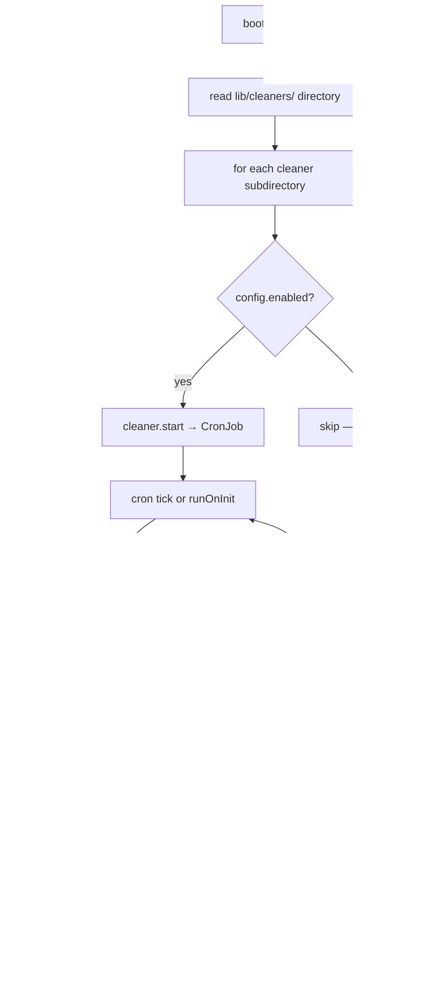

**Key behaviors:**
- Each cleaner is **dynamically discovered** from the `lib/cleaners/` directory at init time
- Cleaners are matched to their config by directory name → `config.cleanerSettings[name]`
- The `runOnInit: true` flag causes each cleaner to fire immediately at startup
- The `_working` guard prevents overlapping executions if a cron tick fires while a previous run is still active
- A global health check interval (`healthchecksInterval`, default 10s) polls all enabled cleaners

### 2.2 Inner Loop — BaseCleaner (`base-cleaner.js`)

Every cleaner extends `BaseCleaner` which implements the CronJob lifecycle:

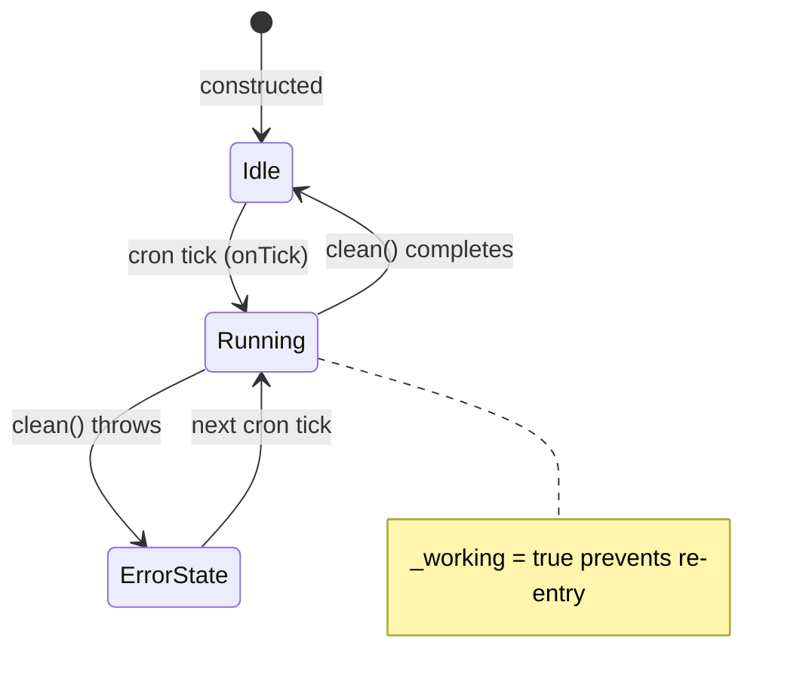

**Health determination:**
$$\text{isHealthy} = (\text{lastCronEndTime} - \text{lastCronStartTime}) < \text{healthCheckMaxDiff}$$

Where `healthCheckMaxDiff` defaults to 30,000ms. If a cleaner run exceeds this duration, the cleaner is marked unhealthy.

---

## 3. Decision Matrix — The 11 Cleaners

### 3.1 Cleaner Summary Table

| Cleaner | Cron Default | maxAge Default | Target Store | Action |
|---------|-------------|----------------|--------------|--------|
| **datasource** | `0 0 * * *` (daily midnight) | 0.166 min (~10s) | Local filesystem | Delete stale datasource directories |
| **debug** | `*/2 * * * *` (every 2 min) | 10 min | MongoDB (algorithms) | Delete expired debug algorithms |
| **etcd** | `0 1 * * *` (daily 1 AM) | 1440 min (24h) | Etcd (13 paths) | Delete old keys in batch |
| **gateway** | `*/2 * * * *` (every 2 min) | 0.166 min (~10s) | MongoDB (algorithms) | Delete expired gateway algorithms |
| **jobs** | `*/1 * * * *` (every 1 min) | completed: 1 min, failed: 1 min, pending: 1 min | Kubernetes | Delete completed/failed/pending K8s jobs |
| **output** | `*/2 * * * *` (every 2 min) | 10 min | MongoDB (algorithms) | Delete expired output algorithms |
| **pipelines** | `*/5 * * * *` (every 5 min) | N/A (TTL-based) | API Server (HTTP) | Stop expired pipelines |
| **redis** | `20 1 * * *` (daily 1:20 AM) | 7200 min (5 days) | Redis (3 key patterns) | Delete old graph keys |
| **status** | `*/5 * * * *` (every 5 min) | N/A | MongoDB (jobs) | Fix mismatched job statuses |
| **storage** | `0 2 * * *` (daily 2 AM) | results: 14400 min (10d), temp: 7200 min (5d), builds: 1440 min (24h) | S3/FS storage | Delete expired results, temp, indices, builds |
| **taskStatus** | `* * * * *` (every 1 min) | N/A | MongoDB + Etcd | Sync warning statuses from Etcd to DB graphs |

### 3.2 DataSource Cleaner (`cleaners/datasource/`)

**Purpose:** Remove stale datasource snapshot directories from local filesystem.

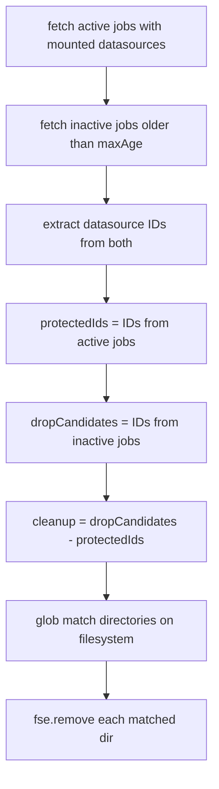

**Safety:** Active job datasources are explicitly protected — only datasources from jobs inactive longer than `maxAge` AND not referenced by any active job are deleted.

**Filesystem path:** `{baseDatasourcesDirectory}/{clusterName}-{dataSourcesInUse}/`

### 3.3 Debug / Gateway / Output Cleaners (Kind-Based)

These three cleaners share the same logic via `KindCleaner`:

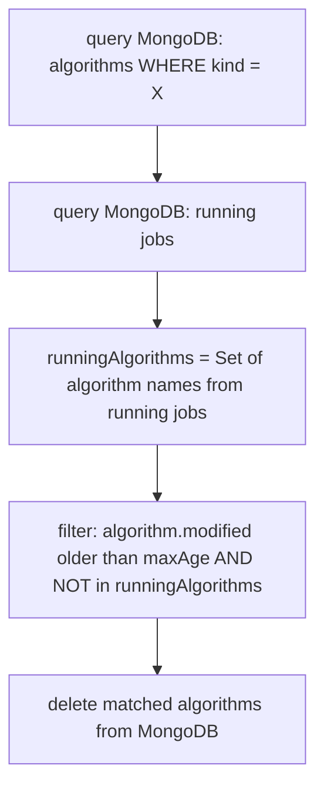

**Safety:** Algorithms referenced by any currently running job are never deleted, regardless of age.

**Deletion eligibility:**
$$\text{canDelete}(a) = \text{isTimeBefore}(a.\text{modified}, \text{maxAge}) \wedge a.\text{name} \notin \text{runningAlgorithms}$$

### 3.4 Etcd Cleaner (`cleaners/etcd/`)

**Purpose:** Purge stale keys from 13 Etcd paths.

**Targeted paths:**
```
/webhooks, /jobs/status, /jobs/results, /jobs/tasks,
/workers, /drivers, /executions, /events,
/algorithmQueues, /algorithms/queue, /algorithms/builds,
/algorithms/executions, /streaming/statistics
```

**Deletion logic per key:**

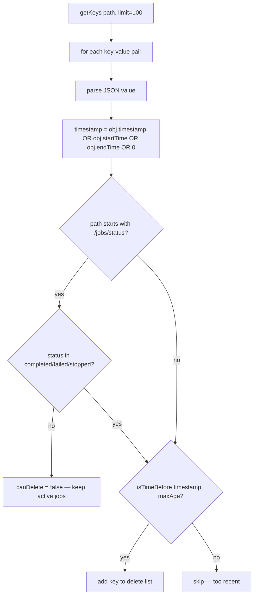

**Batch processing:** Each path is cleaned in a loop — fetch 100 keys, delete matches, repeat until no more matches. This prevents memory issues with large key sets.

**Safety:** Keys under `/jobs/status` are only deleted if the job is in a terminal state (`completed`, `failed`, `stopped`).

### 3.5 Jobs Cleaner (`cleaners/jobs/`)

**Purpose:** Delete stale Kubernetes jobs and pods (workers, pipeline-drivers, algorithm-builders).

**Pod normalization** (`normalize.js`):

For each K8s pod, the normalizer computes:
| Field | Logic |
|-------|-------|
| `completed` | All containers terminated with exitCode 0 |
| `failed` | Any container terminated with non-zero exit OR (some terminated + some not) |
| `waiting` | Any container in `ImagePullBackOff` or `ErrImagePull` |
| `unschedulable` | Any pod condition has `reason === 'Unschedulable'` |
| `requested` | Algorithm name exists in current algorithm requests (Etcd) |
| `age` | `moment().diff(startTime, 'minutes', true)` |

**Deletion criteria:**

| Category | Condition |
|----------|-----------|
| Completed | `completed === true AND age > completedMaxAge` |
| Failed | `failed === true AND age > failedMaxAge` |
| Waiting | `waiting === true AND age > failedMaxAge` |
| Pending | `unschedulable === true AND (age > pendingMaxAge OR !requested)` |

**Orphan job handling:** K8s jobs without a corresponding pod are also collected. These are matched by `job-name` label and included if their age exceeds thresholds.

**Deletion method:** Sequential `kubernetes.deleteJob()` calls (not parallel) with `propagationPolicy: Foreground`. If the job is 404, falls back to direct pod deletion.

### 3.6 Pipelines Cleaner (`cleaners/pipelines/`)

**Purpose:** Stop pipelines that have exceeded their TTL or active TTL.

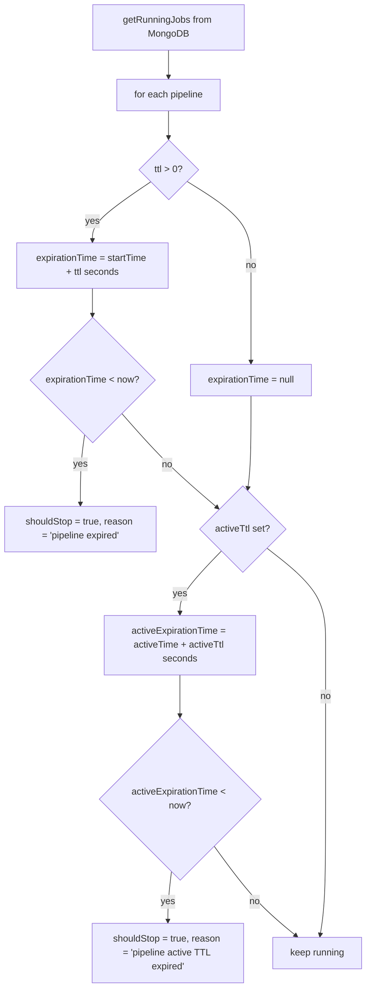

**Action:** Sends `POST /internal/v1/exec/stop` to the API server with `{ jobId, reason }`. Uses retry logic (5 attempts, 5s delay, HTTP/network error strategy).

**Two TTL types:**
1. **Pipeline TTL** (`pipeline.options.ttl`): Absolute time from `startTime`
2. **Active TTL** (`pipeline.options.activeTtl`): Time from `activeTime` (when pipeline became active)

### 3.7 Redis Cleaner (`cleaners/redis/`)

**Purpose:** Purge old pipeline graph keys from Redis.

**Targeted key patterns:**
```
/hkube:pipeline:graph/*
/pipeline-driver/graph/*
/pipeline-driver/nodes-graph/*
```

**Logic:** Uses `SCAN` stream to iterate keys. For each key, extracts timestamp from `value.graph.timestamp` or `value.timestamp`. Deletes if `isTimeBefore(timestamp, maxAge)`.

### 3.8 Status Cleaner (`cleaners/status/`)

**Purpose:** Fix MongoDB jobs where `result.status !== status.status` (status drift).

**This is not a deletion cleaner — it's a consistency repair cleaner.**

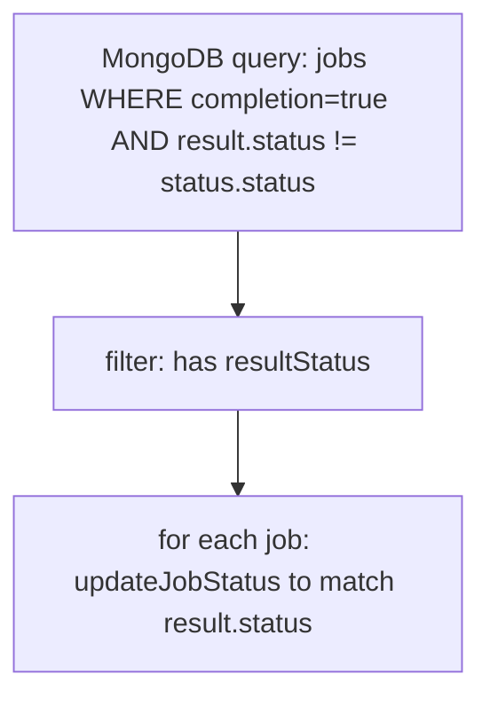

**Root cause:** A job may complete and have its `result.status` written, but the `status.status` field may not have been updated (crash, race condition). This cleaner heals that drift.

### 3.9 Storage Cleaner (`cleaners/storage/`)

**Purpose:** Delete expired objects from S3/FS storage across 4 categories.

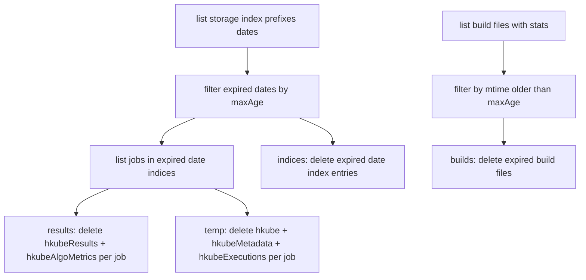

**Sub-cleaners:**

| Sub-cleaner | What it deletes | Storage paths |
|-------------|----------------|---------------|
| `results-cleaner` | Job results + algorithm metrics | `hkubeResults/{jobId}`, `hkubeAlgoMetrics/{jobId}` |
| `temp-cleaner` | Temporary data + metadata + executions | `hkube/{jobId}`, `hkubeMetadata/{jobId}`, `hkubeExecutions/{jobId}` |
| `indices-cleaner` | Date-based index entries | `hkube-index/{date}` |
| `builds-cleaner` | Algorithm build artifacts | `hkubeBuilds/{buildId}` |

**Index-based discovery:** The storage cleaner uses a date-based index (`hkube-index/YYYY-MM-DD/jobId`) to find jobs by age. The index dates themselves determine eligibility — all jobs under an expired date index are cleaned.

**Error handling:** Uses `Promise.allSettled` for deletion batches — individual failures are logged but don't abort the run.

### 3.10 TaskStatus Cleaner (`cleaners/taskStatus/`)

**Purpose:** Synchronize warning statuses from Etcd task records back to MongoDB graph nodes.

**This is a data synchronization cleaner, not a deletion cleaner.**

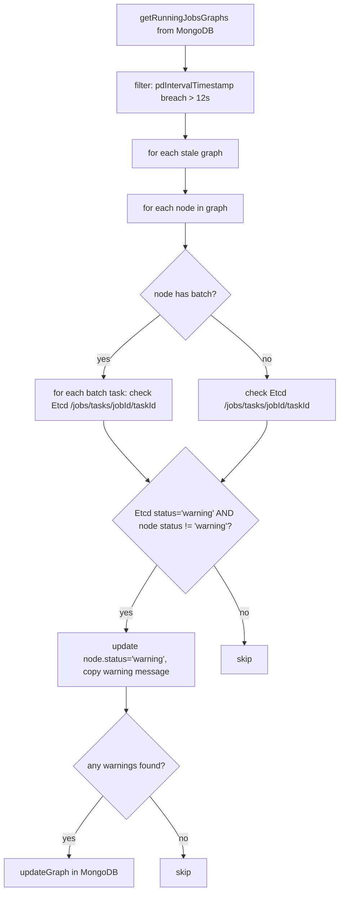

**Trigger condition:** Only processes graphs where `Date.now() - pdIntervalTimestamp >= pdIntervalBreach` (12,000ms). This means the pipeline-driver has not updated the graph recently, suggesting it may have missed propagating warnings.

---

## 4. State Sovereignty

### Owns (Read-Write)

| Data | Store | Access Pattern |
|------|-------|----------------|
| Cleaner run metadata | In-memory | `_lastCronStartTime`, `_lastCronEndTime`, `_totalCleaned`, `_working`, `_isHealthy` |

**The gc-service owns no persistent state.** All its operations are deletions or corrections on data owned by other services.

### Modifies (Write via cleanup)

| Data | Store | Operation |
|------|-------|-----------|
| Etcd keys (13 paths) | Etcd | Delete stale keys |
| Redis graph keys (3 patterns) | Redis | Delete stale keys |
| K8s jobs + pods | Kubernetes API | Delete completed/failed/pending jobs |
| Algorithm records (debug/gateway/output) | MongoDB | Delete expired algorithm records |
| Job status records | MongoDB | Update mismatched statuses |
| Job graph nodes | MongoDB | Update warning status |
| Pipeline results, temp, indices, builds | S3/FS | Delete expired storage objects |
| Datasource directories | Local filesystem | Delete stale directories |
| Running pipelines | API Server (HTTP) | Stop expired pipelines |

### Observes (Read-Only)

| Data | Source | Purpose |
|------|--------|---------|
| Running jobs | MongoDB (`jobs.search`) | Protect active resources from deletion |
| Algorithm requests | Etcd (`algorithms.requirements`) | Determine if pending pods are still requested |
| Pod/job status | Kubernetes API | Identify completed/failed/pending pods |
| Task status | Etcd (`/jobs/tasks/`) | Sync warnings to MongoDB |
| Pipeline TTL config | MongoDB (`pipeline.options.ttl/activeTtl`) | Determine expired pipelines |
| Storage indices | S3/FS (`hkubeIndex.listPrefixes`) | Discover jobs by age |
| Build file metadata | S3/FS (`hkubeBuilds.listWithStats`) | Filter builds by mtime |

---

## 5. Side Effects

| Side Effect | Target | Trigger |
|-------------|--------|---------|
| **Delete Etcd keys** | Etcd | Etcd cleaner cron |
| **Delete Redis keys** | Redis | Redis cleaner cron |
| **Delete K8s jobs/pods** | Kubernetes API | Jobs cleaner cron |
| **Delete algorithm records** | MongoDB | Debug/Gateway/Output cleaner crons |
| **Update job status** | MongoDB | Status cleaner cron |
| **Update graph warnings** | MongoDB | TaskStatus cleaner cron |
| **Delete storage objects** | S3/FS | Storage cleaner cron |
| **Remove filesystem directories** | Local FS | DataSource cleaner cron |
| **Stop pipelines** | API Server (HTTP POST) | Pipelines cleaner cron |
| **On-demand clean/dryrun** | All of the above | REST API call |

---

## 6. Configuration & Thresholds

| Parameter | Env Var | Default | Unit | Purpose |
|-----------|---------|---------|------|---------|
| `rest.port` | `REST_PORT` | `7000` | — | REST API port |
| `rest.prefix` | — | `api/v1/gc` | — | REST API prefix |
| `datasource.cron` | `DATASOURCE_CRON` | `0 0 * * *` | cron | Daily midnight |
| `datasource.maxAge` | `DATASOURCE_MAX_AGE` | `0.166` | minutes | ~10 seconds |
| `debug.cron` | `DEBUG_CRON` | `*/2 * * * *` | cron | Every 2 minutes |
| `debug.maxAge` | `DEBUG_MAX_AGE` | `10` | minutes | 10 minutes |
| `etcd.cron` | `ETCD_CRON` | `0 1 * * *` | cron | Daily 1 AM |
| `etcd.maxAge` | `ETCD_MAX_AGE` | `1440` | minutes | 24 hours |
| `gateway.cron` | `GATEWAY_CRON` | `*/2 * * * *` | cron | Every 2 minutes |
| `gateway.maxAge` | `GATEWAY_MAX_AGE` | `0.166` | minutes | ~10 seconds |
| `jobs.cron` | `JOBS_CRON` | `*/1 * * * *` | cron | Every 1 minute |
| `jobs.completedMaxAge` | `JOBS_COMPLETED_MAX_AGE` | `1` | minutes | 1 minute |
| `jobs.failedMaxAge` | `JOBS_FAILED_MAX_AGE` | `1` | minutes | 1 minute |
| `jobs.pendingMaxAge` | `JOBS_PENDING_MAX_AGE` | `1` | minutes | 1 minute |
| `output.cron` | `OUTPUT_CRON` | `*/2 * * * *` | cron | Every 2 minutes |
| `output.maxAge` | `OUTPUT_MAX_AGE` | `10` | minutes | 10 minutes |
| `pipelines.cron` | `PIPELINES_CRON` | `*/5 * * * *` | cron | Every 5 minutes |
| `redis.cron` | `REDIS_CRON` | `20 1 * * *` | cron | Daily 1:20 AM |
| `redis.maxAge` | `REDIS_MAX_AGE` | `7200` | minutes | 5 days |
| `status.cron` | `STATUS_CRON` | `*/5 * * * *` | cron | Every 5 minutes |
| `storage.cron` | `STORAGE_CRON` | `0 2 * * *` | cron | Daily 2 AM |
| `storage.results.maxAge` | `STORAGE_RESULT_MAX_AGE` | `14400` | minutes | 10 days |
| `storage.temp.maxAge` | `STORAGE_TEMP_MAX_AGE` | `7200` | minutes | 5 days |
| `storage.builds.maxAge` | `BUILDS_MAX_AGE` | `1440` | minutes | 24 hours |
| `taskStatus.cron` | `TASKSTATUS_CRON` | `* * * * *` | cron | Every 1 minute |
| `taskStatus.pdIntervalBreach` | — | `12000` | ms | Hardcoded — graph staleness threshold |
| `healthchecksInterval` | `HEALTH_CHECK_INTERVAL` | `10000` | ms | Health poll interval |
| `healthchecks.maxDiff` | `HEALTHCHECK_MAX_DIFF` | `30000` | ms | Max allowed cleaner run duration |

---

## 7. Dependency Map

### 7.1 Northbound (What triggers this service)

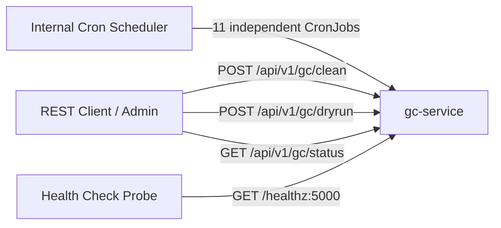

**The gc-service is entirely self-triggered.** No external service pushes work to it. The REST API provides operational override capability.

### 7.2 Southbound (What this service calls)

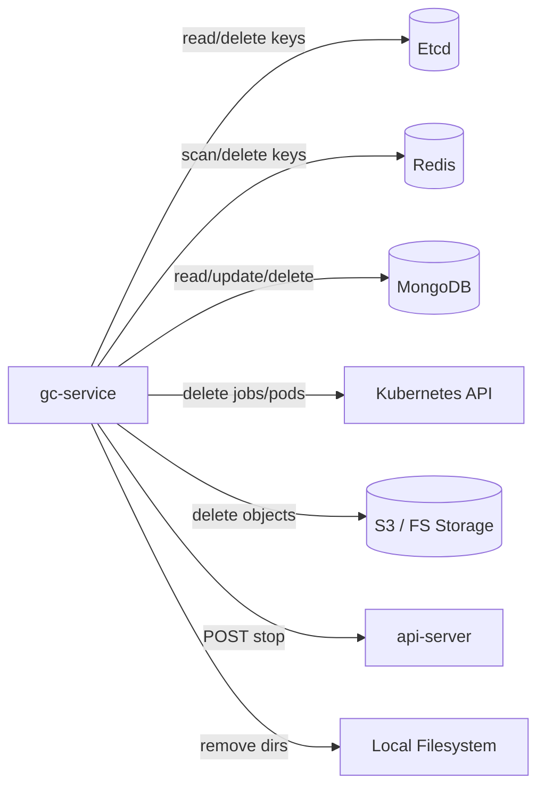

### 7.3 Internal Module Dependencies (`@hkube/*`)

| Package | Role |
|---------|------|
| `@hkube/config` | Configuration loading with environment overlay |
| `@hkube/consts` | Shared enums: `nodeKind` (Debug, Gateway, Output) |
| `@hkube/db` | MongoDB client — jobs CRUD, algorithm CRUD, graph updates |
| `@hkube/etcd` | Etcd client — key listing, deletion, algorithm requirements |
| `@hkube/kubernetes-client` | K8s API — job/pod listing and deletion |
| `@hkube/redis-utils` | Redis client factory with SCAN stream support |
| `@hkube/storage-manager` | S3/FS abstraction — index listing, results/temp/builds/metadata CRUD |
| `@hkube/rest-server` | Express-based REST framework |
| `@hkube/healthchecks` | Health endpoint registration |
| `@hkube/logger` | Structured logging with throttle support |

### 7.4 Third-Party Dependencies

| Package | Role |
|---------|------|
| `cron` | CronJob scheduling engine |
| `cronstrue` | Human-readable cron expression formatting |
| `moment` | Time arithmetic (age calculation, TTL comparison) |
| `fs-extra` | Filesystem operations (readdir, remove) |
| `glob` | Pattern-based file/directory discovery |
| `requestretry` | HTTP client with retry logic (API server calls) |

---

## 8. REST API

| Method | Path | Purpose | Body |
|--------|------|---------|------|
| `GET` | `/api/v1/gc/status` | Get all cleaner statuses | — |
| `GET` | `/api/v1/gc/status/:type` | Get single cleaner status | — |
| `POST` | `/api/v1/gc/clean` | Run all cleaners now | `{ maxAge? }` |
| `POST` | `/api/v1/gc/clean/:type` | Run single cleaner now | `{ maxAge? }` |
| `POST` | `/api/v1/gc/dryrun` | Dry-run all cleaners | `{ maxAge? }` |
| `POST` | `/api/v1/gc/dryrun/:type` | Dry-run single cleaner | `{ maxAge? }` |

**Status response shape:**
```json
{
  "name": "jobs",
  "enabled": true,
  "isHealthy": true,
  "error": null,
  "cron": "*/1 * * * *",
  "cronText": "Every minute (*/1 * * * *)",
  "cronNextTick": "2026-04-14T12:01:00.000Z",
  "maxAge": { "completedMaxAge": 1, "failedMaxAge": 1, "pendingMaxAge": 1 },
  "lastCronStartTime": "14/04/2026 12:00:00",
  "lastCronEndTime": "14/04/2026 12:00:02",
  "totalCleaned": 5
}
```

**Clean/dryrun response shape:**
```json
{
  "name": "jobs",
  "count": 5,
  "sample": [{ "podName": "worker-xyz", "jobName": "worker-xyz" }]
}
```

---

## 9. Logic Contract

### LC-1: Age-Based Deletion Safety
- All time-based cleaners use `isTimeBefore(timestamp, maxAgeMinutes)` which computes:
$$\text{canDelete} = \text{moment}(\text{timestamp}).\text{isBefore}\left(\text{now} - \text{maxAge} \text{ minutes}\right)$$
- The `maxAge` parameter can be overridden via REST API at call time, falling back to config values

### LC-2: Active Resource Protection
- **Kind cleaners** (debug/gateway/output): Never delete algorithms referenced by running jobs
- **DataSource cleaner**: Explicitly computes `protectedIds` from active jobs before deletion
- **Etcd cleaner**: Skips `/jobs/status` keys for non-terminal jobs (not in `completed/failed/stopped`)
- **Jobs cleaner**: Pending pods with active algorithm requests (`requested === true`) require age > `pendingMaxAge`

### LC-3: Idempotency & Re-Entrancy
- All cleaners are idempotent — running them multiple times produces the same result
- The `_working` flag prevents concurrent execution of the same cleaner
- Individual delete failures (via `Promise.allSettled`) are logged but don't abort the batch

### LC-4: Health Contract
- A cleaner is marked **unhealthy** when `lastCronEndTime - lastCronStartTime >= healthCheckMaxDiff`
- This detects stuck cleaners (e.g., blocked on I/O or deadlocked)
- `checkHealth()` returns `true` only if ALL enabled cleaners report healthy
- If a cleaner has never run (`lastCronStartTime === null`), health check is skipped

### LC-5: Pipeline TTL Enforcement
- Pipeline TTL: $\text{expired} = \text{moment}(\text{startTime}) + \text{ttl seconds} < \text{now}$
- Active TTL: $\text{expired} = \text{moment}(\text{activeTime}) + \text{activeTtl seconds} < \text{now}$
- Pipeline TTL is checked first; active TTL is only evaluated if pipeline TTL doesn't trigger

### LC-6: TaskStatus Sync Condition
- Only graphs where the pipeline-driver heartbeat (`pdIntervalTimestamp`) is stale by ≥ `pdIntervalBreach` (12s) are processed
- This ensures only graphs potentially missed by the pipeline-driver are corrected
- Warning status is only applied when Etcd says `'warning'` but MongoDB doesn't — preventing stale overwrites

### LC-7: Storage Index-Based Cleanup
- Job deletion eligibility is determined by the **index date**, not individual job timestamps
- All jobs under an expired date index are cleaned together
- This is a coarse-grained approach: if an index date is older than `maxAge`, all jobs within are candidates
