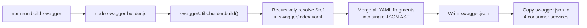
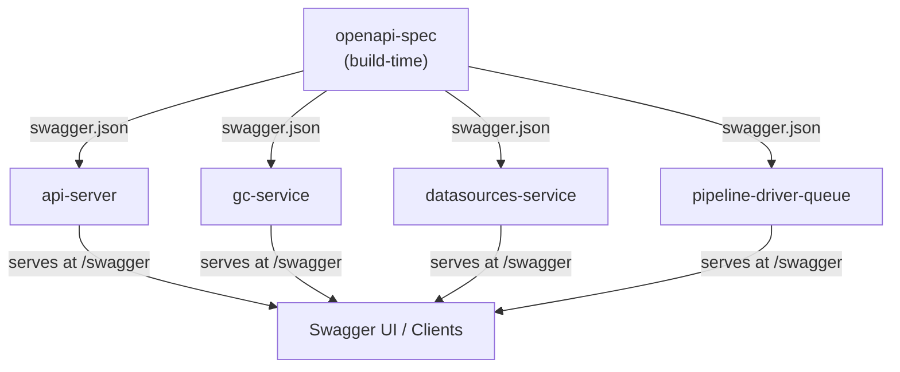

# openapi-spec — Reverse-Spec Discovery

> **Service:** `openapi-spec`  
> **Version:** 2.11.0  
> **Language:** Node.js (build-time only)  
> **Description:** Static OpenAPI 3.0 specification generator for the entire HKube REST API surface. This is NOT a runtime service — it is a build-time tool that compiles a tree of modular YAML fragments into a single `swagger.json`, then distributes that artifact to the consuming services that serve the API.

---

## 1. Structural Overview

```
openapi-spec/
├── swagger-builder.js              # Entry point — Node.js script, invokes @hkube/rest-server swaggerUtils
├── swagger.json                     # OUTPUT — compiled OpenAPI 3.0 spec (~66K lines)
├── package.json                     # Single dependency: @hkube/rest-server
└── swagger/
    ├── index.yaml                   # Root OpenAPI document — $ref assembly point
    ├── info/index.yaml              # API title, version (1.1.30), contact, license (MIT)
    ├── tags/index.yaml              # Tag definitions (Execution, Graph, Builds, Cron, DataSource, GC, etc.)
    ├── paths/
    │   ├── index.yaml               # Master route registry — maps URL patterns → per-route YAML files
    │   ├── exec/                    # /exec/* — pipeline execution (raw, stored, caching, stop, pause, resume, search)
    │   ├── pipelines/               # /pipelines/* — results, status, triggers
    │   ├── cron/                    # /cron/* — cron pipeline management
    │   ├── datasource/              # /datasource/* — data source CRUD, versions, snapshots, credentials
    │   ├── store/                   # /store/algorithms/*, /store/pipelines/* — algorithm & pipeline CRUD
    │   ├── builds/                  # /builds/* — build status, list, stop, rerun, webhooks (GitHub/GitLab)
    │   ├── versions/                # /versions/algorithms/*, /versions/pipelines/* — versioning & tagging
    │   ├── boards/                  # /boards/tensors/*, /boards/optunas/* — TensorBoard & OptunaBoard
    │   ├── webhooks/                # /webhooks/* — status & results webhooks per jobId
    │   ├── graph/                   # /graph/* — raw & parsed pipeline graph retrieval
    │   ├── storage/                 # /storage/* — S3/FS storage browsing, streaming, download
    │   ├── resources/               # /resources/* — unscheduled & ignored-unscheduled algorithms
    │   ├── kubernetes/              # /kubernetes/* — algorithm pods & jobs by name
    │   ├── preferred/               # /queue/preferred/* — preferred queue management
    │   ├── managed/                 # /queue/managed/* — managed queue listing & aggregation
    │   ├── queue/                   # /queue/count — queue count
    │   ├── gc/                      # /gc/* — garbage collector clean, dryrun, status
    │   ├── gateway/                 # /gateway/* — algorithm gateways
    │   ├── experiment/              # /experiment/* — experiment CRUD
    │   ├── readme/                  # /readme/* — algorithm & pipeline readmes
    │   ├── status/                  # /status/version — version info
    │   └── auth/                    # /auth/login — JWT authentication
    └── components/
        ├── schemas/
        │   ├── index.yaml           # Master schema registry (~90 schemas)
        │   ├── algorithms/          # algorithm, algorithmKind, algorithmImage, sideCars, volumes, kaiObject, etc.
        │   ├── pipelines/           # pipeline, pipelineNode, pipelineKind, nodeKind, priority, triggers, etc.
        │   ├── exec/                # caching, stopRequest, pauseRequest, searchJobs, rerun, auditTrail, etc.
        │   ├── datasource/          # DataSource, DataSourceWithMeta, Snapshot, Credentials, etc.
        │   ├── common/              # defaultResponse, error, jobId, tag, queryList, queryRange
        │   ├── boards/              # createBoardRequest, createOptunaboardRequest, metrics
        │   ├── builds/              # buildId, buildIdObject
        │   ├── cron/                # cronPattern, cronRequest
        │   ├── experiment/          # experiment, experimentName
        │   ├── gateway/             # gateway, gatewayName
        │   ├── gc/                  # clean, cleanResponse, statusResponse
        │   ├── graph/               # graph, graphEdges, graphNodes, graphQuery, graphPreview
        │   ├── hyperparamsTuner/    # hyperparamsTuner, hyperParams, sampler
        │   ├── output/              # output
        │   ├── preferred/           # addToPreferredRequest, removeFromPreferredRequest
        │   ├── queue/               # queue
        │   ├── resources/           # complexResourceDescriptor, nodes
        │   ├── security/            # (securitySchemes: bearerAuth JWT)
        │   ├── versions/            # versionAlias
        │   ├── auth/                # loginRequest
        │   └── webhooks/            # webhookResult, webhooks, githubWebhook, gitlabWebhook
        └── responses/
            └── index.yaml           # Response definitions (auth, boards, builds, exec, etc.)
```

---

## 2. The Control Loop

This service has **no runtime control loop**. It is a **pure build-time code generator** with a single synchronous pipeline:



### Build Script (`package.json → scripts.build-swagger`)

```bash
node ./swagger-builder.js && echo \
  ../api-server/api/rest-api \
  ../gc-service/api/rest-api \
  ../datasources-service/api/rest-api \
  ../pipeline-driver-queue/api/rest-api \
| xargs -n 1 cp swagger.json
```

**This is the entire "logic" of the service.** Two phases:
1. **Compile:** Invoke `@hkube/rest-server`'s `swaggerUtils.builder.build()` with `src=./swagger/` and `dest=./swagger.json`
2. **Distribute:** Copy the output to 4 consumer service directories via `xargs cp`

---

## 3. Decision Matrix

There is no runtime decision logic. The "decisions" are **structural** — the OpenAPI spec definition itself:

### 3.1 API Surface Coverage

| Domain | Route Prefix | Path Count | Tag |
|--------|-------------|------------|-----|
| Pipeline Execution | `/exec/*` | 14 | Execution |
| Algorithm Store | `/store/algorithms/*` | 4 | StoreAlgorithms |
| Pipeline Store | `/store/pipelines/*` | 4 | StorePipelines |
| Algorithm Versions | `/versions/algorithms/*` | 5 | Algorithm Versions |
| Pipeline Versions | `/versions/pipelines/*` | 4 | Pipeline Versions |
| DataSources | `/datasource/*` | 11 | DataSource |
| Builds | `/builds/*` | 6 | Builds |
| Boards | `/boards/*` | 6 | — |
| Storage | `/storage/*` | 8 | Storage |
| Cron | `/cron/*` | 5 | Cron |
| Graph | `/graph/*` | 2 | Graph |
| GC | `/gc/*` | 6 | GC |
| Resources | `/resources/*` | 4 | — |
| Queue | `/queue/*` | 6 | — |
| Webhooks | `/webhooks/*` | 3 | Webhooks |
| Kubernetes | `/kubernetes/*` | 2 | — |
| Gateway | `/gateway/*` | 2 | — |
| Experiment | `/experiment/*` | 2 | — |
| Readme | `/readme/*` | 2 | — |
| Auth | `/auth/login` | 1 | — |
| Status | `/status/version` | 1 | — |

### 3.2 Security Model

```yaml
securitySchemes:
  bearerAuth:
    type: http
    scheme: bearer
    bearerFormat: JWT

security:        # Global — applied to ALL endpoints
  - bearerAuth: []
  - {}           # Also allows unauthenticated access (optional auth)
```

The global security array includes both `bearerAuth` and `{}` (empty), meaning **authentication is optional** at the spec level. Enforcement is delegated to the runtime services.

### 3.3 Spec Authoring Conventions

- **One file per route** in `paths/` (e.g., `exec/raw.yaml` defines `POST /exec/raw`)
- **One file per schema** in `components/schemas/` — referenced via `$ref: "#/components/schemas/<name>"`
- **Shared responses** in `components/responses/` (e.g., `errorBadRequest`, `unauthorized`, `default`)
- **$ref assembly** — `index.yaml` at each level acts as a manifest, the build tool recursively resolves all `$ref` pointers into a flat JSON output

---

## 4. State Sovereignty

### Owns (Source of Truth)

| Data | Format | Description |
|------|--------|-------------|
| HKube REST API contract | YAML fragments → JSON | The canonical definition of every endpoint, schema, response, and security scheme |
| API version | `info.version: 1.1.30` | Independent of service versions |

### Observes

Nothing. This is a standalone build artifact with no runtime state or external data dependencies.

---

## 5. Side Effects

| Side Effect | Target | Trigger |
|-------------|--------|---------|
| **Write `swagger.json`** | `openapi-spec/swagger.json` | Build script execution |
| **Copy `swagger.json`** | `api-server/api/rest-api/swagger.json` | Build script (post-compile) |
| **Copy `swagger.json`** | `gc-service/api/rest-api/swagger.json` | Build script (post-compile) |
| **Copy `swagger.json`** | `datasources-service/api/rest-api/swagger.json` | Build script (post-compile) |
| **Copy `swagger.json`** | `pipeline-driver-queue/api/rest-api/swagger.json` | Build script (post-compile) |

---

## 6. Dependency Map

### 6.1 Build-Time Dependencies

| Package | Role |
|---------|------|
| `@hkube/rest-server` | Provides `swaggerUtils.builder.build()` — the YAML-to-JSON OpenAPI compiler |

### 6.2 Consumers (Northbound — Who uses the output)



Each consumer loads `swagger.json` at boot via `fse.readJSON('api/rest-api/swagger.json')` and registers it with `@hkube/rest-server` to serve Swagger UI and validate requests.

### 6.3 Southbound

None. This service calls no external APIs, databases, or infrastructure.

---

## 7. Configuration

| Parameter | Value | Source |
|-----------|-------|--------|
| Source directory | `./swagger/` | Hardcoded in `swagger-builder.js` |
| Output file | `./swagger.json` | Hardcoded in `swagger-builder.js` |
| Distribution targets | 4 service paths | Hardcoded in `package.json` `build-swagger` script |
| OpenAPI version | `3.0.0` | `swagger/index.yaml` |
| API info version | `1.1.30` | `swagger/info/index.yaml` |

There are no environment variables, no runtime config, and no thresholds.

---

## 8. Logic Contract

### LC-1: Single Source of Truth
- All HKube REST API endpoints MUST be defined in `openapi-spec/swagger/` YAML fragments
- The generated `swagger.json` is the authoritative contract — runtime services MUST NOT define additional undocumented endpoints

### LC-2: Build Idempotency
- Running `npm run build-swagger` with identical YAML input MUST produce identical `swagger.json` output
- The build is a pure function: `f(YAML fragments) → JSON`

### LC-3: Distribution Completeness
- After build, `swagger.json` MUST exist in all 4 consumer directories
- Adding a new consuming service requires updating the `build-swagger` script's `echo ... | xargs` list

### LC-4: Schema Reusability
- Schemas in `components/schemas/` are shared across multiple path definitions via `$ref`
- Breaking schema changes propagate to all referencing endpoints — no schema duplication

### LC-5: Ref Resolution Integrity
- Every `$ref` in the YAML tree MUST resolve to an existing file
- The `swaggerUtils.builder.build()` will fail on broken references — no partial output

---

## 9. Key Observations & Risks

1. **Manual distribution** — The copy step in `build-swagger` is a static list. If a new service starts consuming the spec, the developer must remember to add it. There is no dynamic discovery.

2. **Version drift** — The `info.version` (1.1.30) is independent of the monorepo service versions (2.11.0). These can diverge silently.

3. **No validation step** — The build script compiles but does not validate the output against the OpenAPI 3.0 schema. A structurally valid YAML tree that produces semantically invalid OpenAPI would not be caught.

4. **Optional auth by default** — The global security array includes `{}`, making authentication optional at the spec level. This is intentional for public read endpoints but means security enforcement is entirely runtime-side.

5. **Large output** — At ~66K lines, the generated `swagger.json` is monolithic. Consumer services load the entire spec even if they only serve a subset of routes.
