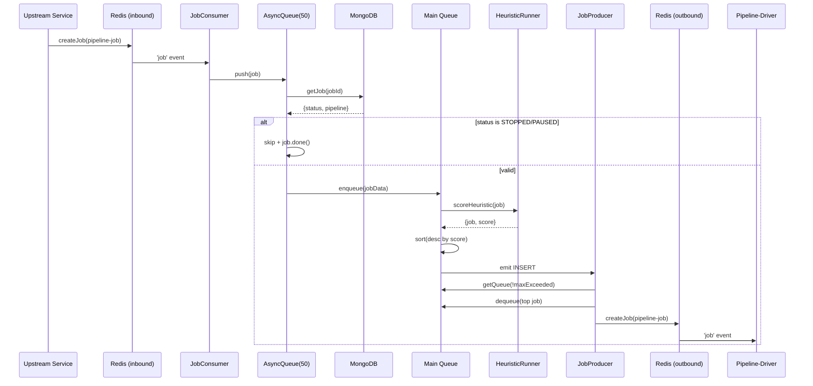
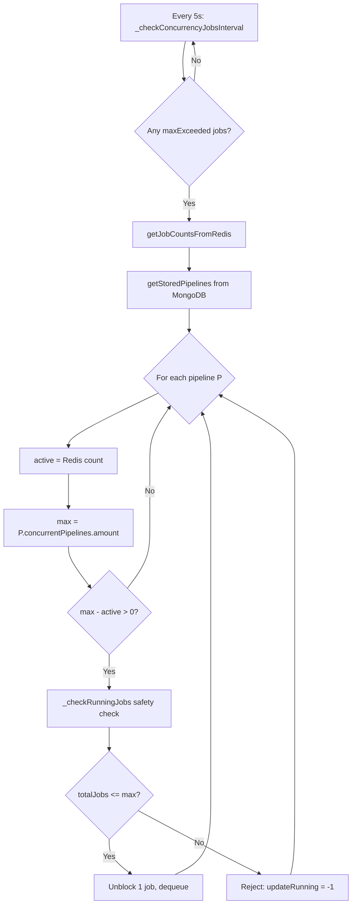

# pipeline-driver-queue — Reverse-Spec Discovery

> **Service Role:** Priority-aware scheduling queue that sits between pipeline submission and pipeline execution. It accepts pipeline jobs from an upstream Redis queue, scores them via configurable heuristics, enforces pipeline-level concurrency limits, and dispatches eligible jobs to downstream pipeline-drivers via a second Redis queue.

---

## 1. Control Loop

The service has **no single reconciliation loop**. Instead, it operates via three cooperating timer-driven loops plus two event-driven triggers:

| Loop / Trigger | Interval | Owner | Purpose |
|---|---|---|---|
| `_checkQueue` | 500 ms | `producer.js` | Poll both queues; if an eligible (non-maxExceeded) job exists and Redis has 0 pending, create a Redis job. Self-disables after the first dequeue (`_firstJobDequeue`). |
| `_updateState` | 5 000 ms | `producer.js` | Persist both queues (snapshot → S3/FS, scoring → ETCD). |
| `_checkConcurrencyJobsInterval` | 5 000 ms | `concurrencyHandler.js` | Re-evaluate concurrency limits per-pipeline; unblock `maxExceeded` jobs when slots open. |
| **INSERT event** | — | `queue.js → producer.js` | On every `enqueue`, if the downstream consumer is already active, immediately attempt a dequeue. |
| **ACTIVE / COMPLETED / FAILED** | — | Redis `producer-consumer` events | ACTIVE marks consumer ready and triggers dequeue. COMPLETED / FAILED trigger concurrency re-check. |

### Lifecycle

```
bootstrap.init()
  ├─ dataStore.init()          ← ETCD watch + MongoDB connect
  ├─ metrics.init()            ← Prometheus /metrics endpoint
  ├─ queueRunner.init()
  │   ├─ HeuristicRunner.init(weights)
  │   ├─ Queue('main', heuristic)
  │   ├─ Queue('preferred', identity)
  │   └─ persistencyLoad() × 2  ← restore from S3/FS
  ├─ consumer.init()           ← register Redis consumer
  ├─ producer.init()           ← start 3 timer loops
  └─ REST API server on :7100
```

---

## 2. Decision Matrix

### 2a. Job Scoring (Heuristic Engine)

Each job in the **main queue** is scored as:

$$\text{score} = \sum_{h \in \mathcal{H}} h(job)$$

Where the two built-in heuristics $\mathcal{H}$ are:

| Heuristic | Formula | Default Weight | Constants |
|---|---|---|---|
| **PRIORITY** | $w_p \cdot \dfrac{(\text{maxPriority} + 1) - \text{job.priority}}{\text{maxPriority}}$ | 0.5 | `maxPriority = 5` |
| **ENTRANCE_TIME** | $w_t \cdot \dfrac{\text{now} - \text{job.entranceTime}}{\text{maxTime}}$ (floor: 0.0001) | 0.5 | `maxTime = 3 600 000 ms` (1 h) |

**Sorting:** `orderby(queue, 'score', 'desc')` — highest score dequeues first.

**Anti-starvation property:** As `entranceTime` grows, the time component dominates, ensuring old low-priority jobs eventually surpass younger high-priority ones (crossover at ~48 min for priority 5 vs priority 1).

The **preferred queue** uses an **identity** score function (manual ordering preserved).

### 2b. Dequeue Eligibility

A job is eligible for dispatch if **all** of:

1. `job.maxExceeded === false` (or undefined)
2. Redis pending count === 0 (checked by `_checkQueue` on cold start) **or** the downstream consumer signaled ACTIVE (event-driven hot path)

Queue scan order: **preferred first**, then **main**.

### 2c. Concurrency Gating

```
For each pipeline P with maxExceeded jobs in queue:
  activeP   = count of P's jobs in Redis (running)
  maxP      = P.options.concurrentPipelines.amount (from MongoDB)
  available = maxP - activeP
  if available > 0:
    unblock 1 job (set updateRunning=1, trigger dequeue)
```

Before unblocking, a safety check runs:

```
totalJobs = active + waitingInMain + waitingInPreferred
if totalJobs > max → reject (set updateRunning = -1)
```

Only pipelines with `rejectOnFailure === false` are eligible for concurrency gating.

---

## 3. State Sovereignty

### Owned State

| Data | Location | Description |
|---|---|---|
| In-memory job queues (×2) | Process heap | Sorted arrays of job objects. Source of truth during runtime. |
| Queue snapshots | S3 / Filesystem (`storageManager.hkubePersistency`) | Linked-list serialization for crash recovery. Written every 5 s. |
| Scoring data | ETCD (`storeQueue`) | Top-N job scores + maxExceeded flags. For monitoring only. |
| `_activeState` | Process heap (concurrencyHandler) | Per-pipeline `{count, max}` tracking running jobs. |
| `_isConsumerActive` | Process heap (producer) | Boolean: is the downstream consumer ready? |
| `_firstJobDequeue` | Process heap (producer) | Boolean: has the cold-start poll succeeded? |

### Observed State (Read-Only)

| Data | Source | Method |
|---|---|---|
| Pipeline definitions | MongoDB | `dataStore.getJob()`, `dataStore.getStoredPipelines()` |
| Job statuses (STOPPED/PAUSED) | ETCD watch | `dataStore.on('job-STOPPED')` / `dataStore.on('job-PAUSED')` |
| Active job counts | Redis | `_redisQueue.getJobs()` → `countBy('pipeline')` |
| Incoming pipeline jobs | Redis consumer queue | `@hkube/producer-consumer` Consumer |

---

## 4. Side Effects

| Side Effect | Target | Trigger |
|---|---|---|
| **Create Redis job** | Redis `pipeline-driver:pipeline-job` | `producer.createJob()` — dispatches to pipeline-driver |
| **Mark pipeline FAILED** | ETCD + MongoDB | `consumer._handleFailedJob()` — on "stalled > limit" |
| **Persist queue snapshot** | S3 / FS | `_updateState()` every 5 s; `gracefulShutdown` |
| **Write scoring to ETCD** | ETCD | Part of `persistency.store()` |
| **Emit Prometheus metrics** | `/metrics` HTTP endpoint | On every enqueue/dequeue |

---

## 5. Configuration Reference

### Intervals

| Key | Default | Env Override | Purpose |
|---|---|---|---|
| `checkQueueInterval` | 500 ms | — | Cold-start poll frequency |
| `checkConcurrencyQueueInterval` | 5 000 ms | — | Concurrency re-check frequency |
| `updateStateInterval` | 5 000 ms | — | Queue persistence frequency |

### Heuristic Weights

| Key | Default |
|---|---|
| `heuristicsWeights.PRIORITY` | 0.5 |
| `heuristicsWeights.ENTRANCE_TIME` | 0.5 |

### Consumer

| Key | Default | Purpose |
|---|---|---|
| `consumer.prefix` | `pipeline-driver-queue` | Redis key prefix (inbound) |
| `consumer.jobType` | `pipeline-job` | — |
| `consumer.concurrency` | 15 000 | Redis consumer concurrency ceiling |
| `consumer.incomingJobQueueConcurrency` | 50 | In-process async queue concurrency |
| `consumer.maxStalledCount` | 100 | Stall limit before marking FAILED |

### Producer

| Key | Default | Purpose |
|---|---|---|
| `producer.prefix` | `pipeline-driver` | Redis key prefix (outbound) |
| `producer.jobType` | `pipeline-job` | — |
| `producer.enableCheckStalledJobs` | false | — |

### Infrastructure

| Key | Default Env Vars |
|---|---|
| Redis host/port | `REDIS_SERVICE_HOST` / `REDIS_SERVICE_PORT` (default `localhost:6379`) |
| ETCD host/port | `ETCD_CLIENT_SERVICE_HOST` / `ETCD_CLIENT_SERVICE_PORT` (default `127.0.0.1:4001`) |
| MongoDB | `MONGODB_SERVICE_HOST` / `MONGODB_SERVICE_PORT` / `MONGODB_DB_NAME` |
| Storage backend | `DEFAULT_STORAGE` (`s3` or `fs`) |
| REST port | `REST_PORT` (default `7100`) |
| Metrics port | `METRICS_PORT` |

### Heuristic Constants (hardcoded)

| Constant | Value | Location |
|---|---|---|
| `maxPriority` | 5 | `lib/heuristic/priority.js` |
| `maxTime` | 3 600 000 ms (1 h) | `lib/heuristic/entrance-time.js` |

---

## 6. Dependency Map

### Southbound (Called by this service)

```
┌────────────────────────────┐
│   pipeline-driver-queue    │
└────────────┬───────────────┘
             │
     ┌───────┼────────┬──────────────┐
     ▼       ▼        ▼              ▼
  Redis    ETCD    MongoDB    S3/Filesystem
  (R/W)    (R/W)    (Read)    (Write snapshots)
```

| System | Library | Operations |
|---|---|---|
| **Redis** | `@hkube/producer-consumer` | Consume inbound jobs (`pipeline-driver-queue:pipeline-job`); produce outbound jobs (`pipeline-driver:pipeline-job`); query active/waiting counts |
| **ETCD** | `@hkube/etcd` | Watch job status changes; store scoring data; read/write job status+results on failure |
| **MongoDB** | `@hkube/db` | Read pipeline definitions (`getJob`, `getStoredPipelines`); write job status/results on stall-failure |
| **S3/FS** | `@hkube/storage-manager` | Put/get queue snapshots under `pipelineDriver/{main,preferred}` |

### Northbound (Triggers this service)

| Trigger | Mechanism |
|---|---|
| Upstream pipeline submission | Redis job arrives on `pipeline-driver-queue:pipeline-job` |
| Job status change (STOP/PAUSE) | ETCD watch → `dataStore.emit('job-STOPPED'/'job-PAUSED')` |
| REST API queries | HTTP on `:7100` — read-only queue inspection + preferred queue management |

---

## 7. REST API Contract

**Base:** `http://:{REST_PORT}/api/v1/queue`

| Method | Path | Purpose |
|---|---|---|
| GET | `/count` | `{managed: N, preferred: M}` |
| GET | `/managed/?pageSize=&firstJobId=&lastJobId=&pipelineName=&tag=&lastJobs=` | Paginated main queue |
| GET | `/managed/aggregation/pipeline` | Group main queue by pipeline name |
| GET | `/managed/aggregation/tag` | Group main queue by tag |
| GET | `/preferred/` | List preferred queue |
| GET | `/preferred/aggregation/pipeline` | Group preferred by pipeline name |
| GET | `/preferred/aggregation/tag` | Group preferred by tag |
| POST | `/preferred/` | Move jobs from main → preferred at position (`first`/`last`/`before`/`after` + query) |
| POST | `/preferred/deletes/` | Move jobs from preferred → main (re-scored) |

---

## 8. Data Flow Diagrams

### 8a. Job Ingestion → Dispatch



### 8b. Concurrency Gating



---

## 9. Prometheus Metrics

| Metric Name | Type | Labels | Description |
|---|---|---|---|
| `hkube_pipeline_driver_queue_counter` | Counter | `pipeline_name` | Total jobs ever enqueued |
| `hkube_pipeline_driver_queue_amount` | Gauge | `pipeline_name` | Current queue depth per pipeline |
| `hkube_pipeline_driver_queue_time_in_queue` | Histogram | `pipeline_name` | Wall-clock time from enqueue to dequeue |
| `hkube_pipeline_driver_queue_total_score` | Histogram | `pipeline_name` | Composite heuristic score |
| `hkube_pipeline_driver_queue_priority_score` | Histogram | `pipeline_name` | Priority component of score |
| `hkube_pipeline_driver_queue_time_score` | Histogram | `pipeline_name` | Entrance-time component of score |

---

## 10. Graceful Shutdown Sequence

```
SIGINT / SIGTERM / uncaughtException / unhandledRejection
  │
  ├─ consumer.shutdown()      ← pause Redis consumer
  ├─ producer.shutdown()      ← set _isActive=false (stop timers)
  ├─ queue.persistenceStore() ← snapshot main queue
  ├─ preferredQueue.persistenceStore() ← snapshot preferred queue
  └─ process.exit()
```

---

## 11. Recovery Protocol (Startup)

For each queue (`preferred`, then `main`):

1. Fetch snapshot from S3/FS.
2. Reconstruct ordered list via linked-list `next` pointers.
3. For each job:
   - Fetch pipeline from MongoDB.
   - **Skip** if pipeline not found.
   - **Skip** if status is `STOPPED` or `PAUSED`.
   - Otherwise re-enqueue.
4. Recalculate heuristics on the full queue.

---

## 12. Key Architectural Observations

1. **Dual-queue with priority override.** The preferred queue is scanned first on every dequeue cycle, enabling manual priority escalation via the REST API without altering heuristic weights.

2. **Anti-starvation by design.** The entrance-time heuristic grows linearly and unbounded (score can exceed 1.0 after 2 hours), guaranteeing that any low-priority job will eventually outrank a freshly-submitted high-priority job.

3. **Cold-start vs hot-path.** `_checkQueue` runs a polling loop only until the first dequeue. After that, it switches to a purely event-driven model: INSERT → dequeue, ACTIVE → dequeue, COMPLETED/FAILED → concurrency check → dequeue.

4. **Single-job dispatch.** Only one job is dispatched per event cycle. This is deliberate: the downstream `pipeline-driver` acknowledges (ACTIVE) before the next job is sent, creating natural backpressure.

5. **Concurrency handler unblocks one-at-a-time.** Even if 10 slots open, only 1 `maxExceeded` job is unblocked per interval per pipeline. This prevents burst overload.

6. **Snapshot persistence uses linked-list encoding.** Each job stores a `next` pointer (the jobId of the previous job, or `'FirstInLine'`), preserving queue ordering across S3/FS serialization without relying on array indices.

7. **Singleton module pattern.** `queue-runner`, `producer`, `consumer`, and `data-store` are all exported as singleton instances (`module.exports = new Class()`), creating implicit shared state across the process.
