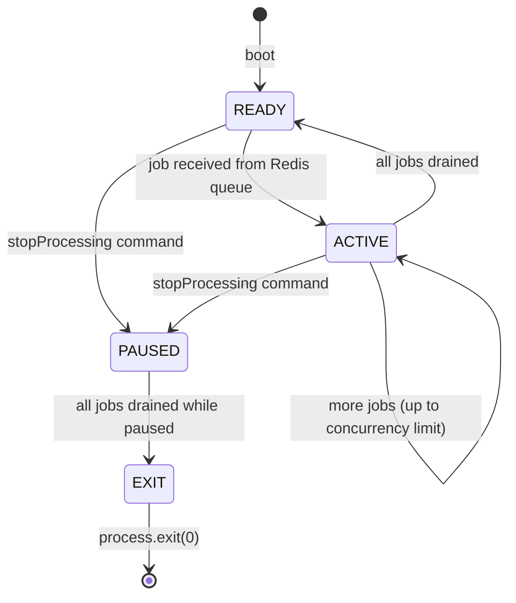
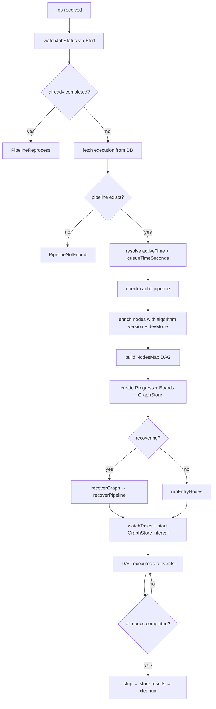
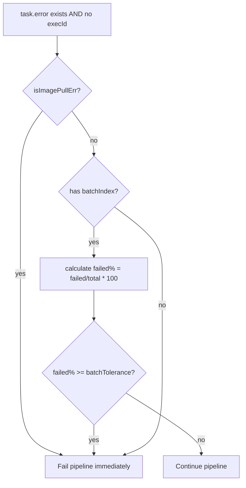
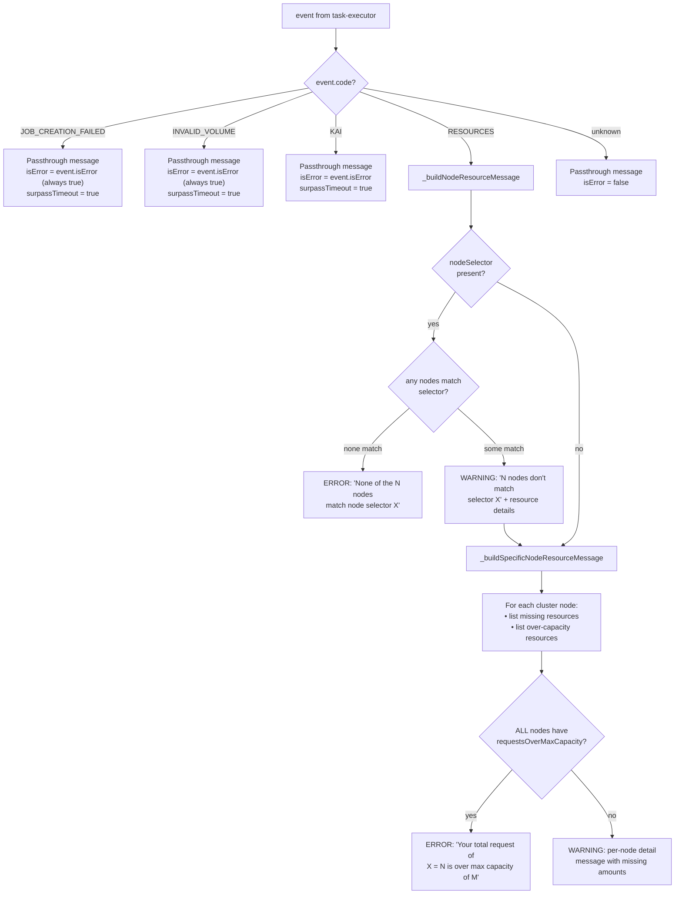
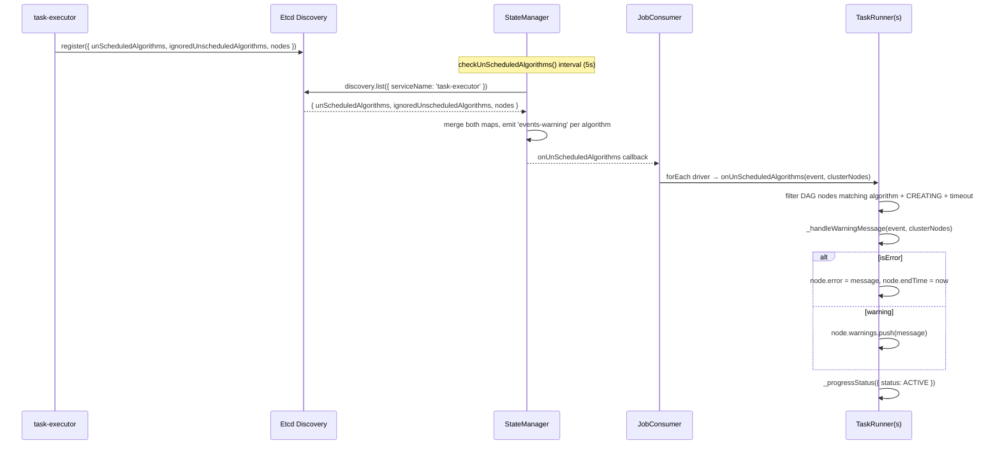
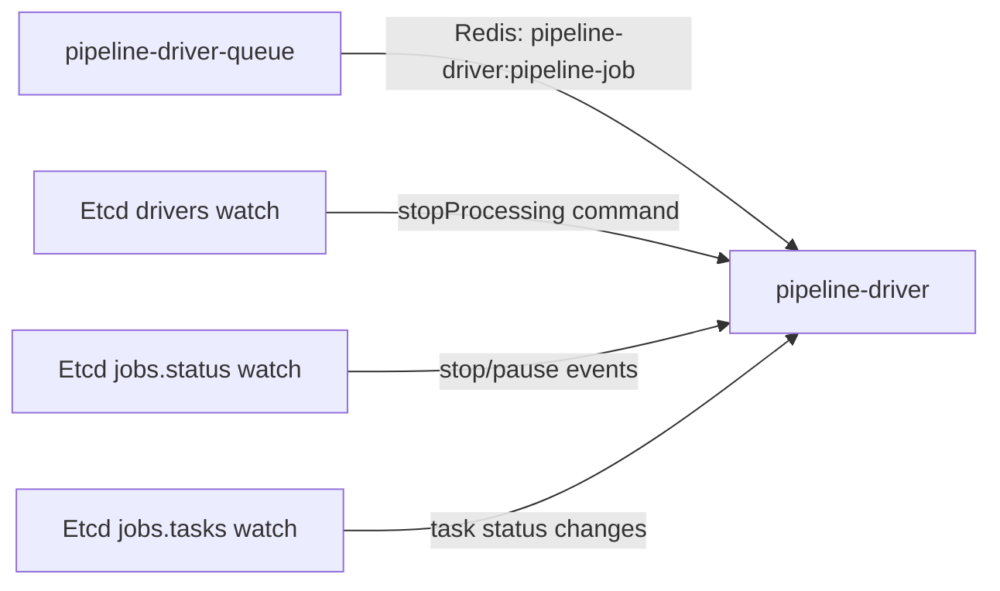
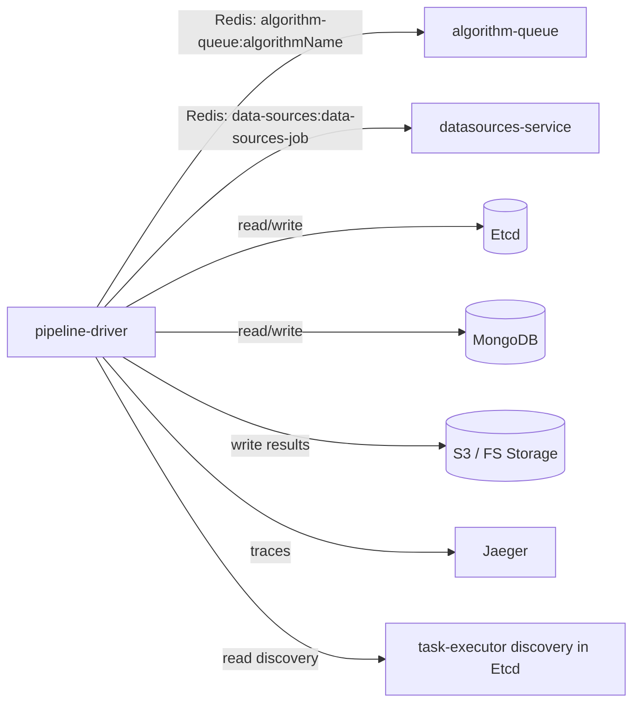
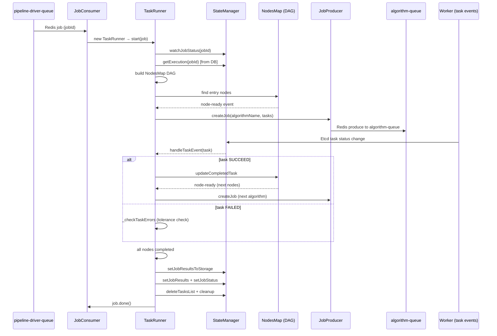

# pipeline-driver — Reverse-Spec Discovery

> **Service:** `pipeline-driver`  
> **Version:** 2.11.1  
> **Language:** Node.js  
> **Description:** DAG-based pipeline execution orchestrator. Receives pipeline jobs from a Redis queue, builds an in-memory DAG of algorithm nodes, dispatches tasks to algorithm-queues, tracks task lifecycle events, computes progress, persists graph state, and terminates pipelines upon completion/failure.

---

## 1. Structural Overview

```
pipeline-driver/
├── app.js                          # Entry — calls bootstrap.init()
├── bootstrap.js                    # Init sequence: Redis monitor → metrics → storage → modules
├── config/main/config.base.js      # All configuration & env-var mapping
├── lib/
│   ├── consumer/jobs-consumer.js   # Redis consumer — receives pipeline-jobs, spawns TaskRunners
│   ├── producer/jobs-producer.js   # Redis producer — publishes algorithm tasks to algorithm-queue
│   ├── tasks/task-runner.js        # **CORE ENGINE** — one instance per active pipeline job
│   ├── tasks/cache-pipeline.js     # Cache pipeline resolution (reuse results from prior job)
│   ├── state/state-manager.js      # Etcd + event bus (watches, discovery, job status)
│   ├── state/db.js                 # MongoDB wrapper (jobs, algorithms, status persistence)
│   ├── state/DriverStates.js       # Enum: READY|PENDING|ACTIVE|PAUSED|RESUMED|FAILED|COMPLETED|STOPPED|EXIT
│   ├── datastore/graph-store.js    # Periodic DAG graph persistence (4s interval)
│   ├── progress/nodes-progress.js  # Progress calculation (batch % or streaming median throughput)
│   ├── boards/boards.js            # TensorBoard path detection & pipeline type update
│   ├── metrics/pipeline-metrics.js # Prometheus metrics registration & lifecycle
│   ├── helpers/discovery.js        # Deduplicates storage discovery addresses by host:port
│   ├── helpers/group-by.js         # Status grouping utilities for progress text
│   ├── consts/                     # componentNames, commands, metricsNames
│   └── errors/                     # PipelineNotFound, PipelineReprocess
└── tests/
```

---

## 2. The Control Loop

The service has **two nested control loops**:

### 2.1 Outer Loop — Job Consumer (`jobs-consumer.js`)



**Trigger:** Redis queue `pipeline-driver:pipeline-job` via `@hkube/producer-consumer`.  
**Discovery heartbeat:** `setInterval(discoveryInterval)` reports `{idle, paused, status, jobs[], max, capacity}` to Etcd.

**Status Resolution Logic:**
| paused | idle | → status |
|--------|------|----------|
| true   | true | EXIT     |
| false  | false| ACTIVE   |
| true   | false| PAUSED   |
| false  | true | READY    |

### 2.2 Inner Loop — TaskRunner (`task-runner.js`)

One `TaskRunner` instance per active `jobId`. This is the **core DAG execution engine**.



---

## 3. Decision Matrix — Task Event Handling

`handleTaskEvent(task)` is the central event dispatcher. All task state transitions flow through it:

| `task.status`   | Action                                                           |
|-----------------|------------------------------------------------------------------|
| `STALLED`       | Rewrite `error` → `warning`, update state only                  |
| `CRASHED`       | Set `endTime`, mark as `FAILED`, call `_onTaskError`            |
| `WARNING`       | Update state only                                                |
| `CREATING`      | Update state only if `execId` present (algorithm execution)      |
| `ACTIVE`        | Update state                                                     |
| `STORING`       | Update state + `_onStoring` (mark node completed in DAG)         |
| `FAILED`        | Update state + `_onTaskError`                                    |
| `SUCCEED`       | Update state + `_onTaskComplete`                                 |
| `STOPPED`       | Update state only                                                |
| `THROUGHPUT`    | `_onStreamingMetrics` (streaming edge metrics aggregation)       |

### 3.1 Error Decision Tree (`_checkTaskErrors`)



**Key formula:**  
$$\text{failPercent} = \left\lfloor \frac{|\text{failed tasks}|}{|\text{total tasks}|} \times 100 \right\rfloor$$

Pipeline fails when $\text{failPercent} \geq \text{batchTolerance}$.

### 3.2 Node Execution Modes

When a node becomes ready (DAG dependencies satisfied), the runner selects execution mode:

| Condition                                           | Mode               | Method                |
|----------------------------------------------------|--------------------|-----------------------|
| `stateType === Stateless && minStatelessCount > 0` | Stateless scaling  | `_runNodeStateless`   |
| `result.batch` is truthy                           | Batch execution    | `_runNodeBatch`       |
| `index` is truthy (from waitAny)                   | WaitAny            | `_runWaitAny`         |
| Default                                            | Simple (single)    | `_runNodeSimple`      |

**Entry node discovery** combines:
- DAG source nodes (no predecessors)
- Stateful nodes (`stateType === Stateful`)
- Stateless nodes with `minStatelessCount > 0`

### 3.3 Streaming Pipeline Completion

A streaming pipeline (`kind === 'Stream'`) terminates differently:
- **Batch pipelines:** stop when `_nodes.isAllNodesCompleted()` returns true  
- **Streaming pipelines:** stop when a **stateful** task completes (`task.isStateful === true`)

### 3.4 Unscheduled Algorithm Warning Logic

The `task-executor` service publishes unscheduled algorithm data to its Etcd discovery record. The pipeline-driver polls this via `checkUnScheduledAlgorithms()` (interval: `SCHEDULING_WARNING_INTERVAL`, default 5s). The `ignoredUnscheduledAlgorithms` map is merged with `unScheduledAlgorithms` so both buckets are evaluated.

#### 3.4.1 Event Filtering — Which Nodes Are Affected

For each event, the driver scans **all DAG nodes** (including batch children) using this predicate:

```
task.algorithmName === event.algorithmName
    AND task.status === CREATING
    AND (Date.now() - event.timestamp > warningTimeoutMs OR event.surpassTimeout)
```

- `warningTimeoutMs` (env `SCHEDULING_WARNING_TIMEOUT`, default **60s**) acts as a grace period — events are ignored until the algorithm has been unscheduled for this duration.
- `surpassTimeout = true` **bypasses** the grace period (used for fatal/immediate errors like job creation failure, invalid volumes, KAI validation).

When nodes match, their **status** (and all matching batch children's status) is set to `event.reason` (typically `"failedScheduling"`).

#### 3.4.2 Warning vs Error — The Two Outcomes

After status update, `_handleWarningMessage()` returns `{ message, isError }`:

- **`isError = false` (Warning):** The `message` is **appended** to `node.warnings[]`. The node stays in the pipeline and may recover if resources free up. Progress continues to report.
- **`isError = true` (Error):** The `message` is set on `node.error`, `node.endTime` is stamped, and the node is effectively dead. Since the node is marked completed-with-error, the DAG will trigger downstream failure handling.

In both cases, `_progressStatus({ status: ACTIVE })` is called to push the updated node state to the UI.

#### 3.4.3 Warning Code Dispatch



#### 3.4.4 Warning Code Details

| Code | Source (task-executor) | `surpassTimeout` | `isError` | Behavior in pipeline-driver |
|------|----------------------|-------------------|-----------|----------------------------|
| **`RESOURCES`** | Resource scheduling check (`findNodeForSchedule`) | `true` if **any** node has max capacity exceeded; `false` otherwise | Computed by driver (see §3.4.5) | Builds detailed per-node resource message. Error only if ALL cluster nodes are over capacity. |
| **`INVALID_VOLUME`** | Volume validation | `true` | `true` (always) | Passthrough. Node gets `error` immediately. Pipeline will fail. Example: `"One or more volumes are missing or do not exist. Missing volumes: vol1, vol2"` |
| **`JOB_CREATION_FAILED`** | K8s `createJob` API failure | `true` | `true` (always) | Passthrough with formatted K8s error (container names resolved from spec, quotes stripped). Node gets `error` immediately. |
| **`KAI`** | Kai object validation | `true` | `true` | Passthrough. Example: `"Kai object validation failed for algorithm X version Y. Error: ..."` |
| **Unknown code** | — | — | `false` | Logged as error. Treated as warning (never escalates to error). |

#### 3.4.5 `RESOURCES` Deep Dive — The Resource Analysis Engine

The `RESOURCES` code triggers the most complex logic. The event carries a `complexResourceDescriptor` from the task-executor:

```typescript
// Shape of complexResourceDescriptor (from task-executor)
{
  requestedSelectors?: string[],          // e.g. ["region=us-east"]
  numUnmatchedNodesBySelector?: number,   // nodes filtered out by selector
  nodes: [{
    nodeName: string,                     // K8s node name
    amountsMissing?: { cpu, mem, gpu },   // shortfall per resource
    requestsOverMaxCapacity: [string, boolean][]  // e.g. [["cpu", true]]
  }]
}
```

**Decision logic in `_buildNodeResourceMessage`:**

1. **Node Selector Check** (`complexResourceDescriptor.requestedSelectors`):
   - If selectors exist AND `nodes.length === 0` → **ERROR**: no nodes match the selector at all. Algorithm can never be scheduled.
   - If selectors exist AND some nodes match → prepend selector mismatch count as warning, then proceed to resource check on remaining nodes.
   - If no selectors → skip to resource check.

2. **Per-Node Resource Check** (`_buildSpecificNodeResourceMessage`):
   
   For each cluster node in `complexResourceDescriptor.nodes`:
   - Report **missing resources** (amounts where `amountsMissing[resource] !== 0`)
   - Report **over-capacity** resources (where `requestsOverMaxCapacity` is non-empty), including requested vs available totals
   - Track a `nodeErrorArray` — mark node index as `1` if it has ANY over-capacity resource

3. **Global Over-Capacity Determination:**
   
   $$\text{isError} = \begin{cases} \text{true} & \text{if } \forall \text{ node } n : \text{nodeErrorArray}[n] = 1 \\ \text{false} & \text{otherwise} \end{cases}$$
   
   In words: **ERROR if and only if EVERY cluster node has at least one resource request exceeding its max capacity.** This means the algorithm can never be scheduled regardless of load.

4. **Concise Error Message** (when all nodes over capacity):
   
   For each resource type that is over capacity on ALL nodes, produce:
   > `"Your total request of {resource} = {requested} is over max capacity of {largestCapacity}"`
   
   Where `largestCapacity` = `max(clusterNodes[*].total[resource])` — the largest available capacity across the entire cluster for that resource type.

5. **Trailing Guidance:** All resource messages end with:
   > `"Check algorithm, workerCustomResources and sideCars resource requests."`

**Example outputs:**

| Scenario | isError | Message |
|----------|---------|---------|
| 3/4 nodes missing memory | `false` | `Insufficient mem (4)\nNode: n1 - missing resources: mem = 0.1,\nNode: n2 - missing: mem = 512, ...\nCheck algorithm, workerCustomResources and sideCars resource requests.` |
| All 4 nodes CPU over capacity, 1 node also has missing resources | `true` | `Your total request of cpu = 2 is over max capacity of 1.5` |
| All 4 nodes over capacity on cpu + mem + gpu | `true` | `Your total request of gpu = 2 is over max capacity of 1.\nYour total request of mem = 2 is over max capacity of 1.\nYour total request of cpu = 2 is over max capacity of 1` |
| Selector "region=us-east" matches 0 of 3 nodes | `true` | `None of the 3 nodes match node selector 'region=us-east'` |
| Selector matches 2 of 4 nodes, remaining 2 have missing mem | `false` | `2 nodes don't match node selector: 'region=us-east',\nNode: n3 - missing resources: mem = 512,\nNode: n4 - missing resources: mem = 256.\nCheck algorithm...` |

#### 3.4.6 Data Flow — End to End



#### 3.4.7 Lifecycle of Warnings

- Warnings **accumulate** in `node.warnings[]` — each poll cycle that matches appends a new entry.
- Errors are **terminal** — `node.error` is set once, `node.endTime` is stamped, and the node stops being matched (its status is no longer `CREATING`).
- The `checkUnScheduledAlgorithms` interval is **started** when any driver has active jobs, and **cleared** (`unCheckUnScheduledAlgorithms`) when no drivers have active jobs — preventing unnecessary polling.

---

## 4. State Sovereignty

### Owns (Read-Write)

| Data                     | Store           | Access Pattern                        |
|--------------------------|-----------------|---------------------------------------|
| Pipeline job status      | Etcd + MongoDB  | Watch + update (optimistic merge)     |
| Pipeline results         | Etcd + Storage  | Write on completion                   |
| DAG graph snapshot       | MongoDB (via `@hkube/dag` Persistency) | Periodic write (4s interval) |
| Task list per job        | Etcd            | Watch + delete on cleanup             |
| Driver discovery state   | Etcd            | Periodic update (discoveryInterval)   |
| Streaming statistics     | Etcd            | Delete on cleanup                     |
| Pipeline `activeTime`, `queueTimeSeconds` | MongoDB | Write on start             |

### Observes (Read-Only)

| Data                          | Source                        |
|-------------------------------|-------------------------------|
| Pipeline execution definition | MongoDB (`db.fetchPipeline`)  |
| Algorithm metadata            | MongoDB (`db.getAlgorithmsByName`) |
| Task status changes           | Etcd watch (`jobs.tasks`)     |
| Job status commands (stop/pause) | Etcd watch (`jobs.status`) |
| Driver commands (stopProcessing) | Etcd watch (`drivers`)     |
| Unscheduled algorithms        | Etcd discovery (`task-executor` service) |
| Cluster node resources        | Etcd discovery (`task-executor` service) |

---

## 5. Side Effects

| Side Effect                        | Target                    | Trigger                               |
|------------------------------------|---------------------------|---------------------------------------|
| **Produce algorithm task**         | Redis `algorithm-queue`   | Node ready in DAG                     |
| **Produce DataSource task**        | Redis `data-sources`      | DataSource node ready                 |
| **Update job status**              | Etcd + MongoDB            | Progress tick, completion, failure    |
| **Store job results to storage**   | S3/FS via `@hkube/storage-manager` | Pipeline completion          |
| **Persist graph snapshot**         | MongoDB (Persistency)     | Every 4s interval + on stop           |
| **Update PD interval timestamp**   | MongoDB                   | Every graph store interval            |
| **Register/deregister Prometheus metrics** | Prometheus `/metrics` | Pipeline start/end               |
| **Emit distributed traces**        | Jaeger (via `@hkube/metrics` tracer) | Pipeline start/end, storage ops |
| **Update discovery registration**  | Etcd                      | Every `discoveryInterval` ms          |
| **process.exit(0)**               | OS                        | Paused + idle; SIGINT/SIGTERM         |
| **process.exit(1)**               | OS                        | Fatal Etcd/DB error; Redis disconnect; unhandledRejection |

---

## 6. Configuration & Thresholds

| Parameter | Env Var | Default | Purpose |
|-----------|---------|---------|---------|
| `jobs.consumer.concurrency` | `CONCURRENCY_LIMIT` | `5` | Max parallel pipeline jobs per driver instance |
| `jobs.consumer.maxStalledCount` | — | `3` | Bull queue stalled job threshold |
| `discoveryInterval` | `DISCOVERY_INTERVAL` | `2000` ms | Heartbeat interval to Etcd |
| `unScheduledAlgorithms.warningTimeoutMs` | `SCHEDULING_WARNING_TIMEOUT` | `60000` ms (1 min) | Time before unscheduled → warning |
| `unScheduledAlgorithms.interval` | `SCHEDULING_WARNING_INTERVAL` | `5000` ms | Poll interval for unscheduled check |
| `storageResultsThreshold` | `STORAGE_RESULTS_THRESHOLD` | `100Ki` | Max result size before "big data" flag |
| Graph store persistence interval | — | `4000` ms (hardcoded) | DAG snapshot write frequency |
| Progress throttle | — | `1000` ms (hardcoded) | Min interval between progress updates |
| Task status collection delay | `STATUS_DELAY_MS` | — | Max wait for active tasks during stop |

---

## 7. Dependency Map

### 7.1 Northbound (What triggers this service)



### 7.2 Southbound (What this service calls)



### 7.3 Internal Module Dependencies (`@hkube/*`)

| Package | Role |
|---------|------|
| `@hkube/dag` | `NodesMap` — DAG data structure, node types (`Node`, `Batch`, `Stateless`), `Persistency` for graph store |
| `@hkube/parsers` | `parser.parse()` — resolves node inputs from parent outputs, flow input, batch operations |
| `@hkube/producer-consumer` | Redis-backed job queue (Bull) — both Consumer and Producer |
| `@hkube/etcd` | Etcd client — watches, discovery, job status/tasks/results/streaming |
| `@hkube/db` | MongoDB client — jobs CRUD, algorithm metadata |
| `@hkube/storage-manager` | Abstraction over S3/FS for result storage |
| `@hkube/metrics` | Prometheus metrics + Jaeger tracer |
| `@hkube/consts` | Shared enums: `pipelineStatuses`, `taskStatuses`, `stateType`, `pipelineKind`, `warningCodes`, `nodeKind` |
| `@hkube/stats` | `median()` — used for streaming progress calculation |

---

## 8. Pipeline Lifecycle — Complete Flow



---

## 9. Recovery Mechanism

On startup, if a job's status is not `PENDING` and a persisted graph exists:

1. **Reconstruct DAG** from stored graph (edges + nodes with their outputs)
2. **Compare** graph tasks against Etcd task list
3. **Replay** any tasks whose Etcd status differs from graph status
4. **Resume** normal execution — DAG will emit `node-ready` for unblocked nodes

If all nodes are already completed at recovery time, the pipeline is immediately stopped (result collection).

---

## 10. Pre-Scheduling Optimization

When a node begins execution, the driver **pre-schedules** its child nodes:
- Creates tasks with status `PRESCHEDULE` in the algorithm-queue
- This allows the resource manager to allocate pods before actual need
- Tracked via `_preScheduledNodes` Set to prevent duplicate pre-schedules

---

## 11. Metrics Emitted (Prometheus)

| Metric Name | Type | Labels | Description |
|-------------|------|--------|-------------|
| `pipeline_driver_pipelines_net` | Histogram | `pipeline_name`, `status` | Pipeline net runtime |
| `pipeline_driver_pipeline_started` | Counter | `pipeline_name` | Pipeline start count |
| `pipeline_driver_pipeline_ended` | Counter | `pipeline_name`, `status` | Pipeline end count |
| `pipeline_driver_streaming_edge_queue_size` | Gauge | `pipelineName`, `jobId`, `source`, `target` | Edge queue depth |
| `pipeline_driver_streaming_edge_throughput` | Gauge | `pipelineName`, `jobId`, `source`, `target` | Edge throughput |
| `pipeline_driver_streaming_edge_queue_time` | Gauge | `pipelineName`, `jobId`, `source`, `target` | Edge queue latency (ms) |
| `pipeline_driver_streaming_edge_processing_time` | Gauge | `pipelineName`, `jobId`, `source`, `target` | Edge processing time (ms) |
| `pipeline_driver_streaming_edge_res_rate` | Gauge | `pipelineName`, `jobId`, `source`, `target` | Response rate |
| `pipeline_driver_streaming_edge_req_rate` | Gauge | `pipelineName`, `jobId`, `source`, `target` | Request rate |
| `pipeline_driver_streaming_edge_round_trip` | Gauge | `pipelineName`, `jobId`, `source`, `target` | Round-trip time (ms) |
| `pipeline_driver_streaming_edge_required` | Gauge | `pipelineName`, `jobId`, `source`, `target` | Required pod count |
| `pipeline_driver_streaming_pods_per_node` | Gauge | `pipelineName`, `jobId`, `node` | Current pod count per stateless node |

---

## 12. Logic Contract

### LC-1: DAG Traversal Correctness
- Entry nodes = `sources ∪ {n : n.stateType = Stateful} ∪ {n : n.stateType = Stateless ∧ n.minStatelessCount > 0}`
- A node `N` becomes ready when **all** predecessor tasks reach a terminal state (SUCCEED, FAILED within tolerance, or SKIPPED)
- The `@hkube/dag` `NodesMap` emits `node-ready` event — the driver does **not** poll

### LC-2: Batch Tolerance
- For batch nodes: pipeline continues as long as `failedCount / totalCount * 100 < batchTolerance`
- Non-batch, non-execId failures are always fatal

### LC-3: Streaming Termination
- A streaming pipeline terminates **only** when a stateful node's task completes
- Batch pipelines terminate when `isAllNodesCompleted()` returns true

### LC-4: Progress Calculation
- **Batch:** $\text{progress} = \frac{|\text{succeed}| + |\text{failed}| + |\text{skipped}|}{|\text{totalNodes}|} \times 100$
- **Stream:** $\text{progress} = \text{median}(\text{edge throughputs})$

### LC-5: Graph Persistence
- Graph is persisted every 4 seconds AND on pipeline stop
- Only written if the graph has changed since last write (deep equality check on filtered graph)
- Used for crash recovery (see §9)

### LC-6: Discovery Contract
- Driver reports `{idle, paused, status, jobs[], max, capacity}` to Etcd every `discoveryInterval` ms
- Only updates Etcd if current discovery differs from last (deep equality check)
- When paused AND idle → `process.exit(0)` (graceful shutdown for scale-down)
