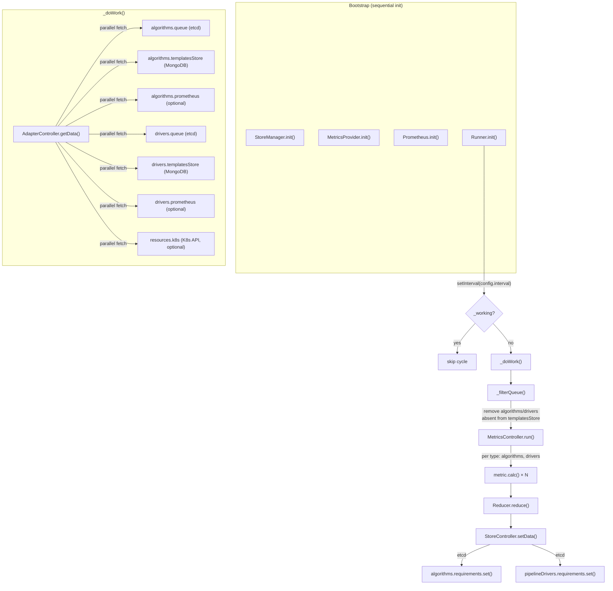

# resource-manager — Reverse-Spec Discovery

> **Version:** 2.11.0  
> **Package:** `resource-manager`  
> **Purpose:** Periodic resource-recommendation engine that observes algorithm/driver work-queues, cluster capacity, historical Prometheus metrics, and algorithm templates to produce **weighted allocation recommendations** written back to etcd for downstream consumers (task-executor, pipeline-driver-queue).

---

## 1. Service Identity

| Property | Value |
|---|---|
| Entry Point | `app.js` → `bootstrap.js` |
| Runtime | Node.js |
| Pattern | Timer-driven control loop (singleton `Runner`), Strategy/Factory pattern for metrics & reducers |
| Persistence Owned | etcd: `algorithms.requirements`, `pipelineDrivers.requirements` |
| Persistence Observed | etcd: `algorithms.queue`, `pipelineDrivers.queue` · MongoDB: `algorithms`, `pipelineDrivers` · Kubernetes API: nodes & pods · Prometheus: range queries |
| Recommendation Modes | `flat` (default), `map` — selected via `config.recommendationMode` |

---

## 2. Core Logic Loop

The service is a **headless daemon** with no HTTP API. A single `setInterval` drives the control loop.



### Cycle Timing
- **Interval:** `config.interval` (default **1000 ms**)
- **Guard:** `_working` boolean prevents overlapping cycles
- **Health:** extends `HealthcheckImpl`; marked healthy after each successful cycle; `maxDiff` default 10 s

---

## 3. Architecture: Adapter → Metric → Reducer → Store

The engine follows a **4-stage pipeline** per cycle, fully driven by configuration and factory pattern.

### 3.1 Adapters (Data Collection Layer)

Adapters extend a base `Adapter` class with TTL-based caching. Each adapter's `_getData()` fetches from one external source.

| Category | Adapter | Source | Cache TTL | Mandatory | Default Enabled |
|---|---|---|---|---|---|
| **resources** | `k8s` | K8s Nodes + Pods API | 30 s | yes | **no** (off by default) |
| **algorithms** | `queue` | etcd `algorithms.queue` | 0 (live) | yes | yes |
| **algorithms** | `templatesStore` | MongoDB `algorithms` collection | 10 s | yes | yes |
| **algorithms** | `prometheus` | Prometheus range queries | 60 s | no | **no** |
| **drivers** | `queue` | etcd `pipelineDrivers.queue` | 0 (live) | yes | yes |
| **drivers** | `templatesStore` | MongoDB `pipelineDrivers` collection | 300 s | yes | yes |
| **drivers** | `prometheus` | Prometheus range queries | 60 s | no | **no** |

#### K8s Adapter Logic
Per node: compute `allocatableCpu`, `allocatableMemory`, then subtract `cpuRequests` and `memoryRequests` of all Running/Pending pods. Returns a Map keyed by node name.

#### Algorithm Queue Adapter
Reads the etcd queue list. Each entry has `{ name, data: [scores...], pendingAmount }`. Transforms scores into `{ name, score }` objects.

#### Driver Queue Adapter
Reads etcd driver queues and **combines all entries into a single pseudo-queue named `"pipeline-driver"`**. Filters out entries whose `maxExceeded[index]` is truthy (concurrency-limited).

#### Prometheus Adapter (Algorithms)
Range query over last **120 hours**, step = `14 * 120 = 1680s`:
- **CPU Usage:** `sum(max(kube_pod_labels) * on(pod) group_right rate(container_cpu_usage_seconds_total{container_name="algorunner"}[5m])) by (label_algorithm_name)` → `max()` of values
- **Run Time:** `algorithm_runtime_summary{quantile="0.5"}` → `median()` of values

#### Prometheus Adapter (Drivers)
- **Pipeline Progress:** `pipelines_progress_gauge{status="active"}` → `median()` of latest values

---

### 3.2 Metrics (Scoring Layer)

Metrics are selected by `recommendationMode` (flat vs map). Weights within each type **must sum to exactly 1.0**.

#### Algorithms Metrics Weights

| Metric | Weight | Description |
|---|---|---|
| `queue` | **0.7** | Primary signal — queue depth & pending amount |
| `cpuUsage` | 0.1 | Historical CPU from Prometheus |
| `runTime` | 0.1 | Historical median run time from Prometheus |
| `templatesStore` | 0.1 | Algorithm CPU request from template |

#### Drivers Metrics Weights

| Metric | Weight |
|---|---|
| `queue` | **1.0** |

---

### 3.3 Flat Mode — Scoring Logic

In flat mode, metrics produce **ordered arrays** of `{ name, score }`. The reducer combines them by weighted sum at array position.

#### Queue Metric (flat)
```
For each queue entry:
  scored_items = queue.data (already scored)
  pendingAmount > 0 → prepend { name, score: MAX_SCORE (10) }
  Order descending by score
  Final score = score × MAX_SCORE (10)
```

#### RunTime Metric (flat)
```
score(runTime, MAX_RUN_TIME) = |MAX_RUN_TIME - runTime| / MAX_RUN_TIME × 10
  MAX_RUN_TIME = 300,000 ms (5 min)
  Higher score = shorter run time → prioritized
  Ordered descending
```

#### CpuUsage Metric (flat)
```
score(cpuUsage, MAX_CPU_USAGE) = |MAX_CPU_USAGE - cpuUsage| / MAX_CPU_USAGE × 10
  MAX_CPU_USAGE = 300,000
  Higher score = lower CPU usage → prioritized
  Ordered descending
```

#### TemplatesStore Metric (flat)
```
score(cpu, MAX_CPU) = |MAX_CPU - cpu| / MAX_CPU × 10
  MAX_CPU = 30 cores
  Higher score = smaller CPU request → prioritized
  Ordered descending
```

#### Flat Reducer
```
For each metric M with weight W:
  For each position i in M.data:
    result[i].score += M.data[i].score × W
```
Output: ordered flat array of `{ name, score }` — the **priority queue** of which algorithm/driver to schedule next.

---

### 3.4 Map Mode — Resource-Aware Allocation Logic

In map mode, metrics produce **per-algorithm pod counts** `{ name, data: N }`. The reducer sums them by weighted count.

#### Queue Metric (map)
```
ordered_queue = order(queue)  // by score desc, pending first
ResourceAllocator(thresholds, k8s_resources, templatesStore)
For each item in ordered_queue:
  if cpu_available ≥ template.cpu AND mem_available ≥ template.mem:
    allocate (decrement available, increment counter)
normalize(queue, results)  // ensure every queued algo appears
```

#### RunTime Metric (map) — Ratio-Based Allocation
```
allocations = groupBy(ordered_queue, 'name')  // count per algorithm
algorithms = prometheus.filter(in_queue).map(a => { name, value: runTime })

AlgorithmRatios:
  ratio_raw = 1 - (value / sum_of_values)   // invert: shorter runtime → higher ratio
  ratio_norm = ratio_raw / sum_of_ratios     // normalize to 1.0
  Assign contiguous [from, to) ranges

Generator loop:
  random ∈ [0, 1) → find matching range → allocate that algorithm
  If algorithm exhausted (allocations=0) → redistribute its ratio equally
  Each allocation passes through ResourceAllocator (capacity check)
```

#### CpuUsage Metric (map) — Same Ratio-Based Pattern
Identical to RunTime but uses `cpuUsage` as the value. Lower CPU usage → higher ratio → more allocations.

#### TemplatesStore Metric (map)
```
Sort queue by cpu ASC (cheapest first)
Allocate through ResourceAllocator
```

#### Map Reducer
```
For each metric M with weight W:
  For each { name, data } in M.data:
    map[name].pods += data × W
Final: ceil(pods) per algorithm
```

---

### 3.5 ResourceAllocator (Capacity Gate)

Used **only in map mode**. Simulates cluster capacity consumption.

```
Available CPU = Σ(node.allocatableCpu × threshold_cpu) - Σ(node.cpuRequests)
Available Mem = Σ(node.allocatableMemory × threshold_mem) - Σ(node.memoryRequests)

For each allocate(name):
  template = templatesStore[name]
  if template.cpu ≤ availableCpu AND template.mem ≤ availableMem:
    availableCpu -= template.cpu
    availableMem -= template.mem
    counter[name]++

If K8s adapter is disabled (default): _enable = false → no capacity check, just count
```

---

## 4. Configuration & Thresholds

| Parameter | Env Var | Default | Description |
|---|---|---|---|
| `recommendationMode` | — | `flat` | `flat` or `map` |
| `interval` | `INTERVAL` | `1000` ms | Control loop period |
| `scoring.maxSize` | `MAX_SCORING_SIZE` | `5000` | Max items written to etcd per set |
| `resourceThresholds.algorithms.cpu` | `ALGORITHMS_THRESHOLD_CPU` | `0.9` | Fraction of allocatable CPU usable |
| `resourceThresholds.algorithms.mem` | `ALGORITHMS_THRESHOLD_MEM` | `0.9` | Fraction of allocatable memory usable |
| `resourceThresholds.pipelineDrivers.cpu` | `DRIVERS_THRESHOLD_CPU` | `0.6` | Fraction of allocatable CPU for drivers |
| `resourceThresholds.pipelineDrivers.mem` | `DRIVERS_THRESHOLD_MEM` | `1.0` | Fraction of allocatable memory for drivers |
| `healthchecks.maxDiff` | `HEALTHCHECK_MAX_DIFF` | `10000` ms | Max time without healthy cycle |
| `prometheus.endpoint` | `PROMETHEUS_ENDPOINT` | (none) | Prometheus URL; if empty, adapter disabled |

### Magic Numbers in Metrics

| Constant | Value | Location | Meaning |
|---|---|---|---|
| `MAX_SCORE` | 10 | `utils/queue.js` | Normalizer for queue scoring |
| `MAX_RUN_TIME` | 300,000 ms | `algorithms-flat/run-time.js` | Ceiling for runtime scoring |
| `MAX_CPU_USAGE` | 300,000 | `algorithms-flat/cpu-usage.js` | Ceiling for CPU scoring |
| `MAX_CPU` | 30 | `algorithms-flat/templates-store.js` | Ceiling for template CPU scoring |
| `PROM_SETTINGS.HOURS` | 120 | Prometheus adapters | Lookback window (5 days) |
| `PROM_SETTINGS.STEP` | 14 | `helpers/prometheus.js` | Base step multiplied by hours |
| `MIN_CACHE` | 1 s | `Adapter.js` | Minimum cache TTL |
| Metrics weight sum | 1.0 | `MetricsController` | Enforced at init; throws if violated |

---

## 5. State Sovereignty

### Owned State (Written)
| Store | Key | Format |
|---|---|---|
| etcd | `algorithms.requirements` | `{ name: 'data', data: Array<{name, score}> }` (flat) or `Array<{name, data: {pods}}>` (map) |
| etcd | `pipelineDrivers.requirements` | Same structure as above |

### Observed State (Read-Only)
| Source | Key | Purpose |
|---|---|---|
| etcd | `algorithms.queue` | Current algorithm work queue with scores |
| etcd | `pipelineDrivers.queue` | Current driver work queue |
| MongoDB | `algorithms` collection | Algorithm templates (CPU/mem requests, metadata) |
| MongoDB | `pipelineDrivers` collection | Driver templates |
| K8s API | `nodes`, `pods` | Cluster capacity (allocatable - requests) |
| Prometheus | range queries | Historical CPU usage & run time per algorithm, pipeline progress |

---

## 6. Side Effects

| Action | Target | Trigger |
|---|---|---|
| `etcd.algorithms.requirements.set()` | etcd | Every cycle, algorithms store |
| `etcd.pipelineDrivers.requirements.set()` | etcd | Every cycle, drivers store |
| Prometheus gauge: `resource_manager_pods_request` | Metrics endpoint | (currently commented out) |
| Prometheus gauge: `resource_manager_pods_allocations` | Metrics endpoint | (currently commented out) |

The service has **no direct infrastructure side effects** (no pod creation, no scaling). It purely writes **recommendations** that downstream services consume.

---

## 7. Dependency Map

### Northbound (What Triggers This Service)
- **Timer:** `setInterval` at `config.interval` — self-triggered
- **No external trigger.** This is a standalone polling daemon.

### Southbound (What It Calls)
| Dependency | Protocol | Purpose |
|---|---|---|
| etcd (`@hkube/etcd`) | gRPC/HTTP | Read queues, write requirements |
| MongoDB (`@hkube/db`) | TCP | Read algorithm/driver templates |
| Kubernetes API (`@hkube/kubernetes-client`) | HTTPS | Read node/pod resources (when enabled) |
| Prometheus (`@hkube/prometheus-client`) | HTTP | Range queries for historical metrics (when enabled) |

### Downstream Consumers (Who Reads the Output)
| Consumer | Reads |
|---|---|
| `task-executor` | `etcd.algorithms.requirements` — uses the recommendation to decide how many worker pods to spawn |
| `pipeline-driver-queue` | `etcd.pipelineDrivers.requirements` — uses recommendation for driver scaling |

---

## 8. Module Topology

```
bootstrap.js
 ├── store-manager          (singleton: etcd + MongoDB connections)
 ├── metrics-provider       (singleton: Prometheus gauge registration)
 ├── prometheus helper      (singleton: Prometheus range query client)
 └── runner                 (singleton: control loop)
      ├── AdapterController
      │    ├── resources/k8s         → K8s nodes & pods
      │    ├── algorithms/queue      → etcd algorithm queue
      │    ├── algorithms/templates  → MongoDB algorithms
      │    ├── algorithms/prometheus → Prometheus CPU & runtime
      │    ├── drivers/queue         → etcd driver queue
      │    ├── drivers/templates     → MongoDB drivers
      │    └── drivers/prometheus    → Prometheus pipeline progress
      ├── MetricsController
      │    ├── [flat|map]/algorithms/{queue,cpuUsage,runTime,templatesStore}
      │    ├── [flat|map]/drivers/{queue}
      │    └── Reducer (flat: positional weighted sum, map: named pod count)
      └── StoreController
           ├── algorithms store → etcd algorithms.requirements
           └── drivers store    → etcd pipelineDrivers.requirements
```

---

## 9. Logic Contract

### Invariant 1: Weight Integrity
The sum of all metric weights within a type (algorithms or drivers) **must equal exactly 1.0**. Enforced at `MetricsController._initMetric()` — throws on violation.

### Invariant 2: Queue Filtering
Before metrics run, any algorithm/driver in the queue that **does not exist in templatesStore** is removed. This prevents allocation of resources for unknown or deleted algorithms.

### Invariant 3: Flat Mode Output Ordering
In flat mode, the final output is a **priority-ordered array** where position + score determines scheduling priority. The downstream consumer should process from index 0 (highest priority) outward.

### Invariant 4: Map Mode Capacity Bound
In map mode, when K8s adapter is enabled, total allocated pods are **bounded by cluster capacity** (`allocatable × threshold - requests`). When K8s is disabled (default), allocation counts are unbounded — the capacity check is skipped.

### Invariant 5: Scoring Formula
$$\text{score}(n, \text{max}) = \frac{|\text{max} - n|}{\text{max}} \times 10$$
Used by flat-mode metrics (runTime, cpuUsage, templatesStore). Values closer to 0 receive scores closer to 10 (maximum priority).

### Invariant 6: Ratio-Based Allocation (Map Mode)
For metrics using `AlgorithmRatios`:
$$\text{ratio}_i^{\text{raw}} = 1 - \frac{\text{value}_i}{\sum \text{values}}$$
$$\text{ratio}_i = \frac{\text{ratio}_i^{\text{raw}}}{\sum \text{ratios}^{\text{raw}}}$$
Algorithm selection is probabilistic via `Math.random()` mapped to contiguous ratio ranges. Exhausted algorithms have their ratio redistributed equally among remaining algorithms.

### Invariant 7: Max Scoring Size
etcd writes are capped at `scoring.maxSize` (default 5000) items via `data.slice(0, maxScoringSize)`.
