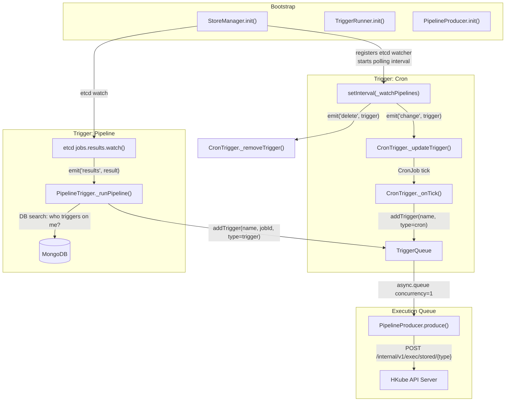

# trigger-service — Reverse-Spec Discovery

> **Version:** 2.11.0  
> **Package:** `trigger-service`  
> **Purpose:** Event-driven orchestration engine that triggers stored pipeline executions in response to **cron schedules** and **pipeline-completion events**.

---

## 1. Service Identity

| Property | Value |
|---|---|
| Entry Point | `app.js` → `bootstrap.js` |
| Runtime | Node.js |
| Pattern | Singleton modules, EventEmitter pub/sub |
| Persistence | MongoDB (via `@hkube/db`), etcd (via `@hkube/etcd`) |
| Outbound API | HKube API Server (`internal/v1/exec/stored/{type}`) |

---

## 2. Core Logic Loop

The service has **no HTTP server**. It is a headless daemon with two independent trigger mechanisms that feed into a single execution queue.



### Control Loop Summary

1. **StoreManager** polls MongoDB every `checkCronsIntervalMs` (default: **15 000 ms**) for all stored pipelines that have triggers configured.
2. For each pipeline found, it emits `change` events; for pipelines that disappeared since the last poll, it emits `delete` events.
3. **StoreManager** simultaneously watches etcd for `jobs.results` changes and emits `results` events.
4. **CronTrigger** and **PipelineTrigger** react to these events and push work into the **TriggerQueue**.
5. **TriggerQueue** (concurrency = 1) serially sends HTTP POST requests to the API Server to execute stored pipelines.

---

## 3. Decision Matrix

### 3.1 Cron Trigger Decision Tree

```
ON 'change' event (Trigger object):
│
├─ trigger.cron?.enabled === false (or absent)
│   └─ REMOVE existing CronJob for this pipeline (if any) → DONE
│
├─ CronJob already exists with SAME pattern
│   └─ NO-OP → DONE
│
├─ CronJob exists with DIFFERENT pattern
│   └─ STOP old CronJob → CREATE new CronJob → DONE
│
└─ No CronJob exists
    └─ CREATE new CronJob → DONE

ON CronJob tick:
    └─ Push { name, type: 'cron' } → TriggerQueue
```

**Business Rules:**
- A cron trigger is active **only** when `triggers.cron.enabled === true`.
- Invalid cron patterns are caught gracefully (logged, not created).
- CronJobs are deduplicated by pipeline name: one pipeline → at most one CronJob.
- Pattern changes cause stop-then-recreate (not in-place update).

### 3.2 Pipeline Trigger Decision Tree

```
ON 'results' event (job result from etcd):
│
├─ result.data is falsy
│   └─ SKIP → DONE
│
└─ result.data is truthy
    └─ DB query: find all pipelines where triggers.pipelines[] contains result.pipeline
        └─ For EACH matched pipeline:
            └─ Push { name, jobId, type: 'trigger' } → TriggerQueue
```

**Business Rules:**
- A pipeline can trigger **multiple** downstream pipelines (fan-out).
- Multiple pipelines can be triggered by the **same** upstream pipeline (many-to-many).
- The `jobId` of the completed parent is propagated as `parentJobId` to the child execution.
- Tags from the parent pipeline execution are fetched and forwarded to child executions.

---

## 4. State Sovereignty

### Owns
| Data | Storage | Lifecycle |
|---|---|---|
| Active CronJob registry | In-memory `Map<name, {cron, pattern}>` | Volatile; rebuilt on every poll cycle |
| Pipeline trigger cache | In-memory `Object (this._pipelines)` | Volatile; rebuilt each poll interval |

### Observes (Read-Only)
| Data | Source | Mechanism |
|---|---|---|
| Stored pipeline definitions | MongoDB (`pipelines` collection) | Polled via `db.pipelines.search()` |
| Job completion results | etcd (`jobs.results` key-space) | Watched via `etcd.jobs.results.watch()` |

**Key insight:** This service owns **no persistent state**. All in-memory state is reconstructed from external sources on every poll cycle. The service is **stateless and crash-safe** — a restart simply rebuilds cron jobs from the DB.

---

## 5. Side Effects

| Side Effect | Target | Mechanism | Trigger Type |
|---|---|---|---|
| Execute stored pipeline (cron) | API Server | `POST /internal/v1/exec/stored/cron` | Cron tick |
| Execute stored pipeline (trigger) | API Server | `POST /internal/v1/exec/stored/trigger` | Pipeline completion |
| Fetch parent tags | API Server | `GET /internal/v1/exec/pipelines/{jobId}` | Pipeline completion |
| Service discovery registration | etcd | `etcd.discovery.register()` | Bootstrap |

### Retry Behavior
The `PipelineProducer` uses `requestretry` with:
- **Max attempts:** 5
- **Retry delay:** 5 000 ms
- **Retry strategy:** `HTTPOrNetworkError`

---

## 6. Configuration

| Parameter | Env Variable | Default | Description |
|---|---|---|---|
| `checkCronsIntervalMs` | `TRIGGER_SERVICE_CHECK_CRONS` | `15000` | Polling interval (ms) for re-scanning pipeline trigger definitions from MongoDB |
| `etcd.host` | `ETCD_CLIENT_SERVICE_HOST` | `127.0.0.1` | etcd host |
| `etcd.port` | `ETCD_CLIENT_SERVICE_PORT` | `4001` | etcd port |
| `db.mongo.host` | `MONGODB_SERVICE_HOST` | `localhost` | MongoDB host |
| `db.mongo.port` | `MONGODB_SERVICE_PORT` | `27017` | MongoDB port |
| `db.mongo.dbName` | `MONGODB_DB_NAME` | `hkube` | MongoDB database name |
| `apiServer.host` | `API_SERVER_SERVICE_HOST` | `localhost` | API Server host |
| `apiServer.port` | `API_SERVER_SERVICE_PORT` | `3000` | API Server port |
| `apiServer.storedPath` | — | `internal/v1/exec/stored` | API path for stored pipeline execution |
| `apiServer.pipelinesPath` | — | `internal/v1/exec/pipelines` | API path for pipeline info retrieval |

---

## 7. Dependency Map

### Southbound (Downstream / Called by this service)
| Dependency | Protocol | Purpose |
|---|---|---|
| **MongoDB** (`@hkube/db`) | TCP/mongo | Read stored pipeline definitions and their trigger configs |
| **etcd** (`@hkube/etcd`) | HTTP | Watch `jobs.results` for pipeline completions; register for service discovery |
| **HKube API Server** | HTTP REST | POST to execute stored pipelines; GET to fetch parent pipeline tags |

### Northbound (Upstream / What triggers this service)
| Trigger | Source | Mechanism |
|---|---|---|
| **Timer** | Node.js `setInterval` | Polls MongoDB every 15s for pipeline trigger definitions |
| **etcd watch** | etcd cluster | Push-notification when a job result is written |
| *(Internal)* CronJob tick | `cron` library | Fires according to per-pipeline cron pattern |

### NPM Dependencies (Runtime)
| Package | Role |
|---|---|
| `@hkube/config` | Configuration loading |
| `@hkube/db` | MongoDB connectivity |
| `@hkube/etcd` | etcd client & watcher |
| `@hkube/logger` | Structured logging |
| `async` | Queue with concurrency control |
| `cron` | Cron pattern scheduling |
| `requestretry` | HTTP client with retry |

---

## 8. Module Topology

```
bootstrap.js
 ├── store/store-manager.js    (EventEmitter — owns DB + etcd connections)
 ├── queue/trigger-runner.js   (orchestrates init of triggers + queue)
 │    ├── queue/trigger-queue.js     (async.queue, concurrency=1)
 │    ├── triggers/cron-trigger.js   (listens 'change'/'delete' → manages CronJobs)
 │    └── triggers/pipeline-trigger.js (listens 'results' → DB lookup → enqueue)
 └── pipelines/pipeline-producer.js  (HTTP POST to API Server)
```

---

## 9. Logic Contract

### Invariants
1. **At most one CronJob per pipeline name** — the in-memory `Map` is keyed by pipeline name; updating replaces, never duplicates.
2. **Execution queue is serial** — `async.queue` concurrency = 1 ensures ordered delivery to the API Server.
3. **Stateless recovery** — the polling loop in `StoreManager._checkPipelinesInterval` re-derives all CronJobs from the database, meaning a service restart self-heals with no data loss.
4. **Guard against re-entrant polling** — the `this._active` flag prevents concurrent `_watchPipelines` executions if a poll cycle exceeds `checkCronsIntervalMs`.
5. **Trigger type propagation** — the `type` field (`cron` | `trigger`) is forwarded to the API Server URL path, routing to different execution strategies server-side.

### Correctness Conditions
- If a pipeline's cron pattern changes in the DB, the old CronJob **must** be stopped before the new one starts (ensured by `_stopCron` → `new CronJob` sequence).
- If a pipeline is deleted from the DB, its CronJob **must** be removed (ensured by the diff logic in `_watchPipelines`).
- Pipeline triggers with `result.data === falsy` are silently skipped (no downstream pipelines fire).

---

## 10. Known Design Observations

1. **Polling + Watch hybrid:** Cron triggers rely on polling (timer), while pipeline triggers rely on push (etcd watch). This is intentional — cron definitions change infrequently so polling is sufficient, while job completions are time-sensitive and require push.
2. **No backpressure:** The `TriggerQueue` has no upper bound on queue depth. A burst of pipeline completions could accumulate unbounded work items.
3. **Tag fetch coupling:** `PipelineProducer._getTags()` makes a synchronous HTTP call to fetch parent tags on every trigger. If the API Server is slow, this blocks the serial queue.
4. **`_active` guard is not async-safe:** The flag is set synchronously, but `_watchPipelines` calls `await`, meaning the finally block resets `_active` before the emitted events are fully processed. However, since `_watchPipelines` is not itself `await`-ed in the interval, this is functionally a "fire-and-forget" with a coarse guard against overlapping polls.
