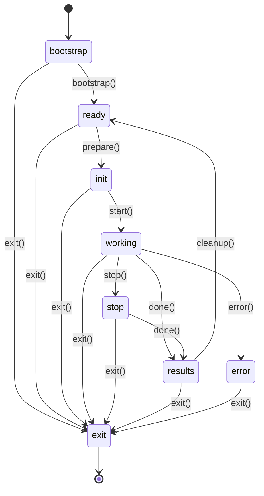
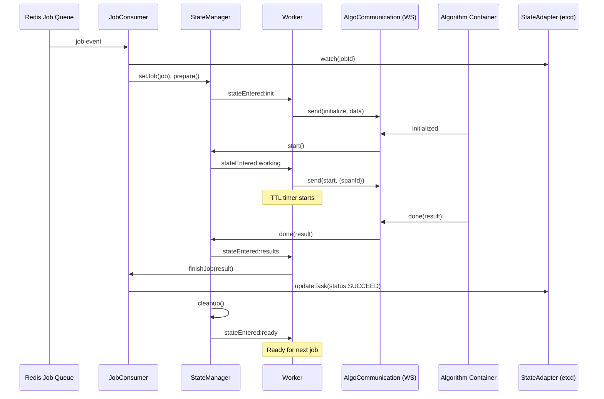
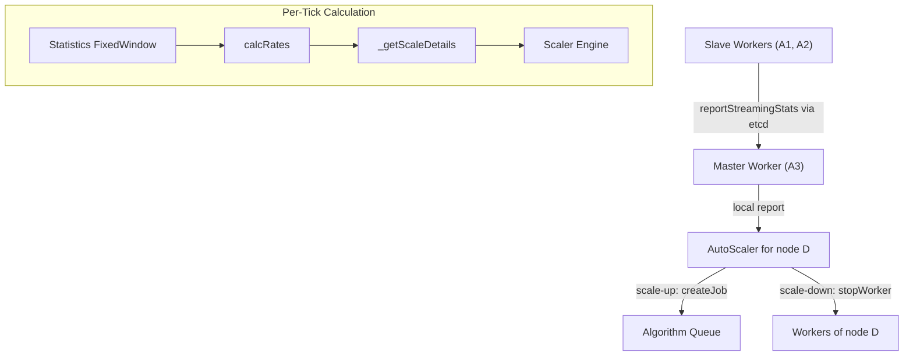

# Worker Service — Reverse-Spec Discovery

> **Service:** `core/worker` · **Version:** 2.11.0  
> **Role:** Per-algorithm sidecar process responsible for lifecycle management of a single algorithm container, including job consumption, data I/O, retry logic, TTL enforcement, streaming auto-scaling, and tracing.

---

## 1. Service Identity

| Attribute | Value |
|---|---|
| Entry point | `app.js` → `bootstrap.js` → `lib/worker.js` |
| Runtime | Node.js |
| Namespace | One worker pod per algorithm container |
| Communication Protocol | WebSocket (default), Socket.IO, Loopback (test) |
| State Backend | etcd (discovery, tasks, job status), MongoDB (algorithms, dataSources), Redis (job queue) |
| Storage Backend | S3/FS/Redis (configurable) |

---

## 2. Core Logic Loop

### 2.1 Bootstrap Sequence

```
Redis monitor → metrics/tracer init → storageManager init
→ worker.preInit(config)
→ [all modules].init()
→ worker.init()
→ workerCommunication.init()
→ JobConsumer.init()
```

### 2.2 Primary Control Loop

The worker is **event-driven**, not timer-driven. Its control loop is a **finite state machine** orchestrated by `stateManager` (powered by `javascript-state-machine`).



**State Transitions and Their Triggers:**

| Transition | From → To | Trigger |
|---|---|---|
| `bootstrap` | bootstrap → ready | Algorithm container running + WS connected |
| `prepare` | ready → init | `JobConsumer` receives job from Bull queue |
| `start` | init → working | Algorithm sends `initialized` message via WS |
| `done` | working/stop → results | Algorithm sends `done`/`stopped` message |
| `stop` | * → stop | Pipeline completed/failed/stopped, TTL expired, or scale-down |
| `cleanup` | results → ready | After `finishJob` completes (if still connected) |
| `exit` | * → exit | Fatal error, worker command, inactive timeout, retry |
| `error` | working/init → error | Wrapper alive timeout exceeded |
| `reset` | * → bootstrap | Reset |

### 2.3 Event Flow (Per Job)



---

## 3. Decision Matrix

### 3.1 Pod Container Readiness Check

Before entering the `ready` state, the worker polls pod container status:

```
Every `checkAlgorithmStatusInterval` (default: 20s):
    FOR each container in pod (algorunner + sidecars):
        IF container.status == RUNNING → mark checked
        ELSE IF reason is ImagePullErr:
            failAttempts++
            IF failAttempts > 3 → endJob(imagePullErr), stop all checks
```

**Variables:** `_shouldCheckAlgorithmStatus`, `_shouldCheckSideCarStatus[]`, fail attempt counters.

### 3.2 Retry Policy Decision Tree

When the algorithm disconnects or sends an error:

```
SWITCH retry.policy:
    CASE "Never":       → endJob(error)
    CASE "OnError":
        IF isAlgorithmError → startRetry(error)
        ELSE               → endJob(error)
    CASE "Always":      → startRetry(error)
    CASE "OnCrash":
        IF isCrashed    → startRetry(error)
        ELSE            → endJob(error, retry=!isAlgoError)
    DEFAULT:            → endJob(error)
```

- `startRetry` → `shouldCompleteJob=false`, emit warning, transition to `exit`
- `endJob` → `shouldCompleteJob=true`, stop sub-pipelines/executions, transition to `exit` or `done`

### 3.3 Inactive Timeout Decision

```
IF state == ready:
    IF hotWorker == false AND inactiveTimeoutMs != 0:
        START timer(inactiveTimeoutMs)
        ON timeout → exit(shouldCompleteJob=false)
ELSE:
    CLEAR inactive timer
```

Two timeout profiles:
- `timeouts.inactive` — normal workers
- `timeouts.inactivePaused` — paused workers

### 3.4 Worker Command Handling (from etcd)

| Command | Decision |
|---|---|
| `coolDown` | Set `hotWorker=false`, update discovery, reset inactive timeout |
| `warmUp` | Set `hotWorker=true`, update discovery, reset inactive timeout |
| `stopProcessing` | IF not paused AND not serving AND not handling job → pause consumer, reset timeout |
| `startProcessing` | IF paused → resume consumer, reset timeout |
| `scaleDown` | Stop all sub-pipelines, transition to `stop` |
| `exit` | Update discovery='exit', transition to `exit` |

### 3.5 Algorithm Serving Detection

```
isServing = lastServingUpdate != null 
         AND (now - lastServingUpdate) < (servingReportInterval * 2)
```

Default `servingReportInterval`: 5000ms → Serving window: 10s.

### 3.6 Wrapper Alive Monitoring

When algorithm sends `alive` signal:
```
CLEAR existing timer
SET timer(wrapperTimeoutDuration)
    ON timeout → stateManager.error()
```
Reset on: `done`, `stopped`, `stopping`, `error` messages.  
Default `wrapperTimeoutDuration`: 10000ms.

### 3.7 TTL Enforcement

```
ON state=working:
    IF job.data.ttl exists:
        SET timer(ttl * 1000ms)
        ON timeout → stopPipeline(status=STOPPED, isTtlExpired=true)
ON state=exit OR state=results:
    CLEAR TTL timer
```

### 3.8 Stop Timeout

```
ON state=stop:
    send(stop, {forceStop}) to algorithm
    SET timer(stopTimeoutMs)  // default: 10000ms
    ON timeout → done(warning), handleExit(0)

ON algorithm sends "stopping":
    IF time since stoppingTime < stoppingTimeoutMs:
        RESET stop timer
    ELSE:
        let original timer expire
```

---

## 4. State Sovereignty

### 4.1 Data Owned (Authoritative)

| Data | Storage | Description |
|---|---|---|
| Worker discovery info | etcd (heartbeat TTL) | `workerId`, `podName`, `algorithmName`, `workerStatus`, `hotWorker`, `isMaster`, etc. |
| Task status updates | etcd (`jobs.tasks`) | Status transitions: ACTIVE → STORING → SUCCEED/FAILED/STOPPED |
| Algorithm result storage | S3/FS | Stores algorithm output data |
| Algorithm metrics (Tensorboard) | S3/FS | `algoMetricsDir` → object storage |
| Sub-pipeline job-to-id mapping | In-memory Map | `_jobId2InternalIdMap` |
| Algorithm execution tracking | In-memory Map | `_executions` |
| Streaming statistics (master) | In-memory Map | Per-source statistics windows |
| Worker FSM state | In-memory | `stateManager._stateMachine.state` |

### 4.2 Data Observed (Read-Only)

| Data | Source | Purpose |
|---|---|---|
| Job queue | Redis (Bull) | Consume next job |
| Pipeline status | etcd (`jobs.status`) | Detect pipeline completed/failed/stopped |
| Worker commands | etcd (`workers`) | Receive coolDown/warmUp/scaleDown/exit/stopProcessing |
| Pod container status | K8s API | Check algorunner/sidecar readiness |
| Pipeline definition | MongoDB | Retrieved for streaming DAG construction |
| Algorithm queue status | etcd | Auto-scaler checks pending queue |
| Streaming statistics (slave) | etcd (`streaming.statistics`) | Master watches slave reports |
| Algorithm execution results | etcd (`algorithms.executions`, `jobs.tasks`) | Watch for remote algorithm completion |
| Job results (sub-pipeline) | etcd (`jobs.results`) | Watch for sub-pipeline completion |

---

## 5. Side Effects

### 5.1 Infrastructure Mutations

| Side Effect | Target | Trigger |
|---|---|---|
| `etcd.discovery.register/update` | etcd | Every state transition, discovery updates |
| `etcd.jobs.tasks.set` | etcd | Task status updates (ACTIVE, STORING, SUCCEED, FAILED, etc.) |
| `producer.createJob` | Redis (Bull queue) | Auto-scaler scale-up (creates streaming tasks) |
| `stateAdapter.stopWorker` | etcd | Auto-scaler scale-down (sends scaleDown to other workers) |
| `kubernetes.deleteJob` | K8s API | On exit when algorithm container won't terminate |
| `storageManager.put` | S3/FS | Store algorithm results and metrics |
| `apiServerClient.postPipeline` | API Server (HTTP) | Launch sub-pipelines from algorithm code |
| `etcd.streaming.statistics.acquireLock/releaseLock` | etcd | Master election for streaming nodes |
| `etcd.streaming.statistics.set` | etcd | Slave reports streaming statistics |
| `Span creation/finish` | Jaeger (via tracer) | Distributed tracing per state and algorithm spans |
| `WS send(command)` | Algorithm container | `initialize`, `start`, `stop`, `exit`, sub-pipeline/exec responses |

### 5.2 Process-Level

| Side Effect | Trigger |
|---|---|
| `process.exit(code)` | `handleExit()` — after cleanup attempt |
| Timer management | Inactive timeout, TTL timeout, stop timeout, wrapper alive, pod status polling |

---

## 6. Configuration & Thresholds

### 6.1 Constants (Hardcoded)

| Constant | Value | Location |
|---|---|---|
| `ALGORITHM_CONTAINER` | `'algorunner'` | `worker.js` |
| `WORKER_CONTAINER` | `'worker'` | `worker.js` |
| `DEFAULT_STOP_TIMEOUT` | `5000` ms | `worker.js` |
| Image pull fail max attempts | `3` | `_handleContainerFailure` |
| Default retry policy | `{ policy: 'OnCrash' }` | `JobConsumer.js` |
| Algorithm execution retry | `{ policy: 'Never' }` | `algorithm-execution.js` |

### 6.2 Configurable Thresholds (Environment Variables)

| Config Key | Env Var | Default | Description |
|---|---|---|---|
| `hotWorker` | `HOT_WORKER` | `false` | Hot workers don't have inactive timeouts |
| `devMode` | `DEV_MODE` | `false` | Tolerates invalid FSM transitions |
| `checkAlgorithmStatusInterval` | `CHECK_ALGORITHM_STATUS_INTERVAL` | `20000` ms | Pod status polling interval |
| `servingReportInterval` | `DISCOVERY_SERVING_REPORT_INTERVAL` | `5000` ms | Serving liveness window |
| `timeouts.stop` | — | `10000` ms | Max wait for algorithm to stop |
| `wrapperTimeoutDuration` | `WRAPPER_TIMEOUT_DURATION` | `10000` ms | Wrapper alive watchdog |
| `etcd.heartBeatTTL` | `ETCD_HEART_BEAT_TTL` | `10` s | Discovery entry TTL |
| `cacheResults.updateFrequency` | `CACHE_UPDATE_FREQUENCY` | `5000` ms | Algorithm list cache refresh |
| `defaultStorageProtocol` | `DEFAULT_STORAGE_PROTOCOL` | `v1` | Storage I/O protocol |
| `defaultWorkerAlgorithmEncoding` | `DEFAULT_WORKER_ALGORITHM_ENCODING` | `json` | WS encoding format |

### 6.3 Streaming / Auto-Scaler Thresholds

| Config Key | Env Var | Default | Description |
|---|---|---|---|
| `autoScaler.interval` | `AUTO_SCALER_INTERVAL` | `2000` ms | Metrics collection tick |
| `autoScaler.scaleInterval` | `AUTO_SCALER_SCALE_INTERVAL` | `10000` ms | Scale check tick |
| `minTimeBetweenScales` | `AUTO_SCALER_MIN_TIME_BETWEEN_SCALE` | `30000` ms | Cooldown between scale actions |
| `minTimeWaitBeforeRetryScale` | `AUTO_SCALER_MIN_TIME_WAIT_BEFORE_RETRY` | `60000` ms | Retry unfulfilled scale wait |
| `maxSizeWindow` | `AUTO_SCALER_WINDOW_SIZE` | `10` | Fixed-window stats size |
| `minTimeNonStatsReport` | `AUTO_SCALER_NON_STATS_REPORT` | `10000` ms | Eviction time for stale stats |
| `maxScaleUpReplicasPerNode` | `AUTO_SCALER_MAX_REPLICAS` | `1000` | Cap on total replicas |
| `maxScaleUpReplicasPerTick` | `AUTO_SCALER_MAX_REPLICAS_PER_SCALE` | `10` | Cap per scale-up tick |
| `replicasOnFirstScale` | `AUTO_SCALER_REPLICAS_FIRST_SCALE` | `1` | First scale-up size |
| `minTimeToCleanUpQueue` | `AUTO_SCALER_MIN_TIME_CLEAN_QUEUE` | `30` s | Queue drain horizon |
| `election.interval` | `ELECTION_INTERVAL` | `10000` ms | Master re-election check |
| `metrics.interval` | `STREAMING_METRICS_INTERVAL` | `2000` ms | Metrics collection interval |
| `serviceDiscovery.interval` | `SERVICE_DISCOVERY_INTERVAL` | `5000` ms | Peer discovery polling |
| `serviceDiscovery.timeWaitOnParentsDown` | `SERVICE_DISCOVERY_PARENTS_DOWN_TIME_WAIT` | `30000` ms | Grace period before scale-down |

---

## 7. Streaming Auto-Scaler — Logic Contract

### 7.1 Architecture

In streaming pipelines, each worker that is a **master** for a downstream node runs an `AutoScaler` for that node. Master election is via etcd distributed locks on `<jobId>/<nodeName>`.



### 7.2 Metrics Calculation

Rates are computed from a **fixed-window** of time-series data:

$$\text{reqRate} = \frac{\Delta \text{count}_{\text{requests}}}{\Delta t}$$

$$\text{resRate} = \frac{\Delta \text{count}_{\text{responses}}}{\Delta t}$$

$$\text{durationsRate} = \frac{1}{\text{mean}(\text{durations})/1000}$$

$$\text{throughput} = \frac{\text{resRate}}{\text{reqRate}} \times 100$$

$$\text{podRate} = \frac{1000}{\text{mean}(\text{roundTripTime})}$$

### 7.3 Required Replicas Formula

**First scale (cold-start):**  
When `totalRequests > 0 AND totalResponses == 0 AND currentSize == 0`:

$$\text{neededPods} = \text{replicasOnFirstScale}$$

**Steady-state scaling (round-trip based):**

$$\text{neededPods} = \left\lceil \frac{\text{queueSize} + \text{reqRate} \times T_{\text{drain}}}{T_{\text{drain}} \times \text{podRate}} \right\rceil$$

Where:
- $T_{\text{drain}}$ = `minTimeToCleanUpQueue` (default: 30s)
- $\text{podRate}$ = `1000 / mean(roundTripTimeMs)` (responses/sec/pod)

**Boundary clamping:**

$$\text{neededPods} = \text{clamp}(\text{neededPods}, \text{minStatelessCount}, \text{maxStatelessCount})$$

Also capped at `maxScaleUpReplicasPerNode` (default: 1000).

### 7.4 Scale-Up Feasibility

```
shouldScaleUp = 
    currentSize < required 
    AND desired < required
    AND (no recent scale-down OR cooldown elapsed)
    AND (desired <= currentSize  [fulfilled]
         OR notFulfilledTimeout > minTimeWaitBeforeRetryScale)
```

Scale up emits `replicas = min(required - desired, maxScaleUpReplicasPerTick)` new tasks to the algorithm queue.

### 7.5 Scale-Down Feasibility

```
shouldScaleDown = 
    queueEmpty
    AND currentSize > required
    AND (no recent scale-up OR cooldown elapsed)
    AND (desired >= currentSize  [fulfilled]
         OR notFulfilledTimeout > minTimeWaitBeforeRetryScale)
```

Scale down sends `stopWorker` commands to non-master workers, preferring to keep masters alive unless scaling to zero.

---

## 8. Dependency Map

### 8.1 Southbound (APIs Called)

| Dependency | Protocol | Purpose |
|---|---|---|
| **K8s API** (`@hkube/kubernetes-client`) | HTTPS | `getPodContainerStatus`, `getJobForPod`, `deleteJob`, `getContainerNamesForPod`, `waitForTerminatedState` |
| **etcd** (`@hkube/etcd`) | HTTP | Discovery, job status watch, task CRUD, worker commands, streaming stats/locks, algorithm execution watch |
| **MongoDB** (`@hkube/db`) | TCP | Fetch pipeline definitions, algorithm metadata, data sources |
| **Redis** (Bull) | TCP | Job queue consume/pause/resume, streaming job production |
| **S3/FS** (`@hkube/storage-manager`) | HTTP/FS | Read input data, write results and metrics |
| **API Server** | HTTP | `POST internal/v1/exec/` — launch sub-pipelines |
| **Jaeger** (`@hkube/metrics` tracer) | UDP | Distributed tracing spans |

### 8.2 Northbound (What Triggers This Service)

| Trigger | Source | Effect |
|---|---|---|
| Job available in Redis queue | `task-executor` / `pipeline-driver-queue` | `JobConsumer` receives job, starts FSM |
| Worker command (etcd watch) | `algorithm-operator` / `resource-manager` | coolDown, warmUp, stopProcessing, startProcessing, scaleDown, exit |
| Pipeline status change (etcd watch) | `pipeline-driver` | Pipeline completed/failed/stopped → stopPipeline |
| Algorithm WS messages | Algorithm container (algorunner) | initialized, done, stopped, error, progress, alive, startSubPipeline, etc. |
| Algorithm execution result (etcd watch) | Other workers | Task SUCCEED/FAILED → relay to algorithm |
| Streaming statistics (etcd watch) | Slave workers | Master's auto-scaler ingests metrics |

### 8.3 Peer Communication (Streaming)

| Direction | Channel | Data |
|---|---|---|
| Slave → Master | etcd `streaming.statistics.set` | `{ source, queueSize, sent, responses, dropped, durations }` |
| Master → Slave Workers | etcd `workers.set(scaleDown)` | Stop command |
| Master → Queue | Redis (Bull `producer.createJob`) | New tasks for scale-up |
| Worker ↔ Worker | `serviceDiscovery` (etcd reads) | Peer discovery map for streaming connections |

---

## 9. Module Inventory

| Module | Path | Responsibility |
|---|---|---|
| `Worker` | `lib/worker.js` | Core orchestrator: FSM event handler, retry, TTL, timeout management |
| `StateManager` | `lib/states/stateManager.js` | Finite state machine (FSM) with tracing integration |
| `StateAdapter` | `lib/states/stateAdapter.js` | etcd + MongoDB abstraction layer |
| `JobConsumer` | `lib/consumer/JobConsumer.js` | Bull queue consumer, task status updates, discovery data |
| `WorkerCommunication` | `lib/algorithm-communication/workerCommunication.js` | WS/SocketIO/Loopback adapter to algorithm container |
| `Storage` | `lib/storage/storage.js` | Data extraction and result persistence |
| `KubernetesApi` | `lib/helpers/kubernetes.js` | K8s client for pod/container/job operations |
| `StreamHandler` | `lib/streaming/services/stream-handler.js` | Streaming orchestration facade |
| `StreamService` | `lib/streaming/services/stream-service.js` | Manages election, adapters, metrics, scaler lifecycle |
| `AutoScaler` | `lib/streaming/services/auto-scaler.js` | Metrics aggregation, replica calculation, scale commands |
| `Scaler` | `lib/streaming/core/scaler.js` | Scale feasibility logic (cooldowns, capacity checks) |
| `Statistics` | `lib/streaming/core/statistics.js` | Fixed-window time-series accumulator |
| `ServiceDiscovery` | `lib/streaming/services/service-discovery.js` | Peer discovery polling, parent-down detection |
| `Election` | `lib/streaming/services/election.js` | Distributed master election via etcd locks |
| `MetricsCollector` | `lib/streaming/services/metrics-collector.js` | Periodic metrics emission |
| `ScalerService` | `lib/streaming/services/scaler-service.js` | Periodic auto-scale trigger |
| `MasterAdapter` | `lib/streaming/adapters/master-adapter.js` | Master role: watches slaves, owns auto-scaler |
| `SlaveAdapter` | `lib/streaming/adapters/slave-adapter.js` | Slave role: reports stats to etcd |
| `SubPipelineHandler` | `lib/code-api/subpipeline/subpipeline.js` | Sub-pipeline lifecycle (start, stop, result relay) |
| `AlgorithmExecution` | `lib/code-api/algorithm-execution/algorithm-execution.js` | Remote algorithm execution (start, stop, result relay) |
| `Producer` | `lib/producer/producer.js` | Bull queue job producer for streaming tasks |
| `Boards` | `lib/boards/boards.js` | Tensorboard metrics upload |
| `Metrics` | `lib/metrics/metrics.js` | Prometheus metrics: runtime, started, succeeded, failed |

---

## 10. Prometheus Metrics Exported

| Metric | Type | Labels |
|---|---|---|
| `hkube_worker_net` | Histogram | `pipeline_name`, `algorithm_name`, `jobId`, `status` |
| `hkube_worker_started` | Counter | `pipeline_name`, `algorithm_name`, `jobId` |
| `hkube_worker_succeeded` | Counter | `pipeline_name`, `algorithm_name`, `jobId` |
| `hkube_worker_failed` | Counter | `pipeline_name`, `algorithm_name`, `jobId` |
| `hkube_worker_runtime` | Summary (p50) | `pipeline_name`, `algorithm_name`, `jobId`, `status` |
